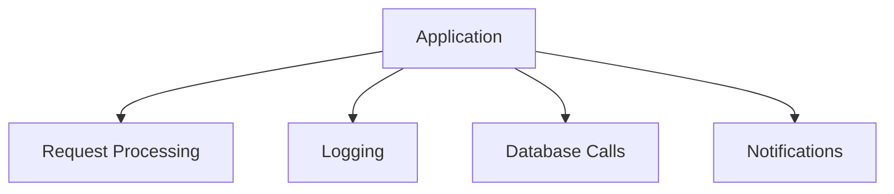
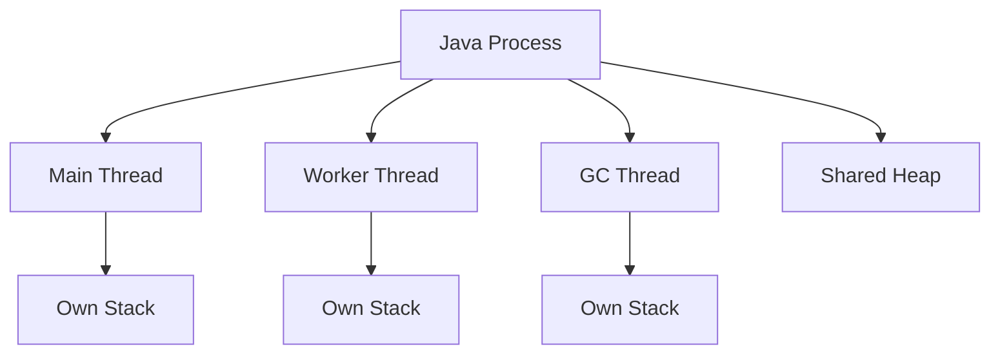
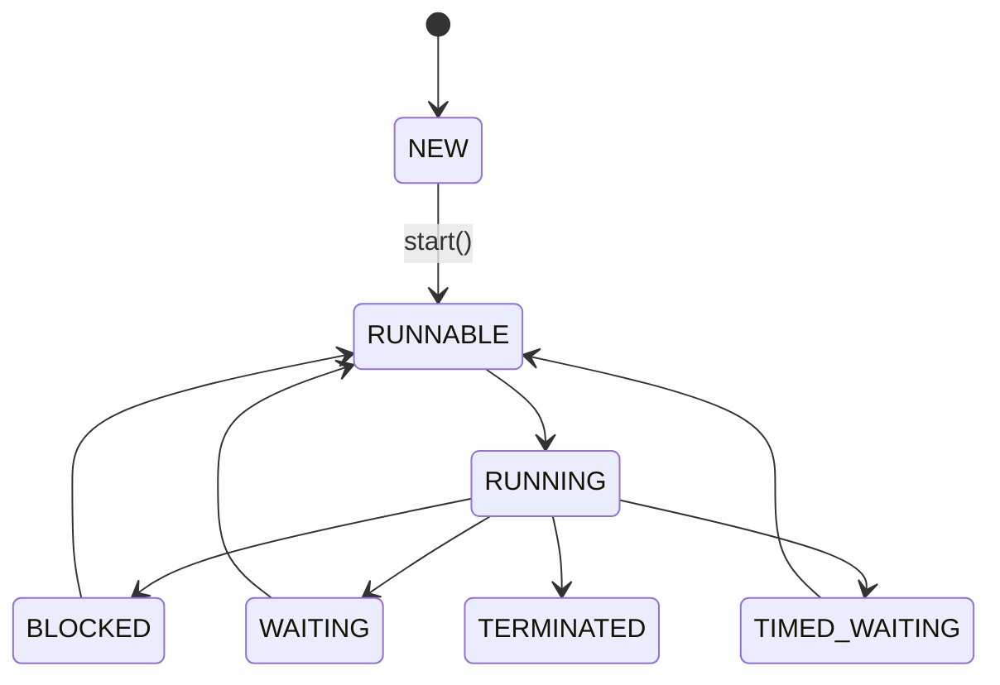
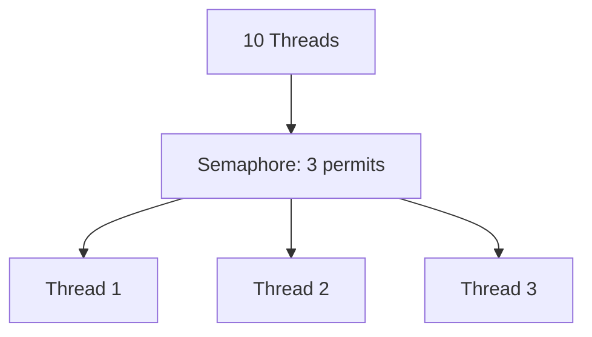
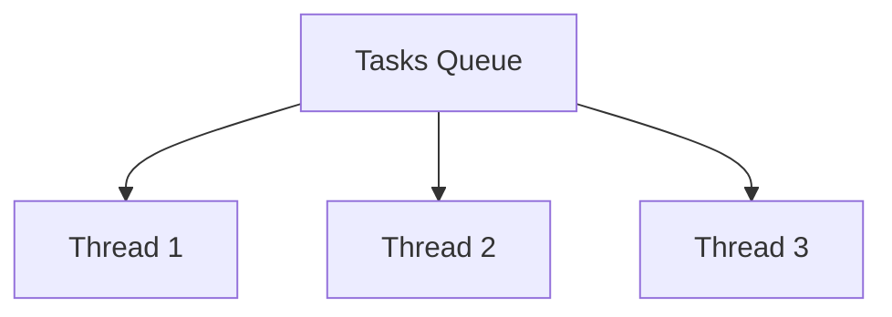
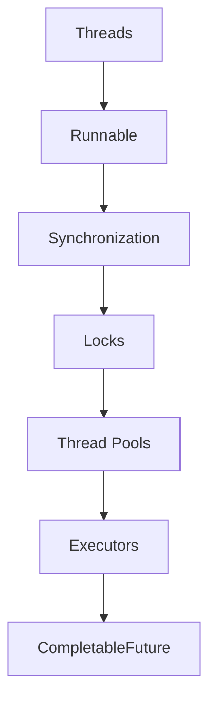

# Java Concurrency & Multithreading Handbook

---

# Table of Contents

1. Why Concurrency?
2. Process vs Thread
3. Creating Threads
4. Runnable vs Callable
5. Thread Lifecycle
6. start() vs run()
7. sleep() vs wait()
8. Thread Communication
9. Synchronization
10. volatile Keyword
11. Atomic Variables
12. Locks
13. Semaphores
14. Thread Pools
15. Executor Framework
16. Future & CompletableFuture
17. Concurrent Collections
18. Producer Consumer Problem
19. Common Problems in Concurrency
20. Production Best Practices

---

# 1. Why Concurrency?

Modern systems need to perform multiple tasks simultaneously.

Examples:

* Web servers handle thousands of requests.
* IDEs index files while keeping UI responsive.
* WhatsApp sends messages while downloading media.



---

# 2. Process vs Thread

## Process

A process is an independent execution environment.

Examples:

* Chrome Browser
* IntelliJ IDEA
* Spotify

## Thread

A thread is the smallest unit of execution inside a process.

Example:

Chrome process:

* UI Thread
* Network Thread
* Rendering Thread

## Diagram



## Comparison

| Feature        | Process   | Thread        |
| -------------- | --------- | ------------- |
| Memory         | Separate  | Shared        |
| Communication  | IPC       | Shared Memory |
| Creation Cost  | High      | Low           |
| Isolation      | Strong    | Weak          |
| Context Switch | Expensive | Cheaper       |

---

# 3. Creating Threads

## Extending Thread

```java
class Worker extends Thread {

    @Override
    public void run() {
        System.out.println("Working");
    }
}

new Worker().start();
```

## Implementing Runnable

```java
class Task implements Runnable {

    @Override
    public void run() {
        System.out.println("Executing task");
    }
}

Thread thread = new Thread(new Task());
thread.start();
```

## Why Runnable?

* Better separation of concerns.
* Supports inheritance.
* Preferred in production.

---

# 4. Runnable vs Callable

| Feature            | Runnable | Callable |
| ------------------ | -------- | -------- |
| Returns Value      | ❌        | ✅        |
| Checked Exceptions | ❌        | ✅        |
| Method             | run()    | call()   |

Example:

```java
Callable<Integer> task = () -> 42;

Future<Integer> future = executor.submit(task);

System.out.println(future.get());
```

---

# 5. Thread Lifecycle



States:

* NEW
* RUNNABLE
* BLOCKED
* WAITING
* TIMED_WAITING
* TERMINATED

---

# 6. start() vs run()

| start()            | run()                   |
| ------------------ | ----------------------- |
| Creates new thread | Normal method           |
| Asynchronous       | Synchronous             |
| JVM schedules      | Current thread executes |

Example:

```java
Thread t = new Thread(
    () -> System.out.println(
        Thread.currentThread().getName()
    )
);

t.run();     // main

t.start();   // Thread-0
```

---

# 7. sleep() vs wait()

| sleep()               | wait()                 |
| --------------------- | ---------------------- |
| Thread class          | Object class           |
| Does not release lock | Releases lock          |
| Used for delays       | Used for communication |

Example:

```java
synchronized(lock) {

    lock.wait();

}
```

---

# 8. Thread Communication

Communication between threads happens using:

* wait()
* notify()
* notifyAll()


Important:

Always use:

```java
while(conditionNotSatisfied)
    wait();
```

Never:

```java
if(conditionNotSatisfied)
,j    wait();
```

Reason:

Spurious wakeups.

---

# 9. Synchronization

Problem:

```java
count++;
```

Actually:

```text
Read count
Increment count
Write count
```

Race conditions occur.

Solution:

```java
synchronized(this) {

    count++;

}
```

---

# 10. volatile

Guarantees:

* Visibility
* Ordering

Does NOT guarantee:

* Atomicity

Bad:

```java
volatile int count;

count++;
```

Still unsafe.

---

# 11. Atomic Variables

```java
AtomicInteger counter =
    new AtomicInteger();

counter.incrementAndGet();
```

Comparison:

| Feature           | synchronized | volatile | Atomic |
| ----------------- | ------------ | -------- | ------ |
| Mutual Exclusion  | ✅            | ❌        | ❌      |
| Visibility        | ✅            | ✅        | ✅      |
| Atomic Operations | ✅            | ❌        | ✅      |

---

# 12. Locks

```java
Lock lock = new ReentrantLock();

lock.lock();

try {

    criticalSection();

} finally {

    lock.unlock();

}
```

Advantages over synchronized:

* tryLock()
* Fairness
* Interruptibility

---

# 13. Semaphore

Allows limited access.

Example:

Only 3 database connections.

```java
Semaphore semaphore =
        new Semaphore(3);
```



---

# 14. Thread Pool

Creating threads repeatedly is expensive.

```java
ExecutorService pool =
        Executors.newFixedThreadPool(10);
```



Benefits:

* Thread reuse.
* Controlled concurrency.
* Reduced overhead.

---

# 15. Executor Framework

Most common:

```java
Executors.newFixedThreadPool()
Executors.newCachedThreadPool()
Executors.newSingleThreadExecutor()
Executors.newScheduledThreadPool()
```

Comparison:

| Pool      | Usage                |
| --------- | -------------------- |
| Fixed     | Stable workload      |
| Cached    | Short-lived tasks    |
| Single    | Sequential execution |
| Scheduled | Delayed tasks        |

---

# 16. Future

Represents result of asynchronous computation.

```java
Future<Integer> future =
    executor.submit(() -> 100);

Integer result = future.get();
```

---

# 17. CompletableFuture

Pipeline style asynchronous programming.

```java
CompletableFuture
    .supplyAsync(() -> fetch())
    .thenApply(data -> process(data))
    .thenAccept(System.out::println);
```


---

# 18. Concurrent Collections

Examples:

* ConcurrentHashMap
* CopyOnWriteArrayList
* BlockingQueue

Example:

```java
ConcurrentHashMap<Integer,String> map =
        new ConcurrentHashMap<>();
```

---

# 19. Producer Consumer Problem

Use:

```java
BlockingQueue<Integer> queue =
        new ArrayBlockingQueue<>(10);
```

Producer:

```java
queue.put(item);
```

Consumer:

```java
queue.take();
```

---

# 20. Production Best Practices

✅ Prefer ExecutorService over raw threads.

✅ Keep critical sections small.

✅ Avoid shared mutable state.

✅ Prefer immutable objects.

✅ Always release locks in finally block.

✅ Use concurrent collections.

✅ Never synchronize unnecessarily.

✅ Avoid creating excessive threads.

---

# Recommended Learning Order


