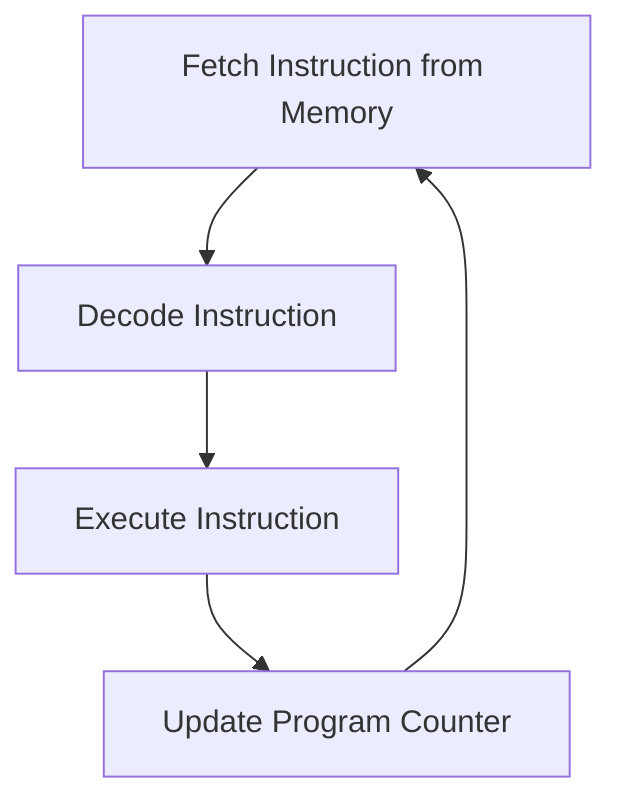

# Why Concurrency?

> **Difficulty:** 🟢 Beginner
>
> **Reading Time:** ~20 minutes
>
> **Prerequisites:** None
>
> **In this chapter, you will learn**
>
> - Why modern computers need concurrency.
> - Why sequential execution is often insufficient.
> - The difference between concurrency and parallelism.
> - Why operating systems introduced threads.
> - The motivation behind everything you'll learn in the rest of this handbook.

---

# Introduction

Before diving into Java threads, thread pools, locks, or synchronization, let's step back and answer a much more fundamental question:

> **Why does concurrency exist at all?**

Every abstraction in computer science is created to solve a problem.

Threads were invented because processes alone were not enough.

Thread pools were invented because creating threads repeatedly was expensive.

Locks were invented because multiple threads could corrupt shared data.

Executors were invented because manually managing threads quickly became difficult.

If we skip the *why* and jump directly into Java APIs, we'll end up memorizing code without understanding the reason those APIs exist.

This chapter focuses entirely on the motivation behind concurrency. Once you understand the problem, the solutions introduced in later chapters will feel natural rather than arbitrary.

---

# A Simple Observation

Imagine opening Google Chrome.

Within a fraction of a second, Chrome begins performing many different activities.

- Rendering the user interface.
- Loading the webpage.
- Downloading images.
- Executing JavaScript.
- Playing videos.
- Receiving keyboard input.
- Processing mouse clicks.
- Managing network connections.
- Saving browser history.
- Communicating with remote servers.

To us, everything appears to happen simultaneously.

The browser feels smooth and responsive.

Now here's the interesting question.

> **How is Chrome doing all of this at the same time?**

Does the CPU really execute all of these tasks simultaneously?

The answer is...

**Sometimes yes.**
**Sometimes no.**

Understanding why requires us to first understand how a CPU actually executes programs.

---

# How a CPU Executes Instructions

Many beginners imagine that a CPU somehow "runs a program."

In reality, that's not what happens.

A CPU performs an extremely simple job.

It repeatedly performs the following cycle:

```text
Fetch Instruction
        ↓
Decode Instruction
        ↓
Execute Instruction
        ↓
Move to Next Instruction
        ↓
Repeat...
```

This cycle is known as the **Fetch–Decode–Execute Cycle**.



Every application running on your computer—whether it's Chrome, VS Code, Spotify, or Minecraft—is ultimately reduced to billions of these tiny machine instructions.

A CPU does not understand "play video" or "open browser."

It only understands instructions like:

- Load data from memory.
- Add two numbers.
- Compare two values.
- Jump to another instruction.
- Store a value back into memory.

Everything else is built on top of these primitive operations.

---

# One CPU Core Can Execute Only One Instruction at a Time

This is one of the most important ideas in concurrency.

A **single CPU core** executes **only one instruction at any given instant**.

Not two.

Not five.

Exactly one.

Imagine the CPU as a chef.

Suppose the chef receives these tasks:

- Make a pizza
- Bake a cake
- Cook pasta

The chef cannot physically stir the pasta and knead pizza dough at the exact same instant.

Instead, the chef rapidly switches between tasks.

- Prepare the pizza.
- Put it in the oven.
- While it bakes, boil the pasta.
- While the pasta cooks, decorate the cake.
- Return to the pizza.

To someone watching from outside, it looks like the chef is doing everything simultaneously.

But in reality, the chef is simply switching attention between tasks.

The same idea applies to a single CPU core.

---

# A World Without Concurrency

Imagine an operating system that supports only one task at a time.

Let's say you open a browser and click a YouTube video.

The browser might need to perform these operations:

1. Download video data.
2. Decode the video.
3. Render each frame.
4. Play audio.
5. Listen for keyboard input.
6. Listen for mouse clicks.

Suppose the operating system insists on finishing one entire task before beginning the next.

The execution might look like this.

```text
Download Entire Video
        ↓
Decode Entire Video
        ↓
Render Entire Video
        ↓
Process Mouse Clicks
        ↓
Play Audio
```

Now imagine clicking the **Pause** button while the browser is downloading the video.

Nothing would happen.

The browser wouldn't even notice your click until the download finished.

The entire application would appear frozen.

This is called **sequential execution**.

Only one task makes progress.

Everything else waits.

Modern applications simply cannot work this way.

---

# Why Sequential Execution Isn't Enough

Sequential execution is perfectly acceptable for simple programs.

For example:

```java
int sum = 0;

for (int i = 1; i <= 100; i++) {
    sum += i;
}

System.out.println(sum);
```

There is only one task.

No waiting.

No user interaction.

No network requests.

No disk access.

Sequential execution is ideal.

Now consider a web server.

It receives requests from thousands of users simultaneously.

If it processes requests one after another, every user must wait for everyone before them.

```
User 1
    ↓
User 2
    ↓
User 3
    ↓
...
User 1000
```

Response times become terrible.

Instead, the server should make progress on many requests during the same period of time.

This is where concurrency enters the picture.

---

# Waiting Is Surprisingly Expensive

One of the biggest reasons concurrency exists is that computers spend a surprising amount of time **waiting**.

Applications wait for:

- Network responses.
- Database queries.
- User input.
- Disk reads.
- Disk writes.
- API calls.

Imagine this code.

```java
String response = downloadLargeFile();
```

From Java's perspective, this is a single line.

Internally, however, your application might spend several seconds waiting for the remote server to respond.

During those seconds, the CPU is capable of performing millions or even billions of instructions.

If we simply wait, we waste valuable CPU time.

Instead, the operating system can schedule another task while this one is blocked.

This simple idea dramatically improves resource utilization.

---

# The Birth of Concurrency

Concurrency is the ability for **multiple tasks to make progress during the same period of time.**

Notice the wording carefully.

It does **not** necessarily mean multiple tasks are executing at the exact same instant.

Instead, it means the system intelligently manages multiple ongoing tasks.

A task may:

- Execute for a while.
- Pause because it's waiting.
- Allow another task to execute.
- Resume later.

Eventually, all tasks make progress.

This keeps applications responsive even when individual tasks spend time waiting.

---

# Key Takeaways

✅ Modern applications perform many activities simultaneously.

✅ A CPU executes machine instructions—not high-level concepts like "play video."

✅ A single CPU core executes only one instruction at a time.

✅ Sequential execution works well for simple workloads but performs poorly for interactive applications.

✅ Many applications spend significant time waiting for external resources.

✅ Concurrency allows multiple tasks to make progress without requiring every task to finish before another begins.

---

# What's Next?

So far we've answered one important question:

> **Why do computers need concurrency?**

The next logical question is:

> **What exactly is a program, and what happens when you run one?**

In the next chapter, we'll follow a Java application from a `.class` file all the way to a running **process**, and we'll see where **threads** fit into the picture.