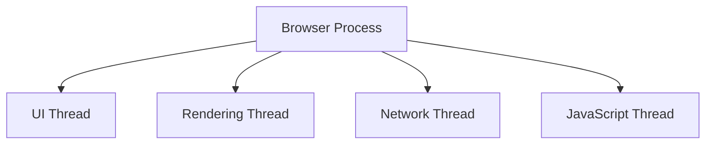
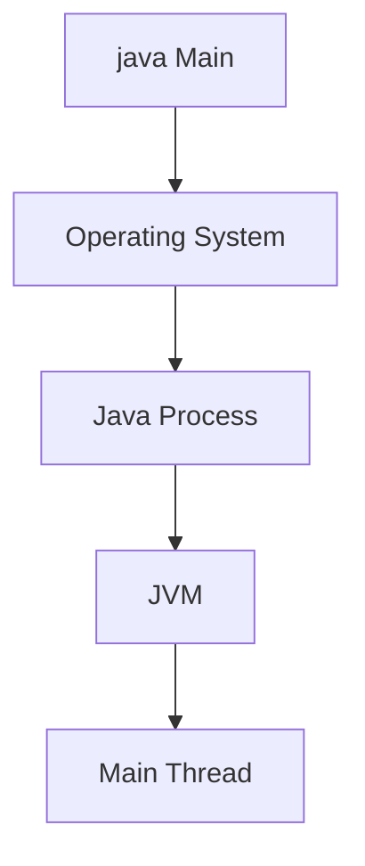

# Programs, Processes, and Threads

> **Difficulty:** 🟢 Beginner
>
> **Reading Time:** ~15 minutes
>
> **Prerequisites:** Why Concurrency?
>
> **In this chapter, you will learn**
>
> - The difference between a program, a process, and a thread.
> - What happens when a program is executed.
> - Why operating systems create processes.
> - Why processes contain threads.
> - How Java applications fit into this model.

---

# Introduction

In the previous chapter, we learned **why** modern systems need concurrency.

The next question is:

> **What actually happens when you run a Java program?**

To answer that, we need to understand three fundamental concepts:

- Program
- Process
- Thread

Although these terms are often used interchangeably, they represent different stages in the lifecycle of an application.


---

# What is a Program?

A **program** is a passive collection of instructions stored on disk.

It contains the code that tells the computer what to do, but it is **not executing**.

Examples include:

- `HelloWorld.java`
- `HelloWorld.class`
- `chrome.exe`
- `spotify.exe`

> [!NOTE]
> A program has **no CPU time, no memory allocation, and no running state**. It is simply a file stored on disk.

---

# From Program to Process

A program becomes useful only when it is executed.

When you launch a program, the operating system creates a **process**.

This involves:

1. Loading the program into memory.
2. Allocating memory for execution.
3. Creating process metadata.
4. Assigning a Process ID (PID).
5. Creating the first thread.


> [!IMPORTANT]
> A **program** is static. A **process** is a running instance of that program.

---

# What Does a Process Own?

A process is much more than just executable code.

It owns the resources required to execute a program.

| Resource | Purpose |
|----------|---------|
| Virtual Memory | Stores code, heap, stacks, and other data |
| Heap | Dynamically allocated objects |
| Open Files | Files currently in use |
| Network Sockets | Communication with other systems |
| Process ID (PID) | Unique identifier assigned by the OS |
| Threads | Units that execute the process's instructions |

```text
+--------------------------------------+
| Process                              |
|--------------------------------------|
| Heap                                 |
| Open Files                           |
| Network Sockets                      |
| Shared Libraries                     |
|                                      |
|  +-----------+   +-----------+       |
|  | Thread A  |   | Thread B  |       |
|  +-----------+   +-----------+       |
+--------------------------------------+
```

---

# What is a Thread?

A **thread** is the smallest unit of execution inside a process.

A process owns resources.

A thread uses those resources to execute instructions.

For example, a browser process might contain:

- UI Thread
- Network Thread
- Rendering Thread
- JavaScript Thread

Each thread performs a different task while sharing the same process resources.



---

# Why Not Create Multiple Processes?

Instead of creating multiple threads, why not create a separate process for each task?

The answer is **resource sharing**.

Processes have isolated memory.

Sharing data between processes requires **Inter-Process Communication (IPC)**, which is comparatively expensive.

Threads, on the other hand, share the same process resources.

This makes communication much faster.

| Multiple Processes | Multiple Threads |
|--------------------|------------------|
| Separate memory | Shared memory |
| IPC required | Direct object sharing |
| Higher creation cost | Lower creation cost |
| Better isolation | Better performance |

> [!TIP]
> Threads are often called **lightweight processes** because creating and switching between them is generally cheaper than creating and switching between processes.

---

# How Does Java Fit In?

When you run a Java application:

```bash
java Main
```

the operating system creates a **Java process**.

The JVM starts inside that process.

One of the first things the JVM does is create the **main thread**, which begins executing the `main()` method.

Additional threads, such as the **Garbage Collector (GC)** thread and **JIT Compiler** thread, are also created by the JVM as needed.



---

# Summary

- A **program** is a file stored on disk.
- Executing a program creates a **process**.
- A process owns the resources required to execute the program.
- Threads execute instructions using the resources owned by the process.
- Multiple threads can exist inside a single process.
- Every Java application starts with a **main thread**.

---

# What's Next?

Now that we understand what threads are, the next step is learning **how Java creates and manages them**.

In the next chapter, we'll explore the `Thread` class, the `Runnable` interface, and the different ways to create threads in Java.