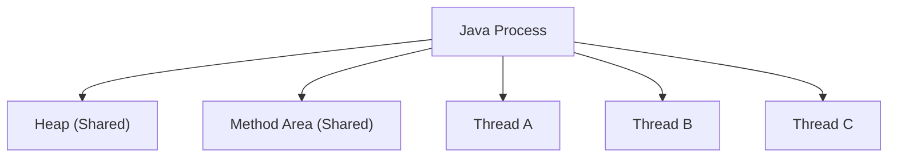
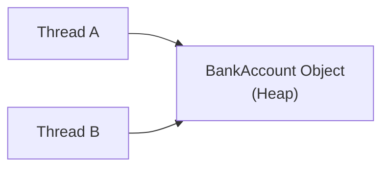
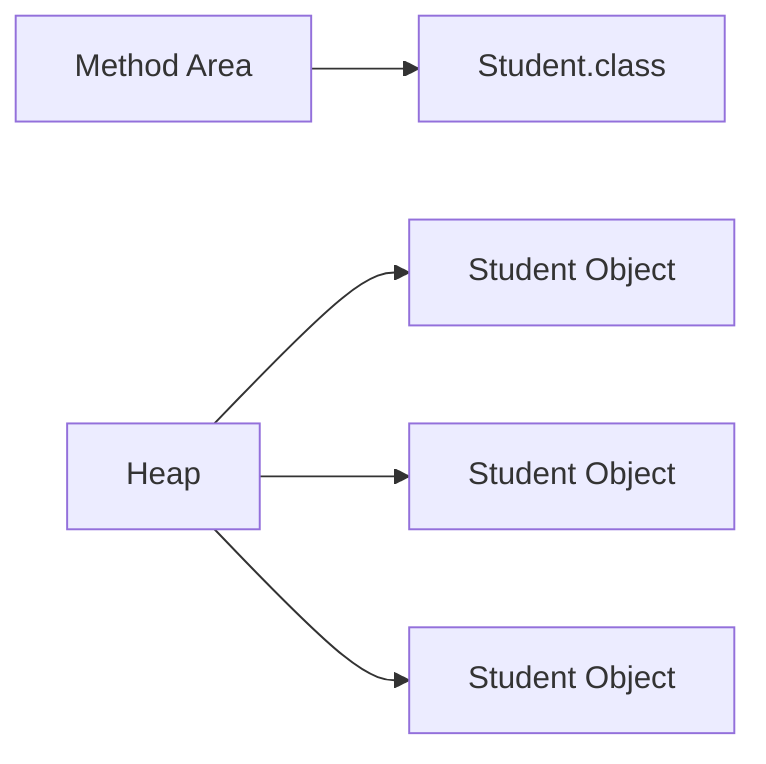
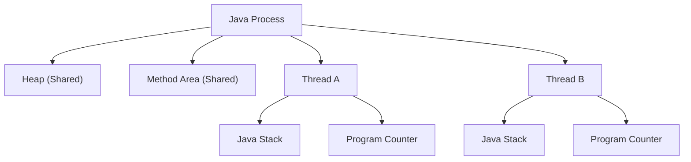
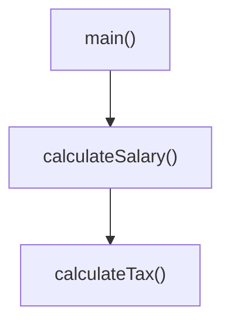

# Process Memory and Thread Layout

> **Difficulty:** 🟢 Beginner
>
> **Reading Time:** ~15 minutes
>
> **Prerequisites:** [Why Concurrency?](01-why-concurrency.md), [Programs, Processes, and Threads](02-programs-processes-and-threads.md)
>
> **In this chapter, you will learn**
>
> - How memory is organized inside a Java process.
> - Which memory regions are shared between threads.
> - Which memory regions belong to individual threads.
> - Why local variables are naturally thread-safe.
> - Why shared objects can lead to race conditions.

---

# Introduction

In the previous chapter, we learned that:

- A **program** is a file stored on disk.
- Executing a program creates a **process**.
- A process can contain multiple **threads**.

This naturally raises another question:

> **If multiple threads run inside the same process, how is memory organized?**

Understanding the answer is one of the most important steps in learning Java concurrency.

Many concurrency bugs—such as race conditions, visibility problems, and inconsistent data—occur simply because developers don't know **which memory is shared and which isn't**.

> [!IMPORTANT]
> Before learning `synchronized`, `volatile`, or `AtomicInteger`, you should understand how memory is organized inside a Java process.

---

# The Big Picture

A Java application consists of **one process** that contains both **shared memory** and **thread-specific memory**.



Notice something interesting.

The process owns the memory.

Threads **do not own the process**.

Instead, every thread executes using the resources that belong to the process.

This design allows threads to communicate efficiently by sharing the same memory.

---

# A Mental Model

Think of a process as an office building.

- The **Heap** is a shared meeting room.
- The **Method Area** is the company handbook that everyone can read.
- Each **thread** is an employee.
- Every employee has their own desk (their own stack).

```
Office Building (Java Process)

+--------------------------------------------------+
| Shared Meeting Room (Heap)                       |
|                                                  |
| Shared Handbook (Method Area)                    |
|                                                  |
|  Employee A Desk      Employee B Desk            |
|  (Stack)              (Stack)                    |
|                                                  |
|  Employee C Desk                               |
|  (Stack)                                        |
+--------------------------------------------------+
```

Employees can safely organize papers on **their own desk**.

However, if multiple employees write on the same whiteboard in the meeting room, they must coordinate.

The same principle applies to Java threads.

---

# Memory Layout of a Java Process

Although the JVM implementation may vary slightly, a Java process is conceptually divided into the following memory regions.

```text
                 Java Process

+------------------------------------------------------+
|                  Heap (Shared)                       |
+------------------------------------------------------+

+------------------------------------------------------+
|              Method Area (Shared)                    |
+------------------------------------------------------+

 Thread A                Thread B              Thread C

+-----------+          +-----------+         +-----------+
| PC        |          | PC        |         | PC        |
+-----------+          +-----------+         +-----------+
| Java Stack|          | Java Stack|         | Java Stack|
+-----------+          +-----------+         +-----------+
| Native    |          | Native    |         | Native    |
| Stack     |          | Stack     |         | Stack     |
+-----------+          +-----------+         +-----------+
```

Let's understand each region one by one.

---

# Heap (Shared Memory)

The **Heap** is the largest memory region in a Java process.

It stores objects and arrays created during program execution.

For example,

```java
Student student = new Student();
```

The `Student` object is allocated on the **Heap**.

Likewise,

```java
int[] numbers = new int[100];
```

The array is also stored on the Heap.

> [!NOTE]
> Almost every object you create using `new` is allocated on the Heap.

---

## Why is the Heap Shared?

Imagine a banking application.

```java
BankAccount account = new BankAccount();
```

Now suppose two threads are running.

- Thread A deposits money.
- Thread B checks the balance.

Both threads must access **the same bank account**.

If every thread had its own copy of the object, the balance would become inconsistent.

Therefore, the object lives in **shared memory**.



Both threads reference the same object.

This makes communication fast.

Unfortunately...

It also introduces the possibility of **race conditions**, which we'll explore in later chapters.

---

# What Lives on the Heap?

Some common examples include:

| Stored on Heap | Example |
|----------------|---------|
| Objects | `new Student()` |
| Arrays | `new int[100]` |
| Instance Variables | `student.name` |
| Collections | `ArrayList`, `HashMap`, `HashSet` |
| String Objects* | `"Hello"` (with JVM optimizations such as the String Pool) |

> [!TIP]
> If multiple threads hold a reference to the same object, they are all accessing the same Heap memory.

---

# Method Area (Shared Memory)

The **Method Area** stores information about classes rather than objects.

When a class is loaded by the JVM, information such as:

- Class metadata
- Method bytecode
- Static variables
- Runtime constant pool

is stored in the Method Area.

For example,

```java
class Student {

    static int totalStudents = 0;

    String name;
}
```

The class definition itself is stored once in the Method Area.

Every `Student` object created later lives on the Heap.



Notice the relationship.

One class definition.

Many object instances.

---

# Static Variables

Static variables belong to the **class**, not to individual objects.

```java
class Counter {

    static int count = 0;
}
```

There is only **one** copy of `count`.

Every object and every thread accesses the same variable.

```text
Method Area

Counter.class

count = 0
```

This makes static variables another form of **shared memory**.

> [!WARNING]
> Static variables are shared across all threads. Updating them without synchronization can lead to race conditions.

---

# Heap vs Method Area

| Heap | Method Area |
|------|-------------|
| Stores objects | Stores class metadata |
| Stores arrays | Stores bytecode |
| Shared by all threads | Shared by all threads |
| Created during object allocation | Created during class loading |

---

## Summary So Far

At this point, we've identified two important shared memory regions.

| Memory Region | Shared Between Threads? |
|---------------|-------------------------|
| Heap | ✅ Yes |
| Method Area | ✅ Yes |

This raises an interesting question.

> If everything were shared, how could one thread execute independently from another?

The answer lies in **thread-local memory**.

In the next section, we'll explore the **Java Stack**, **Program Counter**, and **Native Method Stack**, and we'll see why local variables are naturally thread-safe.


# Thread-Local Memory

In the previous section, we learned that the **Heap** and **Method Area** are shared by all threads.

If every piece of memory were shared, multiple threads would constantly interfere with each other.

Fortunately, that's not how the JVM works.

Every thread owns its own private memory, allowing it to execute independently without affecting other threads.



Notice that while both threads access the same Heap, each thread has its own **Java Stack** and **Program Counter**.

This separation is what allows multiple threads to execute concurrently.

---

# Java Stack

Every thread has its own **Java Stack**.

Unlike the Heap, a stack is **never shared** with other threads.

Its primary responsibility is to store information about the methods currently being executed.

Whenever a method is called, the JVM creates a new **Stack Frame** and pushes it onto the thread's stack.

When the method finishes, that frame is removed.



During execution, the stack looks like this:

```text
Top of Stack
+--------------------------+
| calculateTax()           |
+--------------------------+
| calculateSalary()        |
+--------------------------+
| main()                   |
+--------------------------+
Bottom of Stack
```

As methods return, the stack unwinds in the reverse order.

```
calculateTax() returns
        ↓
calculateSalary() returns
        ↓
main() returns
```

This behavior is known as **Last In, First Out (LIFO)**.

---

# What Does a Stack Frame Contain?

Every stack frame stores the information required to execute a method.

A typical stack frame contains:

- Local variables
- Method parameters
- Intermediate computation results
- Return address

For example,

```java
public void greet(String name) {

    int age = 20;

    System.out.println(name);
}
```

A simplified stack frame would look like:

```text
greet()

--------------------------
Parameter : name
Local Variable : age
Return Address
--------------------------
```

Once `greet()` finishes execution, the entire frame disappears.

No garbage collection is required.

The memory is automatically reclaimed.

---

# Why Are Local Variables Thread-Safe?

This is one of the most important concepts in Java concurrency.

Consider the following method.

```java
public void printSquare(int number) {

    int square = number * number;

    System.out.println(square);
}
```

Suppose two threads call this method simultaneously.

```java
printSquare(5);
printSquare(10);
```

Although both threads execute the same method, each thread creates **its own stack frame**.

```text
Thread A Stack

printSquare()

number = 5

square = 25
```

```text
Thread B Stack

printSquare()

number = 10

square = 100
```

Even though the method is the same, the variables are completely different.

Each thread owns its own copy.

> [!IMPORTANT]
> Local variables are thread-safe because they live inside a thread's private stack.

This is why methods with only local variables generally don't require synchronization.

---

# Program Counter (PC Register)

Every thread also owns a **Program Counter (PC Register)**.

The Program Counter stores the address of the **next instruction** that the thread should execute.

Think of it as a bookmark inside a book.

If you stop reading at page 150, the bookmark remembers where you left off.

Similarly, the Program Counter remembers where a thread should resume execution.

```text
Thread A

main()

↓

Instruction 24

Program Counter = 24
```

Meanwhile,

```text
Thread B

download()

↓

Instruction 87

Program Counter = 87
```

Each thread maintains its own execution position.

Without a separate Program Counter, the operating system would not know where to resume a thread after a context switch.

---

# Context Switching

Suppose a single CPU core is executing two threads.

```text
Time

Thread A
██████

Thread B
      ██████

Thread A
            ██████
```

When the CPU switches from Thread A to Thread B, it saves Thread A's current Program Counter.

Later, when Thread A is scheduled again, execution resumes from the exact instruction where it previously stopped.

This entire process is known as a **context switch**.

> [!TIP]
> The Program Counter is one of the pieces of information saved and restored during every context switch.

---

# Native Method Stack

Java applications occasionally call methods written in native languages such as C or C++.

Examples include:

- File system operations
- Network communication
- Operating system APIs

These methods execute outside the JVM.

Each thread therefore maintains a separate **Native Method Stack** for native method execution.

Although you'll rarely interact with it directly, it's part of every Java thread's memory layout.

---

# Shared vs Thread-Local Memory

We can now summarize everything we've learned.

| Memory Region | Shared? | Owned By |
|--------------|---------|----------|
| Heap | ✅ Yes | Process |
| Method Area | ✅ Yes | Process |
| Java Stack | ❌ No | Individual Thread |
| Program Counter | ❌ No | Individual Thread |
| Native Method Stack | ❌ No | Individual Thread |

This distinction is the foundation of Java concurrency.

Whenever multiple threads modify data stored in **shared memory**, synchronization may be required.

When threads work only with their own private memory, synchronization is generally unnecessary.

---

# A Complete Picture

```text
                    Java Process

+---------------------------------------------------------+
|                     Heap (Shared)                       |
|---------------------------------------------------------|
|  User Objects                                           |
|  Arrays                                                 |
|  Collections                                             |
+---------------------------------------------------------+

+---------------------------------------------------------+
|                  Method Area (Shared)                   |
|---------------------------------------------------------|
|  Class Metadata                                         |
|  Static Variables                                       |
|  Bytecode                                               |
+---------------------------------------------------------+


Thread A                           Thread B

+-------------------+         +-------------------+
| Program Counter   |         | Program Counter   |
+-------------------+         +-------------------+
| Java Stack        |         | Java Stack        |
| Frame 1           |         | Frame 1           |
| Frame 2           |         | Frame 2           |
+-------------------+         +-------------------+
| Native Stack      |         | Native Stack      |
+-------------------+         +-------------------+

         \                          /
          \                        /
           \                      /
            \                    /
             \                  /
              +----------------+
              | Shared Heap    |
              +----------------+
```

> [!IMPORTANT]
> Remember this diagram. Almost every concurrency concept in Java—from race conditions to locks, `volatile`, atomic variables, and thread pools—builds upon this memory organization.

---

## Before Moving On

Let's answer a question that often confuses beginners.

If every thread has its own stack, then why do race conditions happen at all?

The answer is simple:

- Local variables live on the stack and are private.
- Objects live on the Heap and are shared.

Two threads don't fight over their own stacks.

They fight over **shared objects on the Heap**.

In the next section, we'll use this understanding to explain race conditions with a simple `Counter` example.