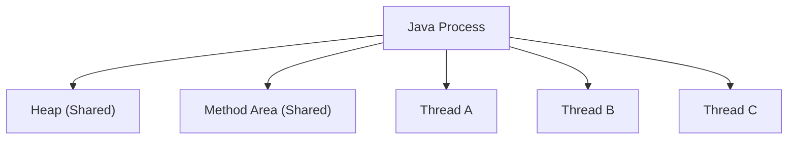
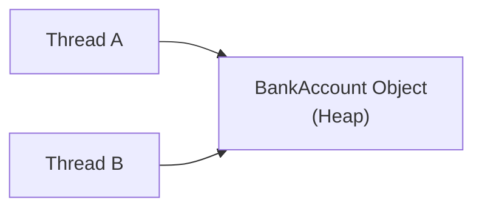
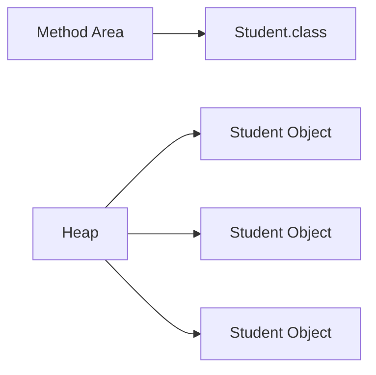

# Process Memory and Thread Layout

> **Difficulty:** 🟢 Beginner
>
> **Reading Time:** ~15 minutes
>
> **Prerequisites:** [Why Concurrency?](01-why-concurrency.md), [Programs, Processes, and Threads](02-programs-processes-and-threads.md)
>
> **In this chapter, you will learn**
>
> - How memory is organized inside a Java process.
> - Which memory regions are shared between threads.
> - Which memory regions belong to individual threads.
> - Why local variables are naturally thread-safe.
> - Why shared objects can lead to race conditions.

---

# Introduction

In the previous chapter, we learned that:

- A **program** is a file stored on disk.
- Executing a program creates a **process**.
- A process can contain multiple **threads**.

This naturally raises another question:

> **If multiple threads run inside the same process, how is memory organized?**

Understanding the answer is one of the most important steps in learning Java concurrency.

Many concurrency bugs—such as race conditions, visibility problems, and inconsistent data—occur simply because developers don't know **which memory is shared and which isn't**.

> [!IMPORTANT]
> Before learning `synchronized`, `volatile`, or `AtomicInteger`, you should understand how memory is organized inside a Java process.

---

# The Big Picture

A Java application consists of **one process** that contains both **shared memory** and **thread-specific memory**.



Notice something interesting.

The process owns the memory.

Threads **do not own the process**.

Instead, every thread executes using the resources that belong to the process.

This design allows threads to communicate efficiently by sharing the same memory.

---

# A Mental Model

Think of a process as an office building.

- The **Heap** is a shared meeting room.
- The **Method Area** is the company handbook that everyone can read.
- Each **thread** is an employee.
- Every employee has their own desk (their own stack).

```
Office Building (Java Process)

+--------------------------------------------------+
| Shared Meeting Room (Heap)                       |
|                                                  |
| Shared Handbook (Method Area)                    |
|                                                  |
|  Employee A Desk      Employee B Desk            |
|  (Stack)              (Stack)                    |
|                                                  |
|  Employee C Desk                               |
|  (Stack)                                        |
+--------------------------------------------------+
```

Employees can safely organize papers on **their own desk**.

However, if multiple employees write on the same whiteboard in the meeting room, they must coordinate.

The same principle applies to Java threads.

---

# Memory Layout of a Java Process

Although the JVM implementation may vary slightly, a Java process is conceptually divided into the following memory regions.

```text
                 Java Process

+------------------------------------------------------+
|                  Heap (Shared)                       |
+------------------------------------------------------+

+------------------------------------------------------+
|              Method Area (Shared)                    |
+------------------------------------------------------+

 Thread A                Thread B              Thread C

+-----------+          +-----------+         +-----------+
| PC        |          | PC        |         | PC        |
+-----------+          +-----------+         +-----------+
| Java Stack|          | Java Stack|         | Java Stack|
+-----------+          +-----------+         +-----------+
| Native    |          | Native    |         | Native    |
| Stack     |          | Stack     |         | Stack     |
+-----------+          +-----------+         +-----------+
```

Let's understand each region one by one.

---

# Heap (Shared Memory)

The **Heap** is the largest memory region in a Java process.

It stores objects and arrays created during program execution.

For example,

```java
Student student = new Student();
```

The `Student` object is allocated on the **Heap**.

Likewise,

```java
int[] numbers = new int[100];
```

The array is also stored on the Heap.

> [!NOTE]
> Almost every object you create using `new` is allocated on the Heap.

---

## Why is the Heap Shared?

Imagine a banking application.

```java
BankAccount account = new BankAccount();
```

Now suppose two threads are running.

- Thread A deposits money.
- Thread B checks the balance.

Both threads must access **the same bank account**.

If every thread had its own copy of the object, the balance would become inconsistent.

Therefore, the object lives in **shared memory**.



Both threads reference the same object.

This makes communication fast.

Unfortunately...

It also introduces the possibility of **race conditions**, which we'll explore in later chapters.

---

# What Lives on the Heap?

Some common examples include:

| Stored on Heap | Example |
|----------------|---------|
| Objects | `new Student()` |
| Arrays | `new int[100]` |
| Instance Variables | `student.name` |
| Collections | `ArrayList`, `HashMap`, `HashSet` |
| String Objects* | `"Hello"` (with JVM optimizations such as the String Pool) |

> [!TIP]
> If multiple threads hold a reference to the same object, they are all accessing the same Heap memory.

---

# Method Area (Shared Memory)

The **Method Area** stores information about classes rather than objects.

When a class is loaded by the JVM, information such as:

- Class metadata
- Method bytecode
- Static variables
- Runtime constant pool

is stored in the Method Area.

For example,

```java
class Student {

    static int totalStudents = 0;

    String name;
}
```

The class definition itself is stored once in the Method Area.

Every `Student` object created later lives on the Heap.



Notice the relationship.

One class definition.

Many object instances.

---

# Static Variables

Static variables belong to the **class**, not to individual objects.

```java
class Counter {

    static int count = 0;
}
```

There is only **one** copy of `count`.

Every object and every thread accesses the same variable.

```text
Method Area

Counter.class

count = 0
```

This makes static variables another form of **shared memory**.

> [!WARNING]
> Static variables are shared across all threads. Updating them without synchronization can lead to race conditions.

---

# Heap vs Method Area

| Heap | Method Area |
|------|-------------|
| Stores objects | Stores class metadata |
| Stores arrays | Stores bytecode |
| Shared by all threads | Shared by all threads |
| Created during object allocation | Created during class loading |

---

## Summary So Far

At this point, we've identified two important shared memory regions.

| Memory Region | Shared Between Threads? |
|---------------|-------------------------|
| Heap | ✅ Yes |
| Method Area | ✅ Yes |

This raises an interesting question.

> If everything were shared, how could one thread execute independently from another?

The answer lies in **thread-local memory**.

In the next section, we'll explore the **Java Stack**, **Program Counter**, and **Native Method Stack**, and we'll see why local variables are naturally thread-safe.