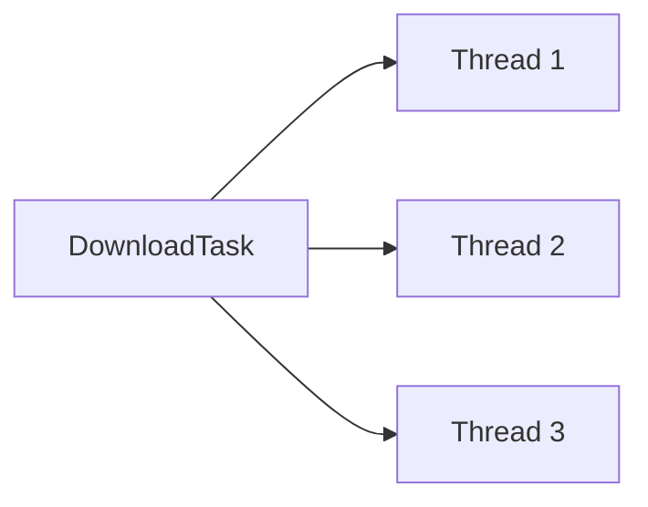
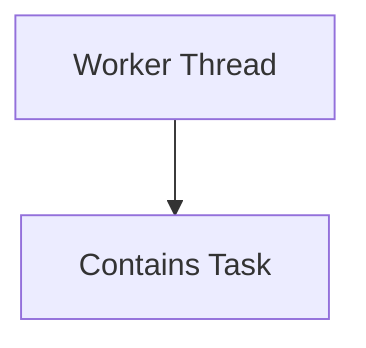
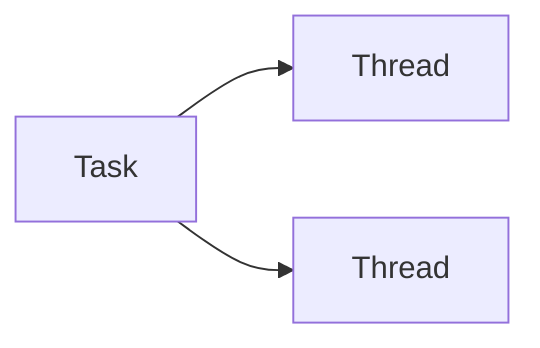

# Creating Threads in Java

> **Difficulty:** 🟢 Beginner
>
> **Reading Time:** ~15 minutes
>
> **Prerequisites:**
>
> - [Why Concurrency?](01-why-concurrency.md)
> - [Programs, Processes, and Threads](02-programs-processes-and-threads.md)
> - [Process Memory and Thread Layout](03-process-memory-and-thread-layout.md)
>
> **In this chapter, you will learn**
>
> - How Java creates new threads.
> - Different ways to execute code concurrently.
> - The `Thread` class and the `Runnable` interface.
> - Why `Runnable` is preferred over extending `Thread`.
> - The difference between `start()` and `run()`.

---

# Introduction

In the previous chapters, we answered three important questions:

- Why do we need concurrency?
- What are processes and threads?
- How is memory organized inside a Java process?

Now it's time to answer the next logical question:

> **How do we actually create a thread in Java?**

Java provides multiple ways to execute code concurrently.

At first glance, this can be confusing.

Questions such as:

- Should I extend `Thread`?
- Should I implement `Runnable`?
- Why do both exist?
- Which approach is considered best practice?

are common among developers new to concurrency.

By the end of this chapter, you'll not only know **how** to create threads, but also **why** Java provides multiple approaches.

---

# Evolution of Java Concurrency

Java's concurrency APIs evolved over time to solve different problems.


Each new API addressed limitations of the previous one.

For example:

| API | Primary Goal |
|------|--------------|
| Thread | Create and manage a thread manually |
| Runnable | Separate the task from the thread |
| Executor Framework | Reuse threads efficiently |
| Callable | Return results from background tasks |
| CompletableFuture | Compose asynchronous workflows |

> [!NOTE]
> In this chapter, we'll focus only on **Thread** and **Runnable**. The remaining APIs will be covered in later chapters.

---

# The Thread Class

The `Thread` class represents an independent path of execution within a Java process.

Every Java application starts with one thread—the **main thread**.

```java
public class Main {

    public static void main(String[] args) {
        System.out.println("Running on the main thread");
    }
}
```

When the JVM starts your application, it creates the **main thread** and begins executing the `main()` method.

Additional threads can be created whenever concurrent execution is required.

---

# Creating a Thread by Extending `Thread`

The most direct way to create a thread is by extending the `Thread` class.

```java
class Worker extends Thread {

    @Override
    public void run() {
        System.out.println("Worker thread is running...");
    }
}
```

To execute the thread:

```java
public class Main {

    public static void main(String[] args) {

        Worker worker = new Worker();

        worker.start();
    }

}
```

Output

```text
Worker thread is running...
```

---

# Understanding What Happened

Let's break down the execution.

### Step 1

Create an instance of the thread.

```java
Worker worker = new Worker();
```

At this point,

- No new thread has been created.
- The object simply exists in memory.

Think of it as preparing a worker before assigning any work.

---

### Step 2

Start the thread.

```java
worker.start();
```

Calling `start()` tells the JVM:

> Create a new thread and execute this object's `run()` method.

The JVM then requests the operating system to schedule a new thread.


Notice that **`start()` does not directly execute your code.**

Instead, it asks the JVM to create a new thread, which will eventually invoke `run()`.

This distinction is extremely important and will be discussed in detail later in this chapter.

---

# What is the `run()` Method?

The `run()` method contains the code that the new thread will execute.

```java
class Worker extends Thread {

    @Override
    public void run() {

        System.out.println("Downloading file...");
    }

}
```

You can think of `run()` as the thread's entry point.

Whenever a thread starts, execution begins inside this method.

---

# A Simple Example

Consider the following program.

```java
class Worker extends Thread {

    @Override
    public void run() {

        for (int i = 1; i <= 5; i++) {
            System.out.println("Worker : " + i);
        }

    }

}

public class Main {

    public static void main(String[] args) {

        Worker worker = new Worker();

        worker.start();

        for (int i = 1; i <= 5; i++) {
            System.out.println("Main   : " + i);
        }

    }

}
```

A possible output:

```text
Main   : 1
Worker : 1
Main   : 2
Worker : 2
Worker : 3
Main   : 3
Worker : 4
Worker : 5
Main   : 4
Main   : 5
```

Your output may be different every time.

Why?

Because **thread scheduling is handled by the operating system**, and the execution order is not deterministic.

> [!IMPORTANT]
> Never assume that threads execute in a specific order unless synchronization mechanisms are used.

---

# Is Extending `Thread` a Good Idea?

Although extending `Thread` works, it has several drawbacks.

The biggest issue is that it mixes **two different responsibilities**.

```text
Thread Class

├── Represents a thread
└── Contains the task to execute
```

In other words,

the class is responsible for:

- defining the work
- representing the worker

These are two separate concepts.

Imagine hiring an employee.

The employee is **not** the work.

The employee **performs** the work.

Similarly,

- a **Thread** is the worker.
- the **task** is the work.

Combining both into a single class reduces flexibility and makes code harder to reuse.

This is exactly the problem that the `Runnable` interface solves.

---

# Limitations of Extending `Thread`

| Limitation | Explanation |
|------------|-------------|
| Single inheritance | A class can extend only one superclass. Extending `Thread` prevents it from extending any other class. |
| Tight coupling | The task is tightly coupled with the thread implementation. |
| Poor reusability | The same task cannot easily be executed by different threads. |
| Less flexible | Modern Java APIs are designed around `Runnable`, not subclasses of `Thread`. |

> [!TIP]
> Extending `Thread` is useful for learning how threads work, but in real-world applications you'll almost always implement `Runnable` or use higher-level concurrency APIs.


---

# The `Runnable` Interface

In the previous section, we created a thread by extending the `Thread` class.

Although this approach works, it combines two different responsibilities into a single class:

- Representing a thread (the worker)
- Defining the task to execute

In software design, combining unrelated responsibilities often leads to code that is difficult to reuse and maintain.

Java addresses this problem through the **`Runnable` interface**.

---

# Separating the Worker from the Work

Imagine a food delivery company.

There are two distinct concepts:

- **Delivery Partner** → The person who delivers food.
- **Delivery Order** → The work that needs to be completed.

These are independent.

The same delivery partner can deliver many orders.

Likewise, the same order could be assigned to a different delivery partner if necessary.

```
Delivery Partner  ≠  Delivery Order
```

Java follows exactly the same design.

```
Thread     ≠     Runnable
Worker            Task
```

A `Thread` represents the worker.

A `Runnable` represents the task.

> [!IMPORTANT]
> A thread executes a task. It is **not** the task itself.

---

# The Runnable Interface

The `Runnable` interface contains a single method.

```java
public interface Runnable {

    void run();

}
```

Instead of extending `Thread`, we simply describe the work that should be executed.

```java
class DownloadTask implements Runnable {

    @Override
    public void run() {

        System.out.println("Downloading file...");

    }

}
```

Notice something.

There is no thread here.

This class only defines **what should happen**.

It does not decide **who will execute it**.

---

# Executing a Runnable

Since a `Runnable` is only a task, we still need a thread to execute it.

```java
Runnable task = new DownloadTask();

Thread thread = new Thread(task);

thread.start();
```

Execution flow:


This separation is much more flexible than extending `Thread`.

---

# Understanding the Constructor

One question naturally comes up.

```java
Thread thread = new Thread(task);
```

Why are we passing a `Runnable` to the `Thread` constructor?

Because a thread needs to know **what work it should perform**.

Internally, the `Thread` stores a reference to the provided `Runnable`.

When `start()` is called, the JVM creates a new thread.

Eventually, that thread invokes the task's `run()` method.

Conceptually, the flow looks like this:

```text
Create Runnable

        ↓

Create Thread with Runnable

        ↓

Call start()

        ↓

JVM Creates New Thread

        ↓

Thread Executes task.run()
```

The important takeaway is that the `Thread` is responsible for **execution**, while the `Runnable` is responsible for **behavior**.

---

# Why Is This Better?

Suppose we want multiple threads to perform the same task.

With `Runnable`, this becomes straightforward.

```java
Runnable task = new DownloadTask();

Thread t1 = new Thread(task);
Thread t2 = new Thread(task);
Thread t3 = new Thread(task);

t1.start();
t2.start();
t3.start();
```



One task.

Multiple workers.

This would be much more awkward if the task were tightly coupled to the thread.

---

# Comparing the Two Approaches

## Extending `Thread`



The worker and the task are bundled together.

---

## Implementing `Runnable`



The task is completely independent from the thread.

This separation leads to cleaner, more reusable code.

---

# Thread vs Runnable

| Thread | Runnable |
|---------|----------|
| Represents a worker | Represents a task |
| Concrete class | Functional interface |
| Can be instantiated directly | Must be executed by a thread |
| Supports inheritance | Supports composition |
| Rarely extended in production code | Preferred in most applications |

---

# Composition over Inheritance

One of the reasons `Runnable` is preferred is that it follows a common object-oriented design principle:

> **Favor composition over inheritance.**

Instead of becoming a specialized type of `Thread`, a class simply provides a task that **can be executed by** a thread.

This keeps responsibilities separate and allows greater flexibility.

You'll encounter this principle throughout Java, including in frameworks such as Spring, JavaFX, and the Executor Framework.

---

# Lambdas Make Runnable Even Simpler

Because `Runnable` is a **functional interface**, it can be implemented using a lambda expression.

Instead of writing:

```java
Runnable task = new Runnable() {

    @Override
    public void run() {

        System.out.println("Hello");

    }

};
```

We can write:

```java
Runnable task = () -> System.out.println("Hello");
```

The behavior is identical.

The lambda simply provides an implementation of the `run()` method.

> [!TIP]
> Modern Java code almost always creates simple `Runnable` tasks using lambda expressions.

---

# Best Practices

✅ Prefer implementing `Runnable` over extending `Thread`.

✅ Keep the task independent of the thread that executes it.

✅ Use meaningful task names such as `DownloadTask` or `EmailSenderTask`.

✅ Think of a `Runnable` as a unit of work rather than as a thread.

---

## Before Moving On

We've now learned two different ways to execute code concurrently.

- Extend `Thread`.
- Implement `Runnable`.

Although both approaches ultimately create a thread, they differ in how responsibilities are organized.

There's one important question still unanswered.

Both examples eventually call:

```java
thread.start();
```

What if we call:

```java
thread.run();
```

instead?

Would a new thread still be created?

The answer surprises many Java developers and is one of the most common interview questions.

We'll explore that in the next section.