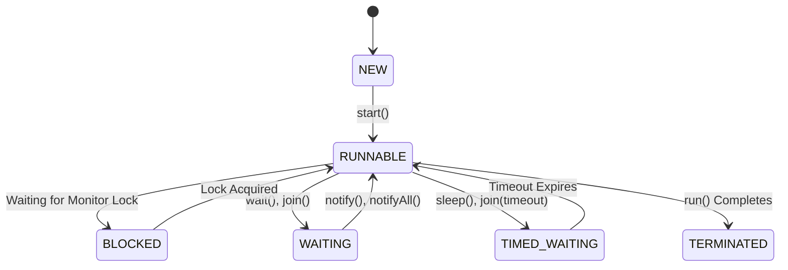
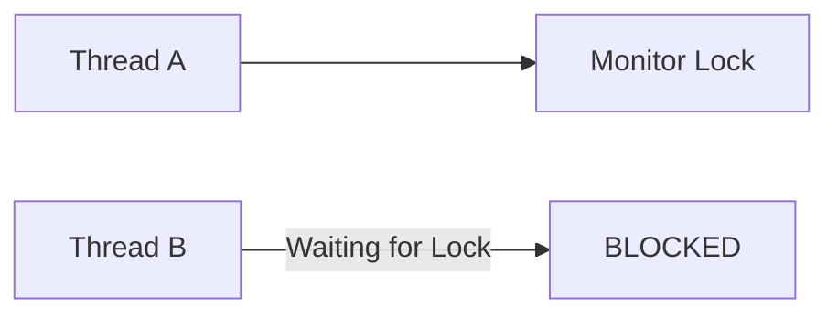
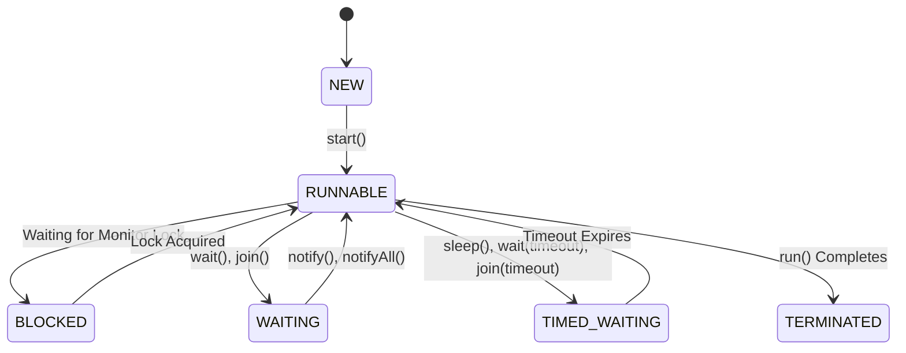

# Thread Lifecycle

> **Difficulty:** 🟢 Beginner
>
> **Reading Time:** ~15 minutes
>
> **Prerequisites:**
>
> - [Creating Threads in Java](04-creating-threads.md)
>
> **In this chapter, you will learn**
>
> - Why threads have different states.
> - The complete lifecycle of a Java thread.
> - What each thread state represents.
> - How threads transition between states.
> - Why understanding thread states is essential before learning synchronization.

---

# Introduction

In the previous chapter, we learned how to create a thread using the `Thread` class and the `Runnable` interface.

However, creating a thread is only the beginning.

Just like a human being is born, works, waits, sleeps, and eventually dies, a thread also goes through several stages during its lifetime.

These stages are known as **Thread States**.

Understanding them is important because many Java APIs—such as `sleep()`, `wait()`, `join()`, and `synchronized`—simply move a thread from one state to another.

> [!IMPORTANT]
> Before learning thread synchronization, it's essential to understand how threads behave throughout their lifetime.

---

# Why Do Threads Have States?

Imagine you're tracking the status of an online food delivery.

```
Order Placed
      ↓
Restaurant Preparing
      ↓
Out for Delivery
      ↓
Delivered
```

At any point in time, the order is in **exactly one state**.

Threads work in the same way.

A thread isn't always running.

Sometimes it's waiting for the CPU.

Sometimes it's sleeping.

Sometimes it's waiting for another thread.

Sometimes it has already finished execution.

Knowing a thread's current state helps both the JVM and developers understand what the thread is doing.

---

# The Thread Lifecycle

Every Java thread moves through a series of well-defined states.



Don't worry if this diagram looks overwhelming.

We'll understand each state one by one.

By the end of this chapter, every arrow in this diagram will make perfect sense.

---

# Java Thread States

The `Thread.State` enum defines six thread states.

| State | Meaning |
|--------|---------|
| `NEW` | Thread has been created but not started. |
| `RUNNABLE` | Thread is ready to run or currently executing. |
| `BLOCKED` | Waiting to acquire a monitor lock. |
| `WAITING` | Waiting indefinitely for another thread to perform an action. |
| `TIMED_WAITING` | Waiting for a specified amount of time. |
| `TERMINATED` | Thread has completed execution. |

One thing often surprises developers.

There is **no `RUNNING` state** in Java.

We'll understand why shortly.

---

# State 1 — NEW

A thread enters the **NEW** state immediately after it is created.

```java
Thread worker = new Thread(() -> {
    System.out.println("Working...");
});
```

At this point:

- The thread object exists.
- No operating system thread has been created yet.
- The `run()` method has **not** started executing.


Think of it as hiring an employee.

The employee has joined the company but hasn't started working yet.

---

## Moving Out of the NEW State

The only valid way to move a thread out of the `NEW` state is by calling:

```java
worker.start();
```

After this call, the JVM requests the operating system to create a new thread.

The thread then moves to the **RUNNABLE** state.


> [!WARNING]
> A thread can leave the `NEW` state only once. Calling `start()` a second time throws an `IllegalThreadStateException`.

---

# State 2 — RUNNABLE

After calling `start()`, the thread enters the **RUNNABLE** state.

Many beginners think this means the thread is actively running.

Not exactly.

The `RUNNABLE` state includes **both**:

- Threads that are ready to run.
- Threads that are currently running on the CPU.

Why?

Because Java doesn't expose a separate `RUNNING` state.

Instead, the JVM groups both situations under `RUNNABLE`.

```text
RUNNABLE

├── Ready to execute
└── Currently executing
```

This is one of the most commonly misunderstood parts of Java concurrency.

---

# Why Doesn't Java Have a RUNNING State?

Imagine two threads.

```
Thread A

Ready to Run
```

```
Thread B

Currently Running
```

The operating system scheduler switches between them extremely quickly.

```
Thread A
████

Thread B
    ████

Thread A
        ████

Thread B
            ████
```

These context switches happen thousands or even millions of times per second.

From the JVM's perspective, distinguishing between "ready" and "currently running" provides little value.

Therefore, Java combines both situations into a single state:

```
RUNNABLE
```

This design keeps the API simpler while still accurately representing a thread's lifecycle.

---

# What Happens Inside RUNNABLE?

When a thread is in the `RUNNABLE` state, one of two things is happening:

1. The thread is waiting for CPU time.
2. The thread is actively executing instructions.

The operating system's scheduler decides which runnable thread gets CPU time.

Java developers **cannot predict or control** the exact execution order.

> [!TIP]
> Calling `start()` only makes a thread eligible to run. It does **not** guarantee immediate execution.

---

# Understanding the Scheduler

The scheduler is part of the operating system.

Its job is to decide which thread should use the CPU.

Imagine three threads becoming runnable at the same time.

```text
RUNNABLE Queue

Thread A

Thread B

Thread C
```

The scheduler might choose:

```text
CPU

↓

Thread B
```

A moment later:

```text
CPU

↓

Thread A
```

Then:

```text
CPU

↓

Thread C
```

The selection depends on many factors, including:

- Operating system policies
- CPU availability
- Thread priorities (in some cases)
- System load

As Java developers, we should assume that the scheduler is **non-deterministic**.

---

# NEW → RUNNABLE Example

```java
class Worker extends Thread {

    @Override
    public void run() {
        System.out.println("Thread is running...");
    }

}

public class Main {

    public static void main(String[] args) {

        Worker worker = new Worker();

        // State: NEW

        worker.start();

        // State: RUNNABLE

    }

}
```

Notice something important.

Calling `start()` **does not** mean the thread begins executing immediately.

It only transitions the thread into the `RUNNABLE` state, where it waits for the scheduler to allocate CPU time.

---

# Summary So Far

We've covered the first two stages of a thread's lifecycle.

| State | Description |
|--------|-------------|
| `NEW` | Thread object created but not yet started. |
| `RUNNABLE` | Thread is ready to run or currently running. |

At this point, a thread is actively participating in the scheduling process.

However, real-world applications often require a thread to pause.

For example:

- Waiting for a lock.
- Sleeping for a few seconds.
- Waiting for another thread to complete.

These situations introduce the remaining lifecycle states:

- `BLOCKED`
- `WAITING`
- `TIMED_WAITING`
- `TERMINATED`

We'll explore each of them in the next section.


---

# State 3 — BLOCKED

A thread enters the **BLOCKED** state when it wants to enter a synchronized block or method, but another thread already owns the required monitor lock.

In simple terms:

> The thread is **ready to execute**, but it **cannot continue until it acquires a lock**.

Consider the following example.

```java
class Counter {

    public synchronized void increment() {
        // Critical section
    }

}
```

Suppose two threads call `increment()` simultaneously.

```
Thread A
│
├── Acquires monitor lock
└── Executes increment()
```

```
Thread B
│
└── Waiting for the monitor lock
```

Since Thread A already owns the lock, Thread B cannot enter the synchronized method.

Instead, it moves to the **BLOCKED** state.



Once Thread A exits the synchronized block and releases the lock, Thread B becomes eligible to execute again.

```
BLOCKED
      │
Lock Released
      │
      ▼
RUNNABLE
```

> [!IMPORTANT]
> A thread enters the `BLOCKED` state **only while waiting to acquire a monitor lock** (`synchronized`).

---

# State 4 — WAITING

Sometimes a thread doesn't need the CPU.

Instead, it wants to wait until **another thread performs some action**.

This is the purpose of the **WAITING** state.

Unlike `BLOCKED`, the thread is **not waiting for a lock**.

Instead, it is waiting for an event.

Common methods that place a thread into the `WAITING` state include:

- `Object.wait()`
- `Thread.join()`

Example:

```java
worker.join();
```

Here, the current thread pauses until `worker` finishes execution.

```
Main Thread

↓

join()

↓

WAITING

↓

Worker Finishes

↓

RUNNABLE
```

Similarly,

```java
lock.wait();
```

causes the current thread to wait until another thread calls:

```java
lock.notify();
```

or

```java
lock.notifyAll();
```

> [!NOTE]
> We'll study `wait()` and `notify()` in detail in the **Thread Communication** chapter.

---

# BLOCKED vs WAITING

These two states are frequently confused.

| BLOCKED | WAITING |
|----------|----------|
| Waiting for a monitor lock | Waiting for another thread |
| Caused by `synchronized` | Caused by `wait()`, `join()` |
| Thread cannot acquire the lock | Thread voluntarily waits for an event |

A simple way to remember this is:

> **BLOCKED → Waiting for a lock.**  
> **WAITING → Waiting for a signal.**

---

# State 5 — TIMED_WAITING

Sometimes a thread wants to wait, but **only for a limited period of time**.

Instead of waiting forever, it specifies a timeout.

Examples include:

```java
Thread.sleep(2000);
```

```java
worker.join(5000);
```

```java
lock.wait(1000);
```

In each case, the thread enters the **TIMED_WAITING** state.

```
RUNNABLE

↓

sleep(2 sec)

↓

TIMED_WAITING

↓

2 Seconds Expire

↓

RUNNABLE
```

Unlike `WAITING`, the thread does not require another thread to wake it up.

Once the timeout expires, it automatically becomes runnable again.

> [!TIP]
> `sleep()` does **not** release any monitor locks currently held by the thread. We'll revisit this when discussing synchronization.

---

# WAITING vs TIMED_WAITING

| WAITING | TIMED_WAITING |
|-----------|----------------|
| Waits indefinitely | Waits for a specified duration |
| Requires another thread to resume | Automatically resumes after timeout |
| Example: `join()` | Example: `sleep(1000)` |

---

# State 6 — TERMINATED

A thread enters the **TERMINATED** state after its `run()` method completes.

Example:

```java
class Worker extends Thread {

    @Override
    public void run() {
        System.out.println("Done");
    }

}
```

Execution:

```
NEW

↓

RUNNABLE

↓

run()

↓

TERMINATED
```

Once terminated,

- the thread cannot execute again.
- calling `start()` again throws an exception.

```
Thread

↓

TERMINATED

↓

❌ Cannot Restart
```

A terminated thread is effectively finished forever.

---

# Complete Lifecycle Recap

Let's revisit the complete lifecycle.



Notice something.

Every state eventually returns to **RUNNABLE**.

Only one state has no outgoing transition:

```
TERMINATED
```

Once a thread reaches this state, its lifecycle is complete.

---

# Common Methods and Their Effects

| Method | Resulting State |
|----------|----------------|
| `start()` | `NEW → RUNNABLE` |
| `sleep()` | `TIMED_WAITING` |
| `wait()` | `WAITING` |
| `join()` | `WAITING` |
| `join(timeout)` | `TIMED_WAITING` |
| Waiting for `synchronized` | `BLOCKED` |
| `run()` finishes | `TERMINATED` |

This table is worth remembering, as these methods appear frequently in both production code and interviews.

---

# Key Takeaways

- A Java thread moves through **six official states**.
- Java does **not** define a separate `RUNNING` state.
- `BLOCKED` means waiting for a monitor lock.
- `WAITING` means waiting indefinitely for another thread.
- `TIMED_WAITING` means waiting for a specified duration.
- `TERMINATED` indicates that the thread has finished execution and cannot be restarted.

---

# Quick Quiz

### 1. Which state is entered while waiting to acquire a `synchronized` lock?

- [ ] WAITING
- [x] BLOCKED
- [ ] TIMED_WAITING

---

### 2. Which method moves a thread into `TIMED_WAITING`?

- [ ] notify()
- [x] sleep()
- [ ] start()

---

### 3. Can a terminated thread be started again?

<details>
<summary>Answer</summary>

No.

A `Thread` object can only be started once. Once its `run()` method completes, it enters the `TERMINATED` state permanently.

</details>

---

# What's Next?

Now that we understand how a thread moves through its lifecycle, we can explore **how threads interact with one another**.

In the next chapter, we'll cover:

- `sleep()`
- `join()`
- `wait()`
- `notify()`
- `notifyAll()`

We'll learn not only what these methods do, but also **when to use them and how they affect thread coordination**.