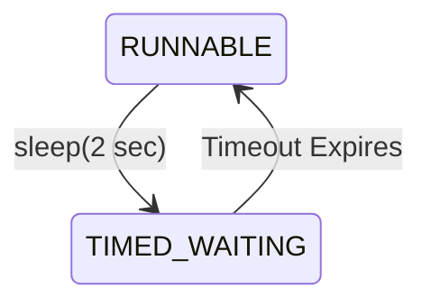
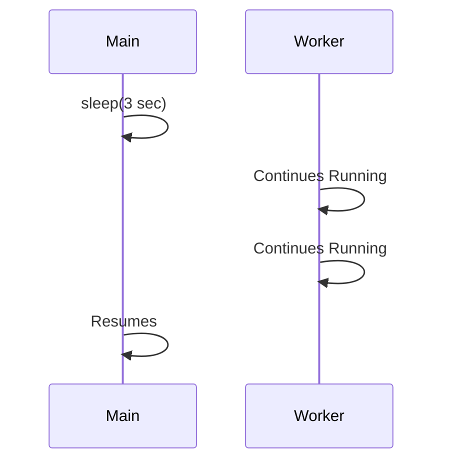

# Thread Control

> **Difficulty:** 🟢 Beginner
>
> **Reading Time:** ~18 minutes
>
> **Prerequisites:**
>
> - [Thread Lifecycle](05-thread-lifecycle.md)
>
> **In this chapter, you will learn**
>
> - How to pause a thread.
> - How one thread waits for another.
> - How to interrupt a thread.
> - The purpose of `yield()`.
> - How to identify the currently executing thread.

---

# Introduction

In the previous chapter, we learned that a thread moves through different lifecycle states such as `NEW`, `RUNNABLE`, and `WAITING`.

The next question is:

> **Can we control a thread while it is running?**

The answer is **yes**.

Java provides several methods that allow us to control a thread's execution.

Some methods pause a thread.

Some allow one thread to wait for another.

Others request a thread to stop what it is doing.

These methods form the foundation of thread coordination and appear frequently in real-world applications.

---

# Thread Control Methods

Throughout this chapter we'll explore the following methods.

| Method | Purpose |
|---------|---------|
| `sleep()` | Pause the current thread for a period of time |
| `join()` | Wait for another thread to finish |
| `interrupt()` | Request a thread to stop waiting or sleeping |
| `isInterrupted()` | Check a thread's interrupt status |
| `Thread.currentThread()` | Get the currently executing thread |
| `yield()` | Hint that another runnable thread may execute |

We'll start with the simplest one.

---

# `Thread.sleep()`

Suppose you're writing a polling service.

Every few seconds, it checks whether a file has been uploaded.

A simplified implementation might look like this.

```java
while (true) {

    checkForNewFiles();

    Thread.sleep(5000);

}
```

Instead of checking continuously and wasting CPU cycles, the thread pauses for five seconds before checking again.

This is exactly what `sleep()` is designed for.

---

# What Does `sleep()` Do?

The `sleep()` method pauses **the currently executing thread** for a specified amount of time.

```java
Thread.sleep(2000);
```

This requests the scheduler:

> "Do not schedule this thread for approximately two seconds."

During this period, the thread enters the **TIMED_WAITING** state.



Once the timeout expires, the thread becomes runnable again.

Notice the wording.

It becomes **runnable**, not **running**.

The scheduler still decides when it will actually execute.

---

# Important Observation

Consider this code.

```java
System.out.println("Start");

Thread.sleep(3000);

System.out.println("End");
```

Output

```text
Start

(approximately three seconds later)

End
```

Only the **current thread** pauses.

Other threads continue executing normally.



This is one of the biggest misconceptions among beginners.

> [!IMPORTANT]
> `sleep()` pauses only the thread that calls it.

---

# Does `sleep()` Release Locks?

Suppose a thread owns a monitor lock.

```java
synchronized (lock) {

    Thread.sleep(5000);

}
```

Will another thread be able to enter the synchronized block?

No.

Even though the thread is sleeping, it **still owns the monitor lock**.

```text
Thread A

Acquire Lock

↓

sleep()

↓

Still Owns Lock

↓

Wake Up

↓

Release Lock
```

Other threads remain blocked until the synchronized block finishes.

> [!WARNING]
> `sleep()` pauses execution but **does not release monitor locks**.

This is an important distinction between `sleep()` and `wait()`, which we'll study in the next chapter.

---

# Handling InterruptedException

The `sleep()` method declares a checked exception.

```java
Thread.sleep(1000);
```

must be handled.

```java
try {

    Thread.sleep(1000);

} catch (InterruptedException e) {

    Thread.currentThread().interrupt();

}
```

Why?

Because another thread may interrupt the sleeping thread before the timeout expires.

We'll understand interruptions later in this chapter.

For now, remember that `sleep()` can end early if the thread is interrupted.

---

# `Thread.currentThread()`

Sometimes a thread needs information about itself.

Java provides the static method:

```java
Thread.currentThread()
```

Example:

```java
System.out.println(Thread.currentThread().getName());
```

Possible output:

```text
main
```

Inside a worker thread:

```text
Thread-0
```

This method is frequently used for:

- Logging
- Debugging
- Identifying which thread is executing code

---

# Example

```java
class Worker extends Thread {

    @Override
    public void run() {

        System.out.println(

            Thread.currentThread().getName()

        );

    }

}
```

Output

```text
Thread-0
```

Meanwhile,

```java
System.out.println(

    Thread.currentThread().getName()

);
```

inside `main()` prints:

```text
main
```

Even though both execute the same method, they are different threads.

---

# Summary So Far

We've learned two important thread control methods.

| Method | Purpose |
|---------|---------|
| `sleep()` | Pause the current thread for a specified duration |
| `currentThread()` | Access the currently executing thread |

These methods are simple but extremely common in Java applications.

In the next section, we'll answer another important question:

> **How can one thread wait for another thread to finish?**

The answer is the `join()` method.