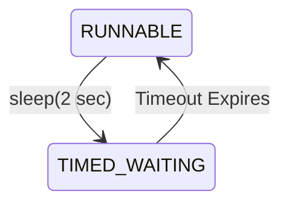
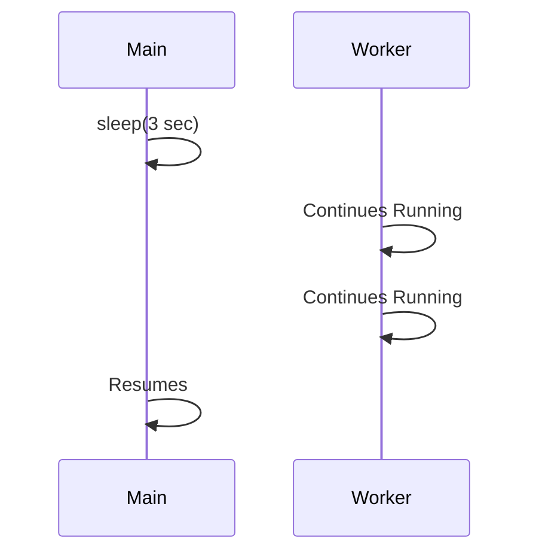
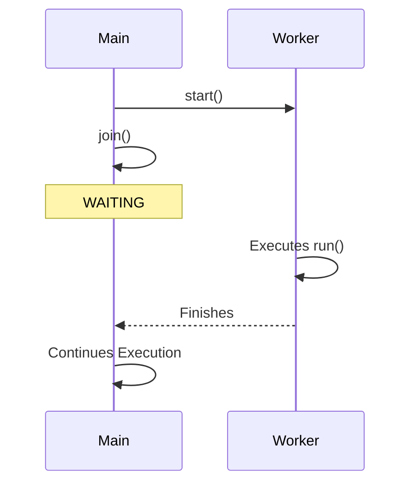
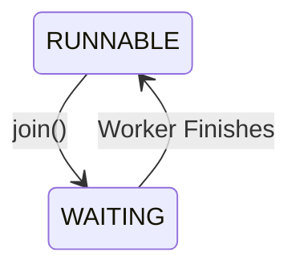

# Thread Control

> **Difficulty:** 🟢 Beginner
>
> **Reading Time:** ~18 minutes
>
> **Prerequisites:**
>
> - [Thread Lifecycle](05-thread-lifecycle.md)
>
> **In this chapter, you will learn**
>
> - How to pause a thread.
> - How one thread waits for another.
> - How to interrupt a thread.
> - The purpose of `yield()`.
> - How to identify the currently executing thread.

---

# Introduction

In the previous chapter, we learned that a thread moves through different lifecycle states such as `NEW`, `RUNNABLE`, and `WAITING`.

The next question is:

> **Can we control a thread while it is running?**

The answer is **yes**.

Java provides several methods that allow us to control a thread's execution.

Some methods pause a thread.

Some allow one thread to wait for another.

Others request a thread to stop what it is doing.

These methods form the foundation of thread coordination and appear frequently in real-world applications.

---

# Thread Control Methods

Throughout this chapter we'll explore the following methods.

| Method | Purpose |
|---------|---------|
| `sleep()` | Pause the current thread for a period of time |
| `join()` | Wait for another thread to finish |
| `interrupt()` | Request a thread to stop waiting or sleeping |
| `isInterrupted()` | Check a thread's interrupt status |
| `Thread.currentThread()` | Get the currently executing thread |
| `yield()` | Hint that another runnable thread may execute |

We'll start with the simplest one.

---

# `Thread.sleep()`

Suppose you're writing a polling service.

Every few seconds, it checks whether a file has been uploaded.

A simplified implementation might look like this.

```java
while (true) {

    checkForNewFiles();

    Thread.sleep(5000);

}
```

Instead of checking continuously and wasting CPU cycles, the thread pauses for five seconds before checking again.

This is exactly what `sleep()` is designed for.

---

# What Does `sleep()` Do?

The `sleep()` method pauses **the currently executing thread** for a specified amount of time.

```java
Thread.sleep(2000);
```

This requests the scheduler:

> "Do not schedule this thread for approximately two seconds."

During this period, the thread enters the **TIMED_WAITING** state.



Once the timeout expires, the thread becomes runnable again.

Notice the wording.

It becomes **runnable**, not **running**.

The scheduler still decides when it will actually execute.

---

# Important Observation

Consider this code.

```java
System.out.println("Start");

Thread.sleep(3000);

System.out.println("End");
```

Output

```text
Start

(approximately three seconds later)

End
```

Only the **current thread** pauses.

Other threads continue executing normally.



This is one of the biggest misconceptions among beginners.

> [!IMPORTANT]
> `sleep()` pauses only the thread that calls it.

---

# Does `sleep()` Release Locks?

Suppose a thread owns a monitor lock.

```java
synchronized (lock) {

    Thread.sleep(5000);

}
```

Will another thread be able to enter the synchronized block?

No.

Even though the thread is sleeping, it **still owns the monitor lock**.

```text
Thread A

Acquire Lock

↓

sleep()

↓

Still Owns Lock

↓

Wake Up

↓

Release Lock
```

Other threads remain blocked until the synchronized block finishes.

> [!WARNING]
> `sleep()` pauses execution but **does not release monitor locks**.

This is an important distinction between `sleep()` and `wait()`, which we'll study in the next chapter.

---

# Handling InterruptedException

The `sleep()` method declares a checked exception.

```java
Thread.sleep(1000);
```

must be handled.

```java
try {

    Thread.sleep(1000);

} catch (InterruptedException e) {

    Thread.currentThread().interrupt();

}
```

Why?

Because another thread may interrupt the sleeping thread before the timeout expires.

We'll understand interruptions later in this chapter.

For now, remember that `sleep()` can end early if the thread is interrupted.

---

# `Thread.currentThread()`

Sometimes a thread needs information about itself.

Java provides the static method:

```java
Thread.currentThread()
```

Example:

```java
System.out.println(Thread.currentThread().getName());
```

Possible output:

```text
main
```

Inside a worker thread:

```text
Thread-0
```

This method is frequently used for:

- Logging
- Debugging
- Identifying which thread is executing code

---

# Example

```java
class Worker extends Thread {

    @Override
    public void run() {

        System.out.println(

            Thread.currentThread().getName()

        );

    }

}
```

Output

```text
Thread-0
```

Meanwhile,

```java
System.out.println(

    Thread.currentThread().getName()

);
```

inside `main()` prints:

```text
main
```

Even though both execute the same method, they are different threads.

---

# Summary So Far

We've learned two important thread control methods.

| Method | Purpose |
|---------|---------|
| `sleep()` | Pause the current thread for a specified duration |
| `currentThread()` | Access the currently executing thread |

These methods are simple but extremely common in Java applications.

In the next section, we'll answer another important question:

> **How can one thread wait for another thread to finish?**

The answer is the `join()` method.


---

# Waiting for Another Thread — `join()`

In many applications, one thread cannot continue until another thread has completed its work.

Imagine downloading a large file.

```
Download File
       │
       ▼
Process File
```

It doesn't make sense to process the file before the download finishes.

This is exactly the problem that `join()` solves.

---

# What Does `join()` Do?

The `join()` method allows one thread to wait for another thread to complete.

```java
worker.join();
```

When this statement executes,

the **current thread** pauses until `worker` finishes execution.



Notice something important.

The **worker thread does not wait**.

The **thread calling `join()` waits**.

---

# Example

```java
class Worker extends Thread {

    @Override
    public void run() {

        System.out.println("Downloading...");

    }

}

public class Main {

    public static void main(String[] args)
            throws InterruptedException {

        Worker worker = new Worker();

        worker.start();

        worker.join();

        System.out.println("Processing Download");

    }

}
```

Possible output

```text
Downloading...

Processing Download
```

Without `join()`, the second message could appear before the download finishes.

---

# What State Does `join()` Cause?

When a thread calls:

```java
worker.join();
```

the current thread enters the **WAITING** state.



If a timeout is specified,

```java
worker.join(5000);
```

the thread enters **TIMED_WAITING** instead.

---

# Common Use Cases

`join()` is useful when work must happen in a specific order.

Examples include:

- Waiting for multiple files to download.
- Waiting for data loading before processing.
- Waiting for background initialization.
- Waiting for worker threads during application shutdown.

> [!TIP]
> `join()` coordinates threads without using shared variables or locks.

---

# Interrupting a Thread

Sometimes waiting is no longer necessary.

For example,

suppose a thread is sleeping for ten seconds.

Suddenly,

the application is shutting down.

Instead of waiting the full ten seconds, we want to wake the thread immediately.

Java provides the `interrupt()` method for this purpose.

---

# What Does `interrupt()` Do?

Calling

```java
thread.interrupt();
```

does **not forcibly stop** a thread.

Instead,

it sends an interruption request.

Think of it as politely saying:

> "Please stop what you're waiting for if possible."

The thread decides how to respond.

---

# Example

```java
class Worker extends Thread {

    @Override
    public void run() {

        try {

            Thread.sleep(10000);

        } catch (InterruptedException e) {

            System.out.println("Interrupted!");

        }

    }

}
```

Main thread:

```java
worker.start();

Thread.sleep(2000);

worker.interrupt();
```

Output

```text
Interrupted!
```

Instead of sleeping for ten seconds,

the thread wakes up immediately because it received an interrupt.

---

# Interrupt Is Cooperative

This is one of the most misunderstood concepts in Java.

Calling

```java
interrupt()
```

does **not** kill a thread.

Instead,

it requests that the thread stop waiting or sleeping.

If the thread ignores the request,

it continues running.

```text
Main Thread

↓

interrupt()

↓

Worker Receives Request

↓

Worker Chooses How to Respond
```

This design prevents applications from terminating threads in unsafe states.

---

# Checking the Interrupt Status

Sometimes a thread isn't sleeping or waiting.

Instead,

it periodically checks whether an interrupt request has been received.

```java
while (!Thread.currentThread().isInterrupted()) {

    doWork();

}
```

Once another thread calls

```java
interrupt();
```

the loop exits naturally.

This is one of the most common ways to stop long-running background threads.

---

# `interrupt()` vs `stop()`

Older versions of Java provided:

```java
thread.stop();
```

This method has been deprecated for many years.

Why?

Because it terminated threads immediately,

possibly leaving shared data in an inconsistent state.

Modern Java prefers cooperative cancellation using `interrupt()`.

| `interrupt()` | `stop()` |
|---------------|----------|
| Requests cancellation | Forcefully terminates thread |
| Safe | Unsafe |
| Recommended | Deprecated |

> [!WARNING]
> Never use `Thread.stop()` in new code.

---

# What About `yield()`?

Sometimes a thread is willing to let another runnable thread execute first.

Java provides:

```java
Thread.yield();
```

This tells the scheduler:

> "I'm willing to let another runnable thread execute."

Notice the wording.

It is only a **hint**.

The operating system may ignore it completely.

```text
Current Thread

↓

yield()

↓

Scheduler Decides

├── Continue Same Thread

└── Run Another Thread
```

Because scheduler behavior depends on the operating system,

`yield()` is rarely used in production code.

> [!NOTE]
> Treat `yield()` as a scheduler hint rather than a synchronization mechanism.

---

# Thread Control Summary

| Method | Purpose | Resulting State |
|----------|---------|----------------|
| `sleep()` | Pause current thread | TIMED_WAITING |
| `join()` | Wait for another thread | WAITING |
| `join(timeout)` | Wait with timeout | TIMED_WAITING |
| `interrupt()` | Request interruption | Depends on current state |
| `currentThread()` | Get current thread | No state change |
| `yield()` | Hint scheduler | Usually remains RUNNABLE |

---

# Best Practices

✅ Use `sleep()` only when a timed pause is actually required.

✅ Prefer `join()` when one thread depends on another.

✅ Use `interrupt()` for cooperative thread cancellation.

✅ Restore the interrupt status if you catch `InterruptedException` and cannot fully handle it.

```java
catch (InterruptedException e) {

    Thread.currentThread().interrupt();

}
```

✅ Do not rely on `yield()` for program correctness.

---

# Key Takeaways

- `sleep()` pauses the **current thread**.
- `join()` allows one thread to wait for another.
- `interrupt()` requests cancellation—it does not forcibly stop a thread.
- `yield()` is only a scheduling hint.
- `Thread.currentThread()` returns the currently executing thread.

---

# Quick Quiz

### 1. Which thread waits when `worker.join()` is called?

- [ ] The worker thread
- [x] The thread calling `join()`

---

### 2. Does `interrupt()` immediately terminate a thread?

- [ ] Yes
- [x] No

---

### 3. Which method should be used to stop a thread safely?

<details>
<summary>Answer</summary>

Use `interrupt()` together with cooperative cancellation. Avoid `Thread.stop()`, as it has been deprecated for many years.

</details>

---

# What's Next?

So far, we've learned how to:

- Create threads.
- Control their execution.
- Wait for them to complete.

The next challenge is even more interesting.

> **How do two threads communicate with each other?**

Suppose one thread produces data while another consumes it.

How does the consumer know when new data is available?

Java answers this using:

- `wait()`
- `notify()`
- `notifyAll()`

These methods form the foundation of thread communication, which we'll explore in the next chapter.