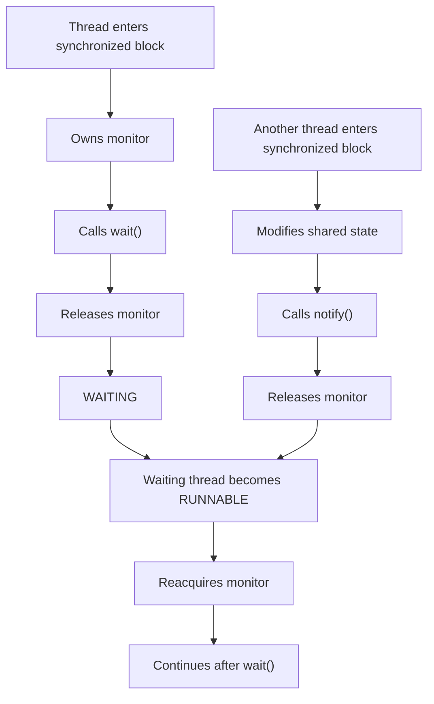
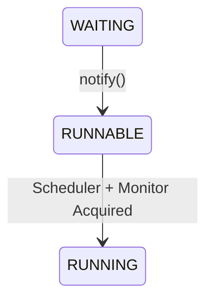
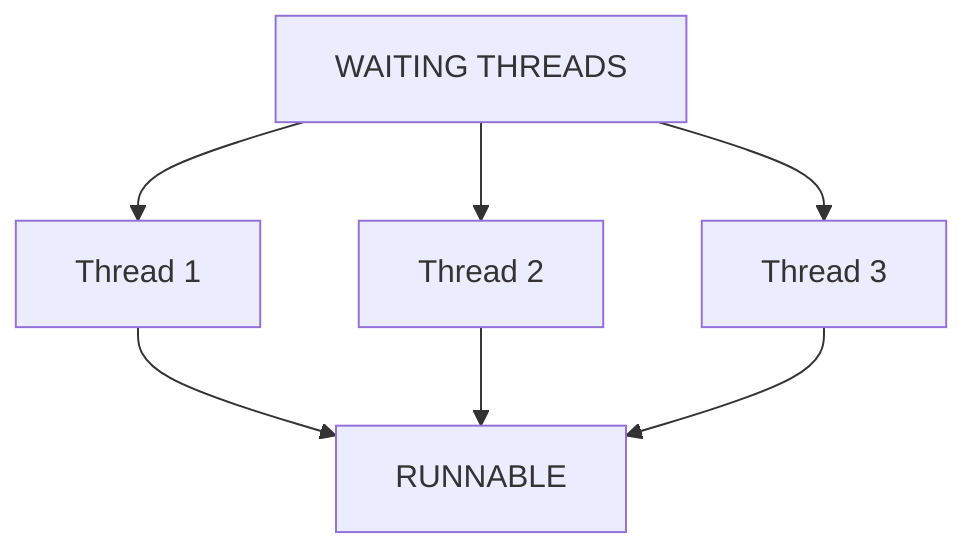
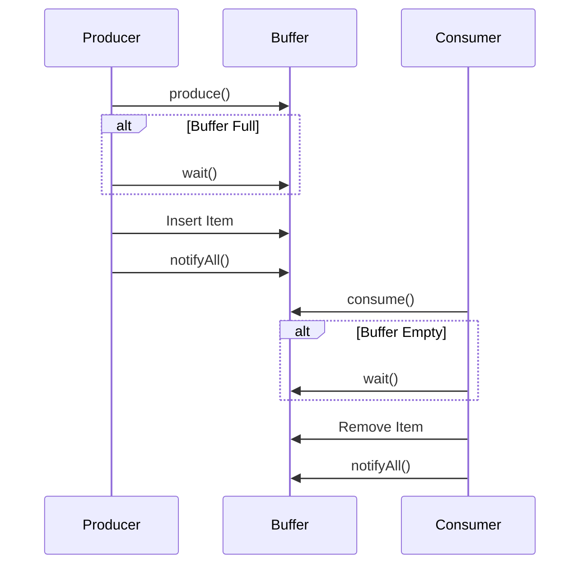

# Thread Communication

> **Difficulty:** 🟡 Intermediate
>
> **Reading Time:** ~18 minutes
>
> **Prerequisites:**
>
> - [Thread Lifecycle](05-thread-lifecycle.md)
> - [Thread Control](06-thread-control.md)
>
> **In this chapter, you will learn**
>
> - Why thread communication is necessary.
> - What busy waiting is and why it is inefficient.
> - The purpose of object monitors.
> - How `wait()` works.
> - Why `wait()` must be called inside a synchronized block.
> - Why `while` should be preferred over `if`.

---

# Introduction

So far we've learned how to:

- Create threads.
- Pause threads.
- Wait for another thread using `join()`.

Now let's consider a different problem.

Suppose two threads are working together.

One thread **produces** data.

Another thread **consumes** that data.

How does the consumer know when new data becomes available?

Should it continuously check?

Should it sleep every few milliseconds?

Neither approach is ideal.

Java provides a much better solution through **thread communication**.

---

# Real-World Motivation

Imagine a restaurant.

```
Chef

↓

Prepares Food

↓

Delivery Partner

↓

Delivers Food
```

The delivery partner cannot leave until the chef finishes preparing an order.

One possible solution is:

```
while(true){

    Is food ready?

}
```

This works...

but it wastes CPU.

The delivery partner keeps asking the same question thousands of times every second.

A much better approach is:

```
Chef

↓

Food Ready

↓

Notify Delivery Partner

↓

Delivery Starts
```

Instead of constantly checking,

the delivery partner simply waits until the chef signals that food is ready.

This is exactly how thread communication works.

---

# The Problem with Busy Waiting

Suppose we write:

```java
while (!dataAvailable) {

    // do nothing

}
```

This loop continuously checks the same condition.

```
Check

↓

Check

↓

Check

↓

Check

↓

Check

↓

...
```

Even though the thread isn't doing useful work,

it still consumes CPU cycles.

This pattern is called **Busy Waiting** (or **Busy Spinning**).

> [!WARNING]
> Busy waiting wastes CPU time because the thread repeatedly checks a condition instead of sleeping efficiently.

---

# A Better Solution

Instead of repeatedly checking,

the thread should sleep until another thread tells it that work is available.

Conceptually:

```
Consumer

↓

wait()

↓

Sleeping

↓

Producer creates data

↓

notify()

↓

Consumer wakes up
```

Notice the difference.

The CPU isn't wasted.

The consumer remains inactive until it actually has work to do.

---

# Enter the Object Monitor

To understand `wait()` and `notify()`, we first need to understand **monitors**.

Every object in Java has an associated **monitor**.

You can think of a monitor as a room where threads coordinate access to that object.

```
Java Object

┌─────────────────┐
│                 │
│    Monitor      │
│                 │
└─────────────────┘
```

Whenever a thread enters a synchronized block,

it acquires the object's monitor.

```java
synchronized(lock) {

    // Thread owns the monitor

}
```

Only one thread can own a monitor at a time.

This makes the monitor the perfect place for threads to communicate.

---

# What Does `wait()` Do?

The `wait()` method tells the current thread:

> "Release the monitor and go to sleep until another thread wakes me up."

This is one of the most important differences between `wait()` and `sleep()`.

When a thread calls:

```java
lock.wait();
```

it performs **three actions**:

1. Releases the monitor.
2. Enters the `WAITING` state.
3. Waits until another thread calls `notify()` or `notifyAll()`.



Notice something important.

After receiving a notification,

the thread **does not continue immediately**.

It must first **reacquire the monitor**.

This subtle detail is responsible for many concurrency bugs.

---

# Why Must `wait()` Be Called Inside `synchronized`?

Consider this code.

```java
lock.wait();
```

Who owns the monitor?

Nobody.

How can Java release a monitor that the thread never acquired?

It can't.

That's why the following code throws:

```text
IllegalMonitorStateException
```

The correct approach is:

```java
synchronized(lock) {

    lock.wait();

}
```

Here,

the thread already owns the monitor.

Therefore,

Java knows exactly which monitor should be released.

> [!IMPORTANT]
> A thread must own an object's monitor before calling `wait()`, `notify()`, or `notifyAll()`.

---

# Visualizing `wait()`

Suppose Thread A owns the monitor.

```
Thread A

Acquire Lock

↓

wait()

↓

Release Lock

↓

WAITING
```

Now another thread can acquire the monitor.

```
Thread B

Acquire Lock

↓

Produce Data

↓

notify()

↓

Release Lock
```

Only after Thread B releases the monitor

can Thread A continue.

```
WAITING

↓

Notification Received

↓

Waiting for Monitor

↓

Monitor Acquired

↓

Execution Continues
```

This is why a notification does **not** guarantee immediate execution.

---

# Why We Use `while` Instead of `if`

Suppose we write:

```java
if (!dataAvailable) {

    lock.wait();

}
```

Looks reasonable.

But it has a subtle problem.

When the thread wakes up,

how do we know that `dataAvailable` is still true?

Another thread may have already consumed the data.

Or the thread may wake up **without any notification at all**.

This rare situation is called a **spurious wakeup**.

Because of this,

Java recommends:

```java
while (!dataAvailable) {

    lock.wait();

}
```

Now every time the thread wakes up,

it checks the condition again before proceeding.

> [!IMPORTANT]
> Always call `wait()` inside a `while` loop that checks the waiting condition.

This is considered the standard pattern in Java concurrency.

---

# Summary So Far

We've learned several important ideas:

- Busy waiting wastes CPU.
- Every Java object has an associated monitor.
- `wait()` releases the monitor and suspends the current thread.
- A thread must own the monitor before calling `wait()`.
- Waking up does **not** guarantee that the condition is satisfied.
- Always use `while`, not `if`, when waiting for a condition.

In the next section, we'll complete the picture by learning:

- `notify()`
- `notifyAll()`
- Producer–Consumer
- Common communication mistakes
- Best practices


---

# Waking Up Waiting Threads

In the previous section, we learned that a thread can voluntarily suspend itself by calling:

```java
lock.wait();
```

At this point, the thread enters the **WAITING** state and releases the monitor.

The obvious question now is:

> **How does the waiting thread know when it should continue?**

The answer is through **notifications**.

Java provides two methods:

```java
notify();
```

and

```java
notifyAll();
```

Both methods are defined in the `Object` class and are used to wake waiting threads.

---

# `notify()`

The `notify()` method wakes **one arbitrary thread** waiting on the object's monitor.

```java
synchronized (lock) {

    // Update shared state

    lock.notify();

}
```

Notice something important.

Calling `notify()` **does not immediately transfer execution** to the waiting thread.

Instead, it simply moves one waiting thread from the **WAITING** state back to **RUNNABLE**.

The awakened thread must still wait until the monitor becomes available.



The thread continues execution only after:

1. It receives a notification.
2. It successfully reacquires the monitor.

---

# Why Doesn't `notify()` Wake the Thread Immediately?

Suppose Thread A is waiting.

```
Thread A

WAITING
```

Thread B currently owns the monitor.

```
Thread B

Owns Monitor

↓

notify()

↓

Still Executing
```

Even after calling `notify()`, Thread B **still owns the monitor**.

Thread A cannot continue until Thread B exits the synchronized block.

```
Thread B

Release Monitor

↓

Thread A

Acquire Monitor

↓

Continue Execution
```

This ensures that shared data remains consistent.

> [!IMPORTANT]
> A notification only makes a waiting thread **eligible to continue**. It does **not** allow it to skip the monitor acquisition step.

---

# `notifyAll()`

Sometimes multiple threads are waiting on the same monitor.

Imagine three consumer threads waiting for work.

```
Consumer 1

WAITING

Consumer 2

WAITING

Consumer 3

WAITING
```

Calling:

```java
lock.notify();
```

wakes only **one** of them.

The JVM does **not** guarantee which thread will be selected.

Instead, if we call:

```java
lock.notifyAll();
```

all waiting threads become runnable.



Notice that they do **not** execute simultaneously.

They still compete for the monitor.

Only one thread can acquire it at a time.

---

# `notify()` vs `notifyAll()`

| `notify()` | `notifyAll()` |
|------------|---------------|
| Wakes one waiting thread | Wakes every waiting thread |
| JVM chooses which thread | All waiting threads become runnable |
| More efficient when only one thread needs to continue | Safer when multiple waiting conditions exist |

---

# Which One Should You Prefer?

Many beginners assume that `notify()` is always better because it wakes fewer threads.

In reality, that's not always true.

Imagine multiple threads waiting for **different conditions**.

```
Thread A

Waiting for Buffer Not Empty
```

```
Thread B

Waiting for Buffer Not Full
```

If the wrong thread is notified,

it may wake up,

check its condition,

and immediately go back to waiting.

Meanwhile,

the correct thread remains asleep.

This can lead to unnecessary waiting or even deadlocks in poorly designed programs.

Because of this,

many production systems prefer:

```java
notifyAll();
```

Each awakened thread checks its own condition.

Only the thread whose condition is satisfied continues.

The others simply call `wait()` again.

---

# Why We Always Use a `while` Loop

Earlier, we wrote:

```java
while (!condition) {

    lock.wait();

}
```

Now we can understand why.

Suppose five threads are awakened by:

```java
notifyAll();
```

Only one of them may actually be able to proceed.

The remaining threads wake up,

recheck the condition,

and go back to waiting.

```text
WAITING

↓

notifyAll()

↓

Wake Up

↓

Condition True?

├── Yes → Continue

└── No → wait() Again
```

This is exactly why Java recommends:

```java
while (!condition) {

    lock.wait();

}
```

instead of:

```java
if (!condition) {

    lock.wait();

}
```

The loop guarantees that the condition is verified every time the thread wakes up.

---

# Best Practices

✅ Always call `wait()`, `notify()`, and `notifyAll()` inside a `synchronized` block.

✅ Always protect `wait()` with a `while` loop.

✅ Prefer `notifyAll()` when multiple waiting conditions exist.

✅ Keep synchronized blocks as small as possible to reduce lock contention.

❌ Never assume that `notify()` wakes a specific thread.

❌ Never assume that waking a thread means it will execute immediately.

---

# Summary So Far

At this point, we understand the complete communication cycle.

```text
Acquire Monitor
        │
        ▼
Condition False
        │
        ▼
wait()
        │
        ▼
WAITING
        │
        ▼
Producer Updates State
        │
        ▼
notify() / notifyAll()
        │
        ▼
RUNNABLE
        │
        ▼
Reacquire Monitor
        │
        ▼
Condition Checked Again
        │
        ▼
Continue Execution
```

We've now learned **how threads sleep, how they wake up, and why they must always recheck the shared condition**.

In the next section, we'll put everything together by solving the classic **Producer–Consumer Problem**, one of the most important examples in concurrent programming.


---

# The Producer–Consumer Problem

We've learned that:

- `wait()` allows a thread to pause efficiently.
- `notify()` and `notifyAll()` allow another thread to wake waiting threads.

Now let's put these concepts together to solve one of the most famous concurrency problems.

Imagine a restaurant.

```
Chef (Producer)
        │
        ▼
     Food Ready
        │
        ▼
Counter (Shared Buffer)
        │
        ▼
Delivery Partner (Consumer)
```

The chef prepares food.

The delivery partner delivers food.

The counter acts as the shared resource.

There are two possible situations:

1. The counter is empty.
   - The delivery partner must wait.

2. The counter is full.
   - The chef must wait.

Neither thread should continuously check the counter.

Instead, they should communicate efficiently using `wait()` and `notifyAll()`.

---

# Designing the Shared Buffer

For simplicity, let's assume the counter can hold only **one item**.

```text
+----------------------+
|      Shared Buffer   |
+----------------------+
|        Empty         |
+----------------------+
```

Possible states:

```text
Producer

↓

Put Item

↓

Buffer Full
```

```text
Consumer

↓

Take Item

↓

Buffer Empty
```

Only one thread should modify the buffer at a time.

Therefore, all operations must be synchronized.

---

# Implementation

```java
class Buffer {

    private Integer item = null;

    public synchronized void produce(int value)
            throws InterruptedException {

        while (item != null) {
            wait();
        }

        item = value;

        System.out.println(
            "Produced : " + value
        );

        notifyAll();
    }

    public synchronized int consume()
            throws InterruptedException {

        while (item == null) {
            wait();
        }

        int value = item;

        item = null;

        notifyAll();

        return value;
    }

}
```

Although this class is small, it demonstrates several important concepts.

---

# Understanding the Producer

Let's walk through the producer method step by step.

```java
while (item != null) {

    wait();

}
```

If the buffer already contains an item,

the producer cannot insert another one.

Instead of repeatedly checking,

it waits efficiently.

Once the consumer removes the item,

the producer is notified and checks the condition again.

Only then does it continue.

---

# Understanding the Consumer

The consumer performs the opposite check.

```java
while (item == null) {

    wait();

}
```

If no item exists,

there is nothing to consume.

The consumer simply waits.

When the producer inserts an item,

it calls:

```java
notifyAll();
```

allowing the consumer to wake up and continue.

---

# Communication Flow



Notice something important.

The producer and consumer never communicate directly.

Instead,

both communicate **through the shared buffer**.

The buffer owns the monitor,

making it the synchronization point.

---

# Common Mistakes

## 1. Using `if` Instead of `while`

❌ Incorrect

```java
if (item == null) {

    wait();

}
```

If the thread wakes up unexpectedly,

it continues immediately,

possibly operating on invalid data.

✅ Correct

```java
while (item == null) {

    wait();

}
```

Always verify the condition after waking up.

---

## 2. Calling `wait()` Outside `synchronized`

❌

```java
wait();
```

This throws:

```text
IllegalMonitorStateException
```

The thread must own the monitor before calling `wait()`.

---

## 3. Forgetting to Notify Waiting Threads

Suppose the producer inserts an item but never calls:

```java
notifyAll();
```

The consumer remains asleep forever.

This creates a deadlock-like situation where progress stops even though work is available.

---

## 4. Assuming `notify()` Wakes a Specific Thread

The JVM makes no guarantee about which waiting thread will be selected.

Never write code that depends on a particular thread being awakened.

---

# Best Practices

✅ Always guard `wait()` with a `while` loop.

✅ Keep shared state private.

✅ Synchronize every access to shared mutable state.

✅ Use `notifyAll()` unless you have a strong reason to use `notify()`.

✅ Keep synchronized blocks as small as possible.

---

# Key Takeaways

- Thread communication avoids busy waiting.
- Every Java object can act as a communication point through its monitor.
- `wait()` releases the monitor and suspends the current thread.
- `notify()` wakes one waiting thread.
- `notifyAll()` wakes every waiting thread.
- A notified thread must reacquire the monitor before continuing.
- Always protect `wait()` with a `while` loop.

---

# Quick Quiz

### 1. Why is busy waiting inefficient?

- [ ] It uses too much memory.
- [x] It continuously consumes CPU while checking a condition.
- [ ] It creates more threads.

---

### 2. What happens when a thread calls `wait()`?

- [x] It releases the monitor and enters the `WAITING` state.
- [ ] It keeps the monitor and sleeps.
- [ ] It terminates.

---

### 3. Does `notify()` immediately execute the waiting thread?

- [ ] Yes
- [x] No

The waiting thread must first reacquire the monitor before continuing.

---

### 4. Why is `while` preferred over `if` when calling `wait()`?

<details>
<summary>Answer</summary>

A thread may wake up because of a notification, a spurious wakeup, or because another thread consumed the shared resource first. Rechecking the condition ensures the thread only proceeds when it is actually safe to continue.

</details>

---

# Chapter Summary

In this chapter, we learned how Java threads communicate without wasting CPU resources.

We started by understanding why **busy waiting** is inefficient and introduced the concept of **object monitors** as a coordination mechanism.

We then explored how:

- `wait()` suspends the current thread while releasing the monitor.
- `notify()` wakes one waiting thread.
- `notifyAll()` wakes all waiting threads.

Finally, we applied these concepts to solve the classic **Producer–Consumer Problem**, demonstrating how threads can safely coordinate through a shared object.

With thread communication complete, we're now ready to tackle a new challenge:

> **What happens when multiple threads modify the same data at the same time?**

The answer leads us to the next chapter:

**Synchronization and Race Conditions.**