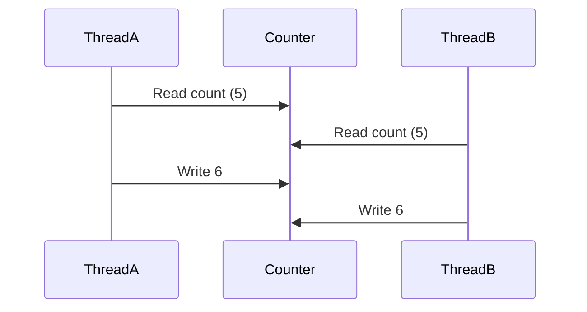
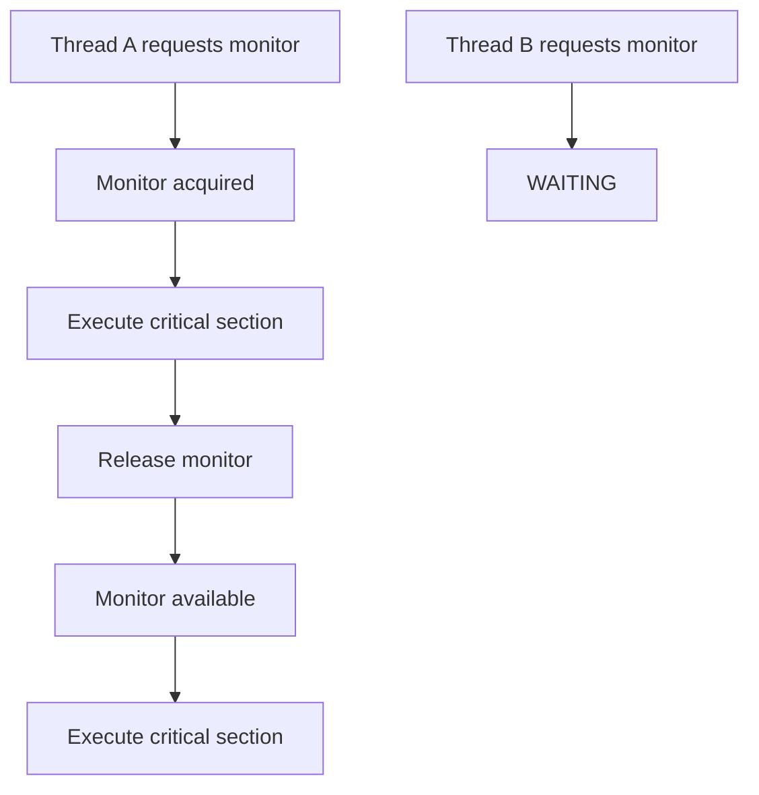

# Race Conditions & Synchronization

> **Difficulty:** 🟡 Intermediate
>
> **Reading Time:** ~20 minutes
>
> **Prerequisites**
>
> - Thread Lifecycle
> - Thread Control
> - Thread Communication
>
> **In this chapter, you'll learn**
>
> - What a race condition is.
> - Why `counter++` is not atomic.
> - What a critical section is.
> - How `synchronized` solves race conditions.
> - Object locks vs class locks.
> - Synchronized methods and synchronized blocks.

---

# Introduction

So far, we've learned how to create threads, control them, and allow them to communicate.

Now we'll explore one of the biggest challenges in concurrent programming.

> **What happens when multiple threads modify the same data at the same time?**

The answer is:

**Race Conditions.**

Race conditions are among the most common causes of concurrency bugs.

The worst part?

Your program may work perfectly thousands of times before suddenly producing the wrong result.

---

# A Simple Example

Suppose we have a shared counter.

```java
class Counter {

    int count = 0;

    public void increment() {
        count++;
    }

}
```

Now imagine we create 100 threads.

Each thread executes:

```java
counter.increment();
```

1,000 times.

How many increments should happen?

```
100 Threads

×

1000 Increments

=

100000
```

Most people expect:

```text
100000
```

But in practice, you might see:

```text
99873

99941

99912

99988
```

The result changes every time the program runs.

Why?

Let's investigate.

---

# Is `count++` Really One Operation?

At first glance,

this line looks like a single instruction.

```java
count++;
```

In reality,

it's three separate operations.

```
Read count

↓

Add 1

↓

Write count
```

Or more formally:

```text
temp = count;

temp = temp + 1;

count = temp;
```

Each step takes time.

This creates an opportunity for another thread to interfere.

---

# The Race Condition

Suppose the counter is currently:

```text
count = 5
```

Now two threads execute simultaneously.

```text
Thread A

Read 5
```

```text
Thread B

Read 5
```

Both threads now calculate:

```text
6
```

Thread A writes:

```text
count = 6
```

Thread B also writes:

```text
count = 6
```

Final value:

```text
6
```

Expected:

```text
7
```

One increment has disappeared.

This is called a **lost update**.

---

# Visualizing the Problem



Both threads read the same value before either writes the updated value.

As a result,

one increment is overwritten.

---

# What Is a Race Condition?

A **race condition** occurs when:

- Multiple threads access the same shared data.
- At least one thread modifies that data.
- The final result depends on the timing of thread execution.

The word *race* comes from the fact that threads are effectively **racing** to read and update the same data.

Whoever writes last wins.

---

# Shared Mutable State

Race conditions require two ingredients.

## Shared State

Multiple threads can access the same object.

```java
Counter counter = new Counter();
```

Every thread references the same instance.

---

## Mutable State

The data can change.

```java
count++;
```

If the object were immutable,

there would be no race condition.

---

# Critical Section

A **critical section** is a portion of code that accesses shared mutable state.

Example:

```java
count++;
```

Even though this is just one line,

it is a critical section because multiple threads may execute it simultaneously.

Whenever multiple threads access shared mutable data,

the critical section must be protected.

---

# The Solution

We need a way to ensure that only **one thread at a time** executes the critical section.

Conceptually:

```text
Thread A

↓

Critical Section

↓

Leaves
```

Only then can:

```text
Thread B

↓

Critical Section
```

In Java,

this is achieved using the `synchronized` keyword.

We'll explore it in the next section.

---

# Key Takeaways

- `count++` is **not** an atomic operation.
- A race condition occurs when multiple threads access shared mutable state without proper synchronization.
- Race conditions often lead to inconsistent and unpredictable results.
- A critical section is any code that accesses shared mutable data.
- Critical sections must be protected to ensure thread safety.

---

# Quick Quiz

### 1. Is `count++` an atomic operation?

- [ ] Yes
- [x] No

---

### 2. Which of the following are required for a race condition?

- [x] Shared mutable state
- [x] Multiple threads
- [ ] Multiple processes

---

### 3. What is a critical section?

<details>
<summary>Answer</summary>

A critical section is a portion of code that accesses shared mutable state and therefore must not be executed by multiple threads simultaneously.

</details>

---

# What's Next?

We've identified the problem.

Now we'll learn how Java solves it using the `synchronized` keyword.

We'll see how monitors prevent multiple threads from entering the same critical section at the same time.


---

# Solving Race Conditions with `synchronized`

In the previous section, we discovered that multiple threads can interfere with each other while executing a critical section.

The solution is simple in principle:

> **Allow only one thread to execute the critical section at a time.**

Java provides the `synchronized` keyword for exactly this purpose.

---

# What Does `synchronized` Do?

A synchronized block ensures that only one thread can execute the protected code at any given time.

```java
synchronized (lock) {

    // Critical Section

}
```

When a thread enters this block:

1. It acquires the monitor associated with `lock`.
2. Executes the protected code.
3. Releases the monitor when it exits.

Any other thread attempting to enter the same synchronized block must wait until the monitor becomes available.



---

# Fixing Our Counter

Earlier, we had:

```java
class Counter {

    private int count = 0;

    public void increment() {
        count++;
    }

}
```

The method wasn't thread-safe.

We can protect the critical section like this:

```java
class Counter {

    private int count = 0;

    public synchronized void increment() {
        count++;
    }

}
```

Now, if Thread A is executing `increment()`, every other thread attempting to execute the same method must wait.

The lost update problem disappears.

---

# What Actually Gets Locked?

One of the biggest misconceptions is:

> "`synchronized` locks the method."

It doesn't.

It locks the **monitor of an object**.

For an instance method like:

```java
public synchronized void increment() {

}
```

the monitor belongs to:

```java
this
```

Conceptually, Java treats it as:

```java
synchronized (this) {

    count++;

}
```

So the object—not the method—is being locked.

---

# Synchronized Methods vs Synchronized Blocks

Java allows synchronization in two ways.

## Synchronized Method

```java
public synchronized void increment() {

    count++;

}
```

The entire method is protected.

---

## Synchronized Block

```java
public void increment() {

    synchronized (this) {

        count++;

    }

}
```

Only the code inside the block is protected.

Both approaches provide the same thread-safety if they lock the same monitor.

The difference is flexibility.

---

# Why Prefer Synchronized Blocks?

Imagine a method that performs three tasks.

```java
public void process() {

    readFile();

    updateCounter();

    writeLog();

}
```

Suppose only `updateCounter()` accesses shared state.

Synchronizing the whole method would unnecessarily block other threads.

Instead:

```java
public void process() {

    readFile();

    synchronized (this) {

        updateCounter();

    }

    writeLog();

}
```

Only the critical section is protected.

This reduces lock contention and improves concurrency.

> [!TIP]
> Synchronize only the code that actually needs protection.

---

# Instance Lock vs Class Lock

Every Java object has its own monitor.

Suppose we create two objects.

```java
Counter counter1 = new Counter();

Counter counter2 = new Counter();
```

Each object has its own monitor.

```
Counter 1
+----------------+
| Monitor A      |
+----------------+

Counter 2
+----------------+
| Monitor B      |
+----------------+
```

A thread holding the monitor of `counter1` does **not** block another thread from entering a synchronized method on `counter2`.

Different objects can execute concurrently.

---

# Static Synchronized Methods

Static methods don't belong to an object.

They belong to the class itself.

```java
public static synchronized void print() {

}
```

In this case, Java locks the monitor associated with the `Class` object.

Conceptually:

```java
synchronized (Counter.class) {

    // Critical Section

}
```

Now the lock is shared across **all instances** of the class.

---

# Object Lock vs Class Lock

| Object Lock | Class Lock |
|-------------|------------|
| Acquired using `synchronized` instance methods or `synchronized(this)` | Acquired using `static synchronized` methods or `synchronized(ClassName.class)` |
| One monitor per object | One monitor per class |
| Different objects do not block each other | All instances share the same class monitor |

---

# Can Two Threads Execute Different Synchronized Methods?

Consider:

```java
class Counter {

    public synchronized void increment() {

    }

    public synchronized void decrement() {

    }

}
```

If both methods are called on the **same object**, the answer is **No**.

Both methods synchronize on `this`.

Only one thread can own that monitor at a time.

However,

if the methods are called on different objects,

they can execute simultaneously.

---

# Common Mistakes

## Synchronizing on the Wrong Object

```java
synchronized (new Object()) {

    count++;

}
```

This is incorrect.

Every call creates a new monitor.

No two threads synchronize on the same object.

---

## Synchronizing Too Much

```java
public synchronized void processLargeFile() {

    // Read file

    // Parse file

    // Save file

}
```

Only the shared data update may require synchronization.

Keeping the entire method synchronized reduces concurrency unnecessarily.

---

## Forgetting That Synchronization Is Per Monitor

This code is **not** synchronized together:

```java
synchronized (lock1) {

}
```

```java
synchronized (lock2) {

}
```

Different monitors mean different locks.

---

# Best Practices

✅ Keep synchronized blocks as small as possible.

✅ Synchronize on a stable, shared object.

✅ Avoid creating lock objects inside synchronized blocks.

✅ Prefer synchronized blocks when only a small portion of the method accesses shared state.

✅ Clearly document which monitor protects shared data.

---

# Summary

In this section, we learned how Java prevents race conditions using intrinsic locks.

The `synchronized` keyword ensures that only one thread can execute a critical section protected by the same monitor at a time.

We also learned that:

- `synchronized` locks **objects**, not methods.
- Instance methods lock `this`.
- Static methods lock the `Class` object.
- Synchronized blocks provide finer control than synchronized methods.
- Choosing the correct lock object is essential for thread safety.

In the next section, we'll explore one important limitation of `synchronized` and introduce **deadlocks**, where multiple threads end up waiting for each other forever.