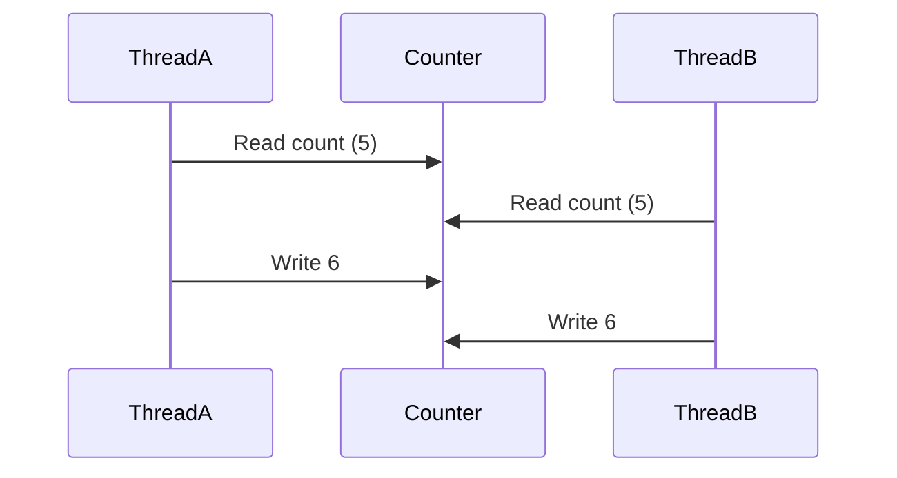

# Race Conditions & Synchronization

> **Difficulty:** 🟡 Intermediate
>
> **Reading Time:** ~20 minutes
>
> **Prerequisites**
>
> - Thread Lifecycle
> - Thread Control
> - Thread Communication
>
> **In this chapter, you'll learn**
>
> - What a race condition is.
> - Why `counter++` is not atomic.
> - What a critical section is.
> - How `synchronized` solves race conditions.
> - Object locks vs class locks.
> - Synchronized methods and synchronized blocks.

---

# Introduction

So far, we've learned how to create threads, control them, and allow them to communicate.

Now we'll explore one of the biggest challenges in concurrent programming.

> **What happens when multiple threads modify the same data at the same time?**

The answer is:

**Race Conditions.**

Race conditions are among the most common causes of concurrency bugs.

The worst part?

Your program may work perfectly thousands of times before suddenly producing the wrong result.

---

# A Simple Example

Suppose we have a shared counter.

```java
class Counter {

    int count = 0;

    public void increment() {
        count++;
    }

}
```

Now imagine we create 100 threads.

Each thread executes:

```java
counter.increment();
```

1,000 times.

How many increments should happen?

```
100 Threads

×

1000 Increments

=

100000
```

Most people expect:

```text
100000
```

But in practice, you might see:

```text
99873

99941

99912

99988
```

The result changes every time the program runs.

Why?

Let's investigate.

---

# Is `count++` Really One Operation?

At first glance,

this line looks like a single instruction.

```java
count++;
```

In reality,

it's three separate operations.

```
Read count

↓

Add 1

↓

Write count
```

Or more formally:

```text
temp = count;

temp = temp + 1;

count = temp;
```

Each step takes time.

This creates an opportunity for another thread to interfere.

---

# The Race Condition

Suppose the counter is currently:

```text
count = 5
```

Now two threads execute simultaneously.

```text
Thread A

Read 5
```

```text
Thread B

Read 5
```

Both threads now calculate:

```text
6
```

Thread A writes:

```text
count = 6
```

Thread B also writes:

```text
count = 6
```

Final value:

```text
6
```

Expected:

```text
7
```

One increment has disappeared.

This is called a **lost update**.

---

# Visualizing the Problem



Both threads read the same value before either writes the updated value.

As a result,

one increment is overwritten.

---

# What Is a Race Condition?

A **race condition** occurs when:

- Multiple threads access the same shared data.
- At least one thread modifies that data.
- The final result depends on the timing of thread execution.

The word *race* comes from the fact that threads are effectively **racing** to read and update the same data.

Whoever writes last wins.

---

# Shared Mutable State

Race conditions require two ingredients.

## Shared State

Multiple threads can access the same object.

```java
Counter counter = new Counter();
```

Every thread references the same instance.

---

## Mutable State

The data can change.

```java
count++;
```

If the object were immutable,

there would be no race condition.

---

# Critical Section

A **critical section** is a portion of code that accesses shared mutable state.

Example:

```java
count++;
```

Even though this is just one line,

it is a critical section because multiple threads may execute it simultaneously.

Whenever multiple threads access shared mutable data,

the critical section must be protected.

---

# The Solution

We need a way to ensure that only **one thread at a time** executes the critical section.

Conceptually:

```text
Thread A

↓

Critical Section

↓

Leaves
```

Only then can:

```text
Thread B

↓

Critical Section
```

In Java,

this is achieved using the `synchronized` keyword.

We'll explore it in the next section.

---

# Key Takeaways

- `count++` is **not** an atomic operation.
- A race condition occurs when multiple threads access shared mutable state without proper synchronization.
- Race conditions often lead to inconsistent and unpredictable results.
- A critical section is any code that accesses shared mutable data.
- Critical sections must be protected to ensure thread safety.

---

# Quick Quiz

### 1. Is `count++` an atomic operation?

- [ ] Yes
- [x] No

---

### 2. Which of the following are required for a race condition?

- [x] Shared mutable state
- [x] Multiple threads
- [ ] Multiple processes

---

### 3. What is a critical section?

<details>
<summary>Answer</summary>

A critical section is a portion of code that accesses shared mutable state and therefore must not be executed by multiple threads simultaneously.

</details>

---

# What's Next?

We've identified the problem.

Now we'll learn how Java solves it using the `synchronized` keyword.

We'll see how monitors prevent multiple threads from entering the same critical section at the same time.