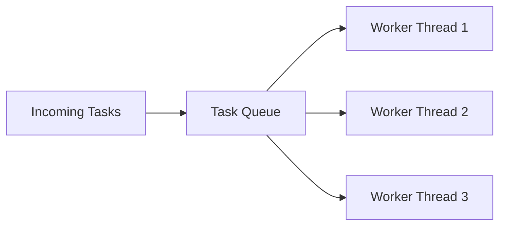
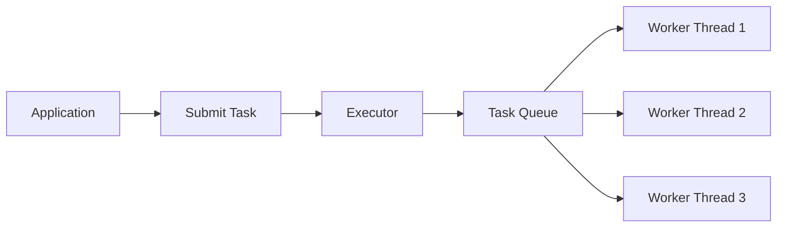
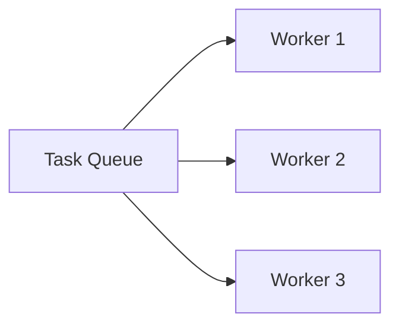
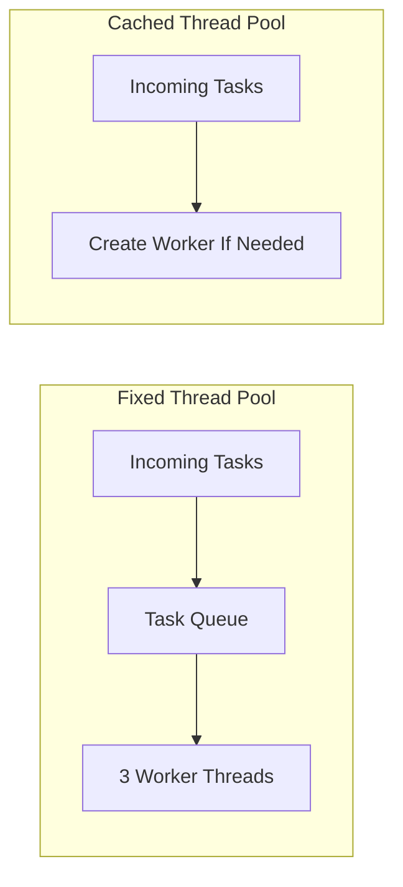
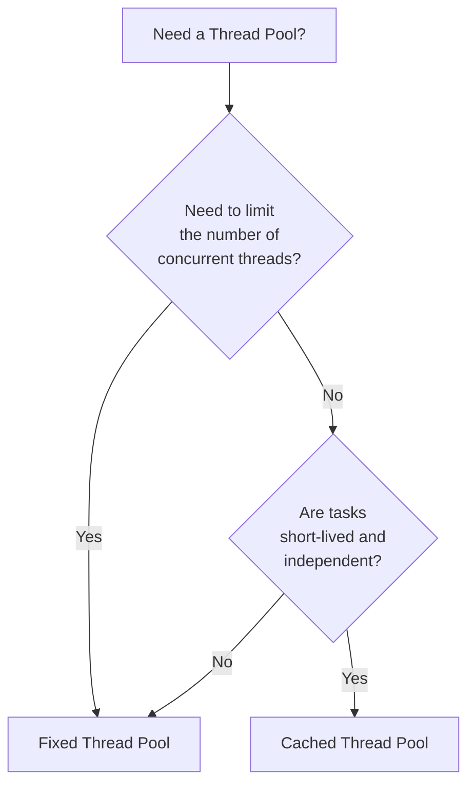
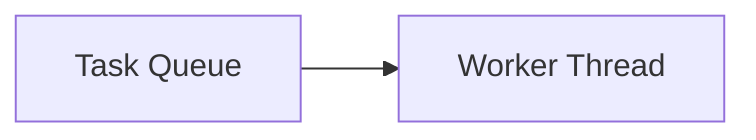
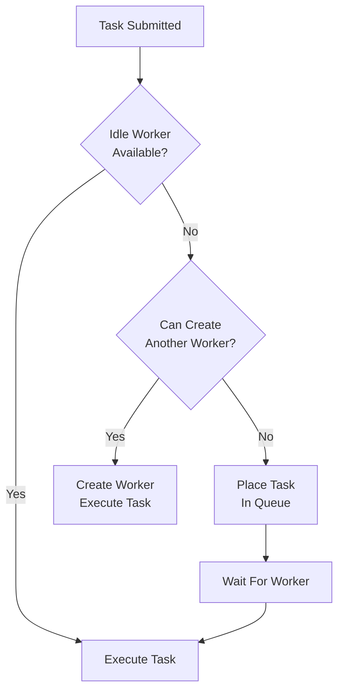
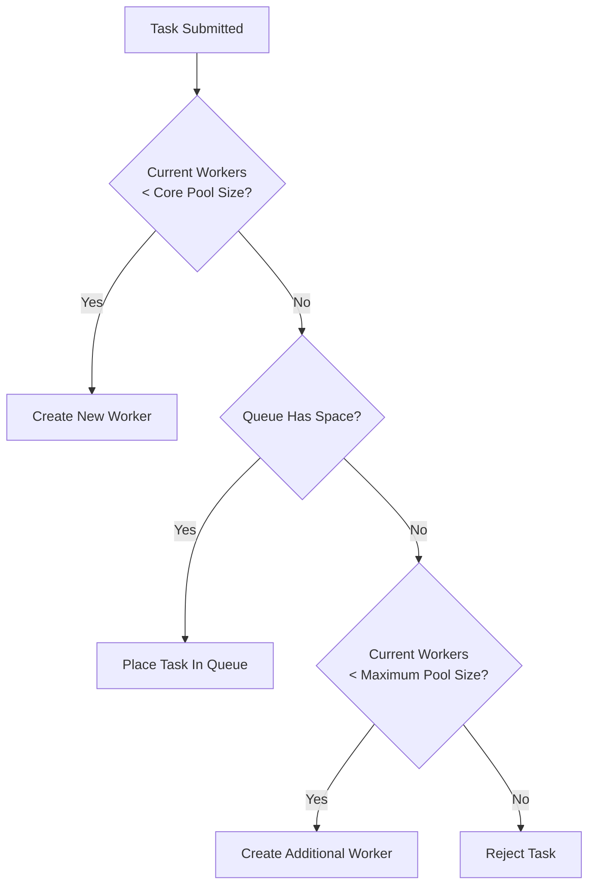

# Thread Pools

> **Difficulty:** 🟠 Intermediate
>
> **Reading Time:** ~25 minutes
>
> **Prerequisites**
>
> - Thread Lifecycle
> - Thread Control
> - Race Conditions & Synchronization
> - Locks & ReentrantLock
>
> **Core Question**
>
> > **Why is creating a new thread for every task inefficient, and how do thread pools solve this problem?**
>
> **Mental Model**
>
> Creating a thread is like hiring a new employee for every single task.
>
> Hiring and training a new employee every time is expensive.
>
> Instead, companies hire employees once and assign them new work as it arrives.
>
> A thread pool follows the same idea:
>
> - Create a fixed set of worker threads.
> - Reuse them for many tasks.
> - Avoid the cost of repeatedly creating and destroying threads.

---

# Introduction

Imagine you're building a web server.

Every incoming HTTP request needs some processing.

One possible solution is:

```java
new Thread(() -> processRequest()).start();
```

for every request.

Initially, this seems reasonable.

A new request arrives.

Create a new thread.

Process the request.

Destroy the thread.

Repeat.

But what happens when your server receives:

```
10 requests?
```

Probably fine.

```
1,000 requests?
```

Still manageable.

```
100,000 requests?
```

Now things start to break down.

Creating a new thread for every task does **not** scale.

---

# Why Are Threads Expensive?

A thread is much more than just a piece of Java code.

Creating a thread involves work at both the JVM and operating system levels.

```text
Application

      │

      ▼

Create Java Thread

      │

      ▼

Allocate Thread Stack

      │

      ▼

Create Native OS Thread

      │

      ▼

Register with Scheduler

      │

      ▼

Execute Task

      │

      ▼

Thread Terminates
```

Every new thread requires:

- Memory for its stack.
- JVM bookkeeping.
- Native operating system resources.
- Scheduling by the operating system.
- Cleanup after completion.

These operations are relatively expensive compared to simply executing a small task.

---

# The Cost of Creating Threads

Suppose every task takes only:

```
5 ms
```

If thread creation itself consumes a noticeable amount of time and resources, a significant portion of your application's work is spent managing threads rather than performing useful work.

Instead of:

```
Execute Task
```

your application repeatedly performs:

```text
Create Thread

↓

Execute Task

↓

Destroy Thread
```

again and again.

The overhead becomes increasingly significant as the number of tasks grows.

---

# An Analogy

Imagine a restaurant.

For every customer who walks in:

```text
Customer Arrives

↓

Hire New Chef

↓

Prepare Meal

↓

Fire Chef
```

Clearly, this would be inefficient.

Restaurants don't hire a new chef for every order.

Instead, they keep a team of chefs ready.

```text
Customers
     │
     ▼
 Orders Queue
     │
     ▼
+----------------------+
| Chef 1               |
| Chef 2               |
| Chef 3               |
+----------------------+
```

When a new order arrives, the next available chef prepares it.

No hiring.

No firing.

Just continuous work.

A **thread pool** works exactly the same way.

---

# What Is a Thread Pool?

A thread pool is a collection of **pre-created worker threads** that are reused to execute many tasks.

Instead of creating a new thread for every task:

```text
Task

↓

New Thread

↓

Execute

↓

Destroy Thread
```

we reuse existing threads.

```text
Task

↓

Idle Worker Thread

↓

Execute Task

↓

Return to Pool
```

The thread isn't destroyed after finishing.

It simply waits for the next task.

---

# Components of a Thread Pool

A thread pool consists of three main parts.



### 1. Incoming Tasks

These are units of work submitted by the application.

Examples:

- Process an HTTP request.
- Send an email.
- Resize an image.
- Write data to a database.

---

### 2. Task Queue

If every worker thread is busy,

new tasks wait inside a queue.

Think of it as customers waiting in line.

---

### 3. Worker Threads

Worker threads repeatedly perform the same cycle.

```text
Take Task

↓

Execute Task

↓

Look For Next Task

↓

Repeat
```

Notice something important.

The **task changes**.

The **thread stays alive**.

This is the key idea behind thread pools.

---

# Thread Pool Lifecycle

Unlike manually created threads,

worker threads usually live for a long time.

```text
Create Worker Threads

        │

        ▼

Wait For Tasks

        │

        ▼

Execute Task

        │

        ▼

Return To Pool

        │

        ▼

Wait Again
```

A worker thread may execute hundreds or even thousands of tasks during its lifetime.

---

# Production Note

> [!NOTE]
> Most modern Java applications rarely create threads using `new Thread()`.
>
> Instead, frameworks such as Spring Boot, Tomcat, Jetty, Kafka, Netty, and many others rely on thread pools to efficiently manage thousands of concurrent tasks.

---

# Why Thread Pools Improve Performance

Thread pools provide several important benefits.

### Reduced Thread Creation Overhead

Threads are created once and reused many times.

---

### Better Resource Management

The application controls how many threads exist.

Instead of accidentally creating thousands of threads, the workload is distributed among a fixed number of workers.

---

### Improved Throughput

Worker threads immediately begin processing queued tasks without paying the cost of thread creation.

---

### Predictable Resource Usage

Limiting the number of worker threads helps prevent excessive memory consumption and context switching.

---

# Summary So Far

We've answered the first question:

> **Why not create a new thread for every task?**

Creating threads is expensive because it requires memory, operating system resources, scheduling, and cleanup.

Instead of repeatedly creating and destroying threads, Java applications reuse a pool of worker threads.

Tasks are submitted to the pool, placed into a queue, executed by available workers, and the workers return to the pool to handle the next task.

In the next section, we'll see how Java provides thread pools through the **Executor Framework** and explore the different types of thread pools available.


---

# The Executor Framework

So far, we've learned **why** thread pools exist.

The next question is:

> **How do we use them in Java?**

Java provides the **Executor Framework**, a high-level API for managing and executing tasks.

Instead of creating and managing threads manually, we submit **tasks** to an executor.

The executor decides:

- Which thread should execute the task.
- When the task should run.
- Whether the task should wait in a queue.
- Whether an existing worker thread can be reused.

As developers, we focus on **what** needs to be done.

The executor handles **how** it gets done.

---

# From Manual Threads to Executors

Without an executor:

```java
Thread thread = new Thread(() -> processOrder());

thread.start();
```

Here, we are responsible for:

- Creating the thread.
- Starting it.
- Managing its lifecycle.

With an executor:

```java
ExecutorService executor =
        Executors.newFixedThreadPool(4);

executor.submit(() -> processOrder());
```

Now we simply submit a task.

The executor chooses an available worker thread from the pool.

---

# How Tasks Flow Through an Executor

The process looks like this:



Notice that the application never interacts directly with worker threads.

Everything goes through the executor.

---

# Key Interfaces

The Executor Framework is built around a few core interfaces.

```
Executor
        │
        ▼
ExecutorService
        │
        ▼
ScheduledExecutorService
```

Each interface adds more capabilities.

---

## `Executor`

The simplest interface.

It has only one responsibility:

```java
void execute(Runnable command);
```

It simply executes a task.

No shutdown.

No return values.

No task management.

Think of it as the minimal abstraction.

---

## `ExecutorService`

`ExecutorService` extends `Executor` and adds many useful features.

For example:

- Submit tasks.
- Return results.
- Shut down the thread pool.
- Wait for tasks to finish.
- Cancel tasks.

Most real-world applications use `ExecutorService` rather than `Executor`.

---

## `ScheduledExecutorService`

Sometimes tasks shouldn't run immediately.

Examples:

- Send a heartbeat every 30 seconds.
- Clean expired cache entries every hour.
- Retry a failed operation after 5 seconds.

`ScheduledExecutorService` is designed for these situations.

We'll explore it in a later chapter.

---

# Creating a Thread Pool

The easiest way to create a thread pool is through the `Executors` utility class.

```java
ExecutorService executor =
        Executors.newFixedThreadPool(4);
```

This creates:

- Four worker threads.
- A shared task queue.
- An executor that assigns tasks to available workers.

```text
                 Tasks
                   │
                   ▼
             +-----------+
             |   Queue   |
             +-----------+
             /    |    \
            ▼     ▼     ▼
      Worker1 Worker2 Worker3 Worker4
```

If all four workers are busy, new tasks wait in the queue.

---

# Submitting Tasks

Suppose we need to process multiple orders.

```java
ExecutorService executor =
        Executors.newFixedThreadPool(4);

executor.submit(() -> processOrder(101));

executor.submit(() -> processOrder(102));

executor.submit(() -> processOrder(103));
```

Each call to `submit()` creates a new **task**, not a new thread.

The executor distributes these tasks among the existing worker threads.

This is one of the biggest mindset shifts when learning the Executor Framework.

> **You submit tasks, not threads.**

---

# Shutting Down the Executor

Worker threads remain alive after completing their tasks.

They continue waiting for new work.

When the application no longer needs the thread pool, it should be shut down.

```java
executor.shutdown();
```

This tells the executor:

> "Don't accept any new tasks, but finish the ones that are already running or waiting."

```text
Running Tasks

↓

Finish Normally

↓

Executor Terminates
```

If you forget to shut down the executor, its worker threads may continue running, preventing the JVM from exiting.

> [!IMPORTANT]
> Always shut down an `ExecutorService` when it is no longer needed.

---

# `shutdown()` vs `shutdownNow()`

Java provides two shutdown methods.

### `shutdown()`

```java
executor.shutdown();
```

- Stops accepting new tasks.
- Allows queued and running tasks to complete.
- Graceful shutdown.

---

### `shutdownNow()`

```java
executor.shutdownNow();
```

- Attempts to stop running tasks.
- Removes tasks that haven't started.
- Interrupts worker threads.

Because interruption is cooperative, running tasks may still continue if they ignore interruption.

Use `shutdownNow()` only when an immediate shutdown is required.

---

# Production Note

> [!NOTE]
> In long-running applications such as web servers, thread pools are typically created once during application startup and reused throughout the application's lifetime.
>
> Creating and destroying thread pools repeatedly defeats the purpose of using a thread pool.

---

# Best Practices

✅ Submit **tasks**, not threads.

✅ Reuse a small number of thread pools instead of creating new ones frequently.

✅ Shut down executors gracefully using `shutdown()`.

✅ Prefer `ExecutorService` over manually creating threads.

❌ Don't create a new thread pool for every request.

❌ Don't forget to shut down executors when they're no longer needed.

---

# Summary So Far

The Executor Framework provides a higher-level abstraction for executing concurrent tasks.

Instead of managing individual threads, applications submit tasks to an `ExecutorService`.

The executor:

- Reuses worker threads.
- Queues incoming tasks.
- Schedules execution.
- Manages the lifecycle of the thread pool.

This separation allows developers to focus on application logic while the framework handles efficient thread management.

In the next section, we'll explore the different types of thread pools provided by Java and learn when each one is appropriate.


---

# Fixed Thread Pool

The most commonly used thread pool in Java is the **Fixed Thread Pool**.

It creates a fixed number of worker threads that are reused to execute incoming tasks.

```java
ExecutorService executor =
        Executors.newFixedThreadPool(4);
```

This creates exactly **4 worker threads**.

No matter how many tasks are submitted, the pool will never execute more than four tasks concurrently.

---

# How It Works

Suppose we create:

```java
ExecutorService executor =
        Executors.newFixedThreadPool(3);
```

The pool immediately creates:

```
Worker 1

Worker 2

Worker 3
```

Now imagine ten tasks arrive.

```text
Task 1
Task 2
Task 3
Task 4
Task 5
Task 6
Task 7
Task 8
Task 9
Task10
```

Only three tasks can execute simultaneously.

The remaining tasks wait in the queue.



---

# Task Execution

Suppose each task takes five seconds.

```
Time = 0s

Worker 1 → Task 1

Worker 2 → Task 2

Worker 3 → Task 3
```

The queue contains:

```
Task 4

Task 5

Task 6

...
```

Five seconds later:

```
Worker 1 → Task 4

Worker 2 → Task 5

Worker 3 → Task 6
```

Notice something important.

The workers never disappear.

Only the **tasks** change.

---

# Why Is This Efficient?

Without a thread pool:

```
Task

↓

Create Thread

↓

Execute

↓

Destroy Thread
```

Repeated for every task.

With a fixed thread pool:

```
Create Workers Once

↓

Execute Task

↓

Return Worker To Pool

↓

Execute Next Task
```

Thread creation happens only once.

This significantly reduces overhead.

---

# Internal Architecture

Conceptually, a fixed thread pool looks like this.

```text
                 Tasks
                   │
                   ▼
          +----------------+
          |  Task Queue    |
          +----------------+
             │    │    │
      ┌──────┘    │    └──────┐
      ▼           ▼           ▼

  Worker 1    Worker 2    Worker 3

      ▲           ▲           ▲
      └───────────┴───────────┘

        Reused For Future Tasks
```

The queue stores waiting tasks.

Workers continuously:

1. Take a task.
2. Execute it.
3. Return to the queue.
4. Repeat.

---

# What Happens If More Tasks Arrive?

Suppose the pool has:

```
4 workers
```

and:

```
500 tasks
```

The executor **does not create more workers**.

Instead:

```
4 Running

496 Waiting
```

Every new task joins the queue.

As workers finish,

they immediately begin processing queued tasks.

---

# Choosing the Pool Size

One common question is:

> **How many worker threads should I create?**

There is no universal answer.

It depends on the workload.

### CPU-bound tasks

Examples:

- Image processing
- Encryption
- Data compression

These tasks spend most of their time using the CPU.

A common guideline is:

```
Number of Threads ≈ Number of CPU Cores
```

Creating significantly more threads often increases context switching without improving throughput.

---

### I/O-bound tasks

Examples:

- Database queries
- Network requests
- Reading files

These tasks spend much of their time waiting for external systems.

While one thread is waiting,

another can use the CPU.

For this reason,

I/O-heavy applications often benefit from having more threads than CPU cores.

> [!TIP]
> Start with measurements rather than guesses. The optimal thread count depends on your workload, hardware, and latency characteristics.

---

# Advantages

✅ Reuses worker threads.

✅ Limits the maximum number of concurrent threads.

✅ Predictable resource usage.

✅ Suitable for long-running server applications.

---

# Limitations

A fixed thread pool has one important limitation.

Tasks that cannot start immediately wait in the queue.

If tasks arrive faster than workers can process them:

```
Tasks Arriving

↓

Queue Grows

↓

Memory Usage Increases

↓

Longer Waiting Times
```

A continuously growing queue can eventually consume a large amount of memory.

---

# Real-World Examples

A fixed thread pool is a good choice when:

- Processing HTTP requests.
- Executing business logic.
- Handling background jobs.
- Processing messages from a queue.
- Running scheduled business operations with a controlled level of concurrency.

The key idea is that the application wants to **limit the number of simultaneously running tasks**.

---

# Best Practices

✅ Choose the pool size based on the workload.

✅ Monitor queue length in production.

✅ Keep tasks reasonably short.

✅ Shut down the pool gracefully when the application exits.

❌ Don't create a pool with hundreds of threads "just in case."

❌ Don't submit long-running blocking tasks without considering their impact on queue growth.

---

# Summary

A fixed thread pool maintains a constant number of worker threads and reuses them to process incoming tasks.

If all workers are busy, new tasks wait in a queue until a worker becomes available.

This provides predictable resource usage and makes fixed thread pools the most common choice for server-side applications.

However, choosing an appropriate pool size is critical.

Too few workers reduce throughput.

Too many increase contention and context-switching overhead.

Understanding your workload is the key to selecting the right configuration.

---

# Cached Thread Pool

A fixed thread pool limits the number of worker threads.

If all workers are busy, new tasks wait in a queue.

A **Cached Thread Pool** takes a different approach.

Instead of making tasks wait,

it creates **new worker threads whenever needed**.

```java
ExecutorService executor =
        Executors.newCachedThreadPool();
```

Unlike a fixed thread pool, there is **no fixed limit** on the number of worker threads.

---

# How It Works

Suppose the application starts.

Initially:

```text
Worker Threads

0
```

The first task arrives.

```text
Task 1

↓

Create Worker 1

↓

Execute Task
```

A second task arrives while Worker 1 is still busy.

```text
Task 2

↓

Create Worker 2

↓

Execute Task
```

A third task arrives.

```text
Task 3

↓

Create Worker 3
```

The pool keeps creating new workers **only when no idle worker is available**.

---

# Reusing Idle Threads

Suppose Worker 1 finishes its task.

Instead of terminating immediately, it waits for more work.

```text
Worker 1

↓

Task Completed

↓

Idle

↓

Wait For Next Task
```

If another task arrives:

```text
New Task

↓

Reuse Worker 1
```

No new thread is created.

This is why it's called a **Cached** Thread Pool.

Idle threads are cached for future reuse.

---

# What Happens During a Traffic Spike?

Imagine an application suddenly receives:

```
500 independent tasks
```

A cached thread pool behaves roughly like this.

```text
Tasks Arrive

↓

No Idle Workers

↓

Create More Workers

↓

Execute Tasks Immediately
```

Unlike a fixed thread pool,

tasks usually don't wait in a queue.

Instead,

the number of worker threads increases.

---

# Internal Architecture

Conceptually, it looks like this.

```text
Incoming Tasks
      │
      ▼
Idle Worker Available?

      │
  ┌───┴────┐
  │        │
 Yes       No
  │        │
  ▼        ▼
Reuse    Create New
Worker    Worker
```

Notice the key difference from a fixed thread pool.

There is **no long waiting queue**.

The pool prefers creating workers over making tasks wait.

---

# Thread Lifecycle

A cached thread pool doesn't keep every thread forever.

When a worker becomes idle:

```text
Task Finished

↓

Idle

↓

Wait For More Work

↓

No Task For Some Time?

↓

Terminate Worker
```

By default, idle threads are removed after approximately **60 seconds**.

This allows the pool to grow during busy periods and shrink when demand decreases.

---

# Fixed vs Cached Thread Pool

| Fixed Thread Pool | Cached Thread Pool |
|-------------------|--------------------|
| Fixed number of workers | Creates workers as needed |
| Tasks wait in a queue | Tries to execute tasks immediately |
| Predictable thread count | Thread count can grow significantly |
| Stable memory usage | Higher resource usage during spikes |
| Best for controlled concurrency | Best for many short-lived asynchronous tasks |

---

# When Should You Use a Cached Thread Pool?

A cached thread pool is useful when:

- Tasks are **short-lived**.
- The arrival rate of tasks is unpredictable.
- Most tasks complete quickly.
- You don't want tasks waiting in a queue.

Examples:

- Processing many lightweight asynchronous jobs.
- Small utility applications.
- Bursty workloads where idle periods are common.

---

# When Should You Avoid It?

Suppose your application receives:

```
20,000 long-running tasks
```

A cached thread pool may attempt to create a very large number of worker threads.

```text
More Tasks

↓

More Threads

↓

More Memory

↓

More Context Switching

↓

Reduced Performance
```

Instead of improving performance,

too many threads may overwhelm the system.

For long-running or blocking tasks,

a cached thread pool is usually **not** the right choice.

> [!WARNING]
> A cached thread pool has **no practical upper limit** on the number of threads it may create.
>
> If tasks are slow or arrive faster than they complete, thread creation can grow rapidly, leading to excessive memory usage and context switching.

---

# Real-World Examples

A cached thread pool can be appropriate for:

- Lightweight background jobs.
- Short asynchronous callbacks.
- Applications with occasional bursts of work.
- Internal tools where task execution is brief.

It is generally **not** recommended for high-traffic servers handling thousands of long-running requests.

---

# Best Practices

✅ Use for short, fast, independent tasks.

✅ Ensure tasks complete quickly.

✅ Monitor thread count in production.

❌ Don't use it for blocking database calls or long-running network operations.

❌ Don't assume "more threads" always means "better performance."

---

# Summary

A cached thread pool dynamically creates worker threads when demand increases and reuses idle workers whenever possible.

Unlike a fixed thread pool, it favors creating additional threads instead of making tasks wait in a queue.

This makes it well-suited for applications with many short-lived tasks and unpredictable workloads.

However, because the number of worker threads can grow significantly under heavy load, cached thread pools should be used carefully in production systems.

---

# Fixed Thread Pool vs Cached Thread Pool

We've now explored the two most commonly used thread pools:

- **Fixed Thread Pool**
- **Cached Thread Pool**

Although both execute tasks using reusable worker threads, they make very different trade-offs.

The fundamental difference is:

> **Should we make tasks wait, or should we create more threads?**

A fixed thread pool prefers **waiting**.

A cached thread pool prefers **creating additional threads**.

---

# High-Level Comparison



Notice the difference.

The fixed pool has a **stable number of workers** and uses a queue.

The cached pool has **no fixed worker limit** and tries to execute tasks immediately by creating additional workers.

---

# Feature Comparison

| Feature | Fixed Thread Pool | Cached Thread Pool |
|----------|-------------------|--------------------|
| Number of worker threads | Fixed | Grows dynamically |
| Task queue | Yes | No large waiting queue (uses direct handoff) |
| Thread creation | Happens once | Happens when needed |
| Resource usage | Predictable | Can grow significantly |
| Best for | Long-running server applications | Short-lived asynchronous tasks |
| Main risk | Queue becomes very large | Too many threads are created |

---

# How They Behave Under Load

Imagine we have:

- 4 worker threads
- 100 incoming tasks

## Fixed Thread Pool

```text
Tasks

↓

Queue

↓

Worker 1
Worker 2
Worker 3
Worker 4
```

The first four tasks begin immediately.

The remaining **96 tasks wait**.

The number of worker threads never changes.

---

## Cached Thread Pool

```text
Task 1 → Worker 1

Task 2 → Worker 2

Task 3 → Worker 3

...

Task 100 → Worker 100
```

Instead of making tasks wait,

the pool creates additional workers whenever necessary.

This reduces waiting time but increases resource usage.

---

# Choosing Between Them

A useful way to think about the decision is:



If controlling resource usage is important,

choose a **Fixed Thread Pool**.

If tasks are very short-lived and unpredictable,

a **Cached Thread Pool** may be appropriate.

---

# Real-World Examples

## Fixed Thread Pool 

Typical use cases:

- Web servers
- REST APIs
- Database operations
- Message consumers
- Batch processing

These applications usually want to process many tasks while limiting the number of concurrent threads.

---

## Cached Thread Pool

Typical use cases:

- Lightweight asynchronous jobs
- Short background tasks
- Utility applications
- Bursty workloads with idle periods

The emphasis is on minimizing task waiting time rather than limiting thread creation.

---

# Common Misconceptions

### ❌ "Cached Thread Pool is always faster."

Not necessarily.

Creating additional threads also consumes memory and increases context switching.

If the workload consists of long-running tasks, a cached thread pool may actually perform worse.

---

### ❌ "Fixed Thread Pool cannot become overloaded."

It can.

The pool itself won't create more threads, but its task queue can continue growing.

If tasks arrive faster than they are processed, waiting time and memory usage both increase.

---

### ❌ "More threads always improve performance."

More threads only help when there is useful work that can execute concurrently.

Beyond a certain point, additional threads simply compete for CPU time and system resources.

---

# Rule of Thumb

| Situation | Recommended Pool |
|-----------|------------------|
| Need predictable resource usage | Fixed Thread Pool |
| Need to process short bursts of lightweight tasks | Cached Thread Pool |
| Long-running server application | Fixed Thread Pool |
| Short asynchronous background work | Cached Thread Pool |
| Unsure which to choose | Start with a Fixed Thread Pool |

> [!TIP]
> If you're unsure, prefer a **Fixed Thread Pool**.
>
> It provides more predictable resource usage and is the safer default for most server-side applications.

---

# Summary

Both thread pools reuse worker threads, but they optimize for different goals.

A **Fixed Thread Pool** limits concurrency and queues excess work, providing predictable resource usage.

A **Cached Thread Pool** minimizes waiting by creating additional worker threads, making it suitable for short-lived tasks but potentially expensive under sustained load.

Choosing the right thread pool is a trade-off between **queueing work** and **creating more threads**.


---

# Single Thread Executor

So far, we've looked at thread pools that execute **multiple tasks concurrently**.

But not every application needs parallel execution.

Sometimes, the requirement is exactly the opposite:

> **Execute tasks one at a time, in the order they were submitted.**

This is where a **Single Thread Executor** becomes useful.

```java
ExecutorService executor =
        Executors.newSingleThreadExecutor();
```

Unlike a fixed thread pool with multiple workers, a single thread executor maintains **exactly one worker thread**.

---

# How It Works

Suppose we submit five tasks.

```java
executor.submit(() -> task(1));
executor.submit(() -> task(2));
executor.submit(() -> task(3));
executor.submit(() -> task(4));
executor.submit(() -> task(5));
```

Internally, the executor has:

- One worker thread.
- One task queue.



Since there is only one worker,

tasks execute one after another.

```text
Task 1

↓

Task 2

↓

Task 3

↓

Task 4

↓

Task 5
```

No two tasks execute simultaneously.

---

# Sequential Execution

Imagine each task takes two seconds.

```
Time = 0s

Worker → Task 1
```

```
Time = 2s

Worker → Task 2
```

```
Time = 4s

Worker → Task 3
```

The worker processes each task in submission order.

This guarantees that one task completes before the next begins.

---

# Why Not Just Call the Methods Directly?

A common question is:

> **If everything runs one after another, why use another thread at all?**

The key difference is **asynchronous execution**.

Suppose the main thread submits a task.

```java
executor.submit(() -> processReport());

System.out.println("Request accepted.");
```

The main thread continues immediately.

Meanwhile, the worker thread processes the report in the background.

```text
Main Thread                    Worker Thread

Submit Task
      │
      ├──────────────► Queue
      │                    │
Continue Working            ▼
                     Process Report
```

The work is still asynchronous,

but tasks execute in a predictable order.

---

# Automatic Ordering

Suppose multiple threads submit tasks at the same time.

```java
executor.submit(() -> write("A"));
executor.submit(() -> write("B"));
executor.submit(() -> write("C"));
```

Even though the requests may originate from different threads,

the executor ensures that only one task executes at a time.

```text
Queue

A

↓

B

↓

C
```

This eliminates the need to manually synchronize access to certain shared resources.

---

# What Happens If a Task Fails?

Suppose one task throws an exception.

```java
executor.submit(() -> {

    throw new RuntimeException();

});
```

Does the executor stop permanently?

No.

The failed task terminates,

but the executor creates a replacement worker thread if necessary and continues processing future tasks.

This means one faulty task does not permanently shut down the executor.

> [!NOTE]
> The executor is designed to continue processing new tasks even if an individual worker thread terminates unexpectedly.

---

# Real-World Use Cases

A single thread executor is useful whenever **order matters more than parallelism**.

Examples include:

- Writing logs to a file.
- Processing events sequentially.
- Updating a cache in a consistent order.
- Sending notifications in the order they were received.
- Executing commands that must not overlap.

In all of these cases,

parallel execution could introduce inconsistencies.

---

# Comparison with Fixed Thread Pool

| Single Thread Executor | Fixed Thread Pool |
|-------------------------|-------------------|
| One worker thread | Multiple worker threads |
| Sequential execution | Parallel execution |
| Guaranteed task ordering | Order depends on thread scheduling |
| No concurrent task execution | Multiple tasks may execute simultaneously |

---

# Advantages

✅ Simple way to process tasks sequentially.

✅ Guarantees task ordering.

✅ Removes the need for synchronization in some scenarios.

✅ Executes work asynchronously without creating new threads.

---

# Limitations

Because there is only one worker,

every task waits for the previous one to finish.

```text
Long Task

↓

Short Task

↓

Short Task

↓

Short Task
```

If one task takes a long time,

every subsequent task is delayed.

This makes a single thread executor unsuitable for CPU-intensive workloads or applications requiring high throughput.

---

# Best Practices

✅ Use when task order is important.

✅ Keep tasks short.

✅ Avoid long-running blocking operations.

❌ Don't expect parallel execution.

❌ Don't use it for workloads that require high concurrency.

---

# Summary

A **Single Thread Executor** provides asynchronous execution while guaranteeing that tasks execute one at a time.

Although it sacrifices parallelism, it greatly simplifies scenarios where maintaining task order is more important than maximizing throughput.

It is an excellent choice for ordered event processing, logging, and other sequential workflows where concurrent execution would complicate the design.


---

# Scheduled Thread Pool

So far, every task we've submitted has started **as soon as a worker thread became available**.

But some tasks shouldn't run immediately.

Instead, they should:

- Run after a delay.
- Run periodically.
- Run at a fixed interval.

For these scenarios, Java provides the **Scheduled Thread Pool**.

```java
ScheduledExecutorService scheduler =
        Executors.newScheduledThreadPool(2);
```

Unlike other thread pools, a scheduled thread pool understands **time**.

It can delay task execution or execute tasks repeatedly.

---

# Delayed Execution

Suppose we want to send a reminder email **10 seconds later**.

```java
scheduler.schedule(
        () -> sendReminder(),
        10,
        TimeUnit.SECONDS
);
```

The task is submitted immediately,

but it doesn't execute until the specified delay has elapsed.

```text
Submit Task

↓

Wait 10 Seconds

↓

Execute Task
```

---

# Periodic Execution

Many applications need tasks to execute repeatedly.

Examples include:

- Refreshing a cache.
- Sending heartbeats.
- Cleaning temporary files.
- Polling an external service.
- Performing health checks.

Instead of manually creating an infinite loop,

we can schedule periodic execution.

---

# Fixed Rate Execution

```java
scheduler.scheduleAtFixedRate(
        this::sendHeartbeat,
        0,
        5,
        TimeUnit.SECONDS
);
```

This attempts to execute the task every **5 seconds**.

```text
0s

↓

5s

↓

10s

↓

15s

↓

20s
```

The schedule is based on the **start time** of each execution.

---

# Fixed Delay Execution

Java also provides:

```java
scheduler.scheduleWithFixedDelay(
        this::cleanup,
        0,
        5,
        TimeUnit.SECONDS
);
```

This behaves differently.

The executor waits **5 seconds after the previous execution finishes**.

Suppose the task itself takes:

```
3 seconds
```

The timeline becomes:

```text
Task Runs (3s)

↓

Wait 5 Seconds

↓

Task Runs Again

↓

Wait 5 Seconds
```

Notice that the delay starts **after** the previous execution completes.

---

# Fixed Rate vs Fixed Delay

| Fixed Rate | Fixed Delay |
|-------------|-------------|
| Based on scheduled start time | Based on completion time |
| Better for periodic events | Better for maintenance tasks |
| Can attempt to "catch up" if execution falls behind | Never overlaps due to scheduling delays |

Examples:

**Fixed Rate**

- Heartbeats
- Metrics reporting
- Polling every second

**Fixed Delay**

- Cache cleanup
- Log rotation
- Temporary file deletion

---

# Internal Architecture

A scheduled thread pool works much like a normal thread pool,

but tasks are first placed into a **delay queue**.

```text
Scheduled Tasks

        │

        ▼

 Delay Queue

        │

        ▼

 Worker Threads

        │

        ▼

 Execute Task
```

A task becomes eligible for execution only after its scheduled time arrives.

---

# Best Practices

✅ Use for periodic background work.

✅ Keep scheduled tasks short.

✅ Handle exceptions inside scheduled tasks.

❌ Don't use it as a replacement for business workflows.

❌ Don't schedule CPU-intensive work at very short intervals.

---

# Summary

A **Scheduled Thread Pool** extends the idea of a thread pool by adding time-based scheduling.

Instead of executing tasks immediately, it can:

- Execute tasks after a delay.
- Execute tasks repeatedly at a fixed rate.
- Execute tasks repeatedly with a fixed delay.

This makes it the preferred choice for timers, maintenance jobs, monitoring, and recurring background tasks.


---

# Inside a Thread Pool

So far, we've used different kinds of thread pools:

- Fixed Thread Pool
- Cached Thread Pool
- Single Thread Executor
- Scheduled Thread Pool

Although they behave differently, they all follow the same fundamental workflow.

Whenever a new task is submitted, the thread pool must decide:

- Should an existing worker execute it?
- Should the task wait in a queue?
- Should a new worker thread be created?
- Should the task be rejected?

These decisions determine how the pool behaves under load.

---

# The Decision Process

Every submitted task follows roughly this sequence.



Notice that **not every task creates a new thread**.

Most tasks are simply picked up by existing worker threads.

Only when necessary does the pool create additional workers.

---

# Step 1 — Reuse an Idle Worker

Suppose the pool already has four worker threads.

```
Worker 1 (Idle)

Worker 2 (Busy)

Worker 3 (Busy)

Worker 4 (Busy)
```

A new task arrives.

The executor immediately assigns it to:

```
Worker 1
```

No queue.

No thread creation.

This is the cheapest possible path.

---

# Step 2 — Create a New Worker

Now imagine all workers are busy.

```
Worker 1 (Busy)

Worker 2 (Busy)

Worker 3 (Busy)

Worker 4 (Busy)
```

Depending on the pool's configuration,

it may create another worker thread.

```text
Task Arrives

↓

No Idle Worker

↓

Create Worker 5

↓

Execute Task
```

Whether this is allowed depends on the pool's limits.

We'll see those limits shortly.

---

# Step 3 — Queue the Task

Sometimes creating another thread isn't the right choice.

Instead, the executor places the task into a waiting queue.

```text
Task

↓

Queue

↓

Wait

↓

Worker Becomes Free

↓

Execute
```

This is exactly how a fixed thread pool behaves.

---

# Step 4 — Reject the Task

What happens if:

- Every worker is busy?
- The queue is full?
- No more workers can be created?

The executor has only one option left.

Reject the task.

```text
Task Submitted

↓

Workers Busy

↓

Queue Full

↓

Maximum Threads Reached

↓

Reject Task
```

We'll learn different rejection strategies later in this chapter.

---

# Every Thread Pool Is a Trade-off

Different thread pools simply make different decisions.

| Thread Pool | Preferred Strategy |
|-------------|--------------------|
| Fixed Thread Pool | Queue tasks |
| Cached Thread Pool | Create more workers |
| Single Thread Executor | Queue behind one worker |
| Scheduled Thread Pool | Delay execution until scheduled time |

The core idea is always the same.

The difference lies in **how the executor responds when work arrives faster than it can be processed.**

---

# Production Note

> [!NOTE]
> Large server applications rarely create a new thread for every request.
>
> Instead, they carefully balance:
>
> - Worker thread count
> - Queue size
> - Memory usage
> - CPU utilization
> - Task latency
>
> Choosing these values well is one of the most important aspects of tuning a thread pool.

---

# Summary

Although Java provides several kinds of thread pools, they all follow the same decision-making process.

When a task is submitted, the executor attempts to:

1. Reuse an existing worker.
2. Create a new worker if allowed.
3. Queue the task if necessary.
4. Reject the task if no other option remains.

In the next section, we'll see how Java exposes these decisions through the `ThreadPoolExecutor` class and learn about the configuration options that control this behavior.


---

# ThreadPoolExecutor — The Decision Algorithm

So far, we've learned about different thread pools such as:

- Fixed Thread Pool
- Cached Thread Pool
- Single Thread Executor
- Scheduled Thread Pool

Although they expose different APIs, they are all built on the same underlying implementation:

```java
ThreadPoolExecutor
```

In fact, most methods in the `Executors` utility class simply create a preconfigured `ThreadPoolExecutor`.

Understanding this class means understanding how almost every Java thread pool behaves.

---

# The Four Decisions

Whenever a new task is submitted, `ThreadPoolExecutor` makes a series of decisions.

Conceptually, it asks:

1. Can an existing worker execute this task?
2. If not, should I create another worker?
3. If not, should I place the task into a queue?
4. If none of the above are possible, should I reject the task?

Every task follows this decision process.

---

# The Complete Flow



This diagram is the heart of `ThreadPoolExecutor`.

Every configuration option simply influences one of these decisions.

---

# Step 1 — Create Core Threads

Suppose the executor is configured as:

```text
Core Pool Size = 4

Maximum Pool Size = 8
```

Initially:

```
Workers = 0
```

Task 1 arrives.

```
0 < 4
```

Create Worker 1.

---

Task 2 arrives.

```
1 < 4
```

Create Worker 2.

---

Task 3 arrives.

```
2 < 4
```

Create Worker 3.

---

Task 4 arrives.

```
3 < 4
```

Create Worker 4.

At this point,

the executor has reached its **core pool size**.

---

# Step 2 — Start Using the Queue

Now Task 5 arrives.

Current workers:

```
4
```

Core size:

```
4
```

Since the core pool is already full,

the executor does **not** immediately create another thread.

Instead, it asks:

> **Can the task wait?**

If the queue has available space:

```text
Task 5

↓

Task Queue
```

The task waits until one of the existing workers becomes available.

This behavior surprises many developers.

A common misconception is:

> "Maximum Pool Size is reached immediately after Core Pool Size."

That is **not** how `ThreadPoolExecutor` works.

The queue is considered **before** creating extra threads.

---

# Step 3 — Create Extra Threads

Now imagine the queue becomes full.

Another task arrives.

The executor asks:

```
Can I create another worker?
```

Current workers:

```
4
```

Maximum workers:

```
8
```

Since:

```
4 < 8
```

it creates:

```
Worker 5
```

If more tasks arrive while the queue remains full:

```
Worker 6

↓

Worker 7

↓

Worker 8
```

The pool grows beyond its core size only because the queue can no longer accept additional tasks.

This is an important design choice.

---

# Step 4 — Reject the Task

Now suppose:

```
Workers = 8

Queue = Full
```

Another task arrives.

The executor has exhausted every option.

```text
Core Threads Full

↓

Queue Full

↓

Maximum Threads Reached

↓

Reject Task
```

The task cannot be executed unless space becomes available.

The rejection behavior depends on the configured **Rejection Policy**, which we'll discuss later.

---

# A Complete Example

Suppose we configure:

```text
Core Pool Size = 2

Maximum Pool Size = 4

Queue Capacity = 2
```

Now six tasks arrive.

### Task 1

```
Create Worker 1
```

---

### Task 2

```
Create Worker 2
```

---

### Task 3

```
Queue
```

---

### Task 4

```
Queue
```

---

### Task 5

Queue is now full.

```
Create Worker 3
```

---

### Task 6

```
Create Worker 4
```

The state now becomes:

```text
Workers

1
2
3
4

Queue

Task 3

Task 4
```

Now suppose Task 7 arrives.

```
Workers = Maximum

Queue = Full
```

The executor rejects the task.

---

# Why This Design?

A natural question is:

> **Why doesn't the executor immediately create threads until it reaches the maximum pool size?**

Because creating threads is relatively expensive.

Whenever possible, Java prefers to:

1. Reuse existing workers.
2. Queue work.
3. Create additional threads only when necessary.

This balances throughput with resource usage.

---

# Key Takeaways

`ThreadPoolExecutor` does not randomly create threads.

It follows a well-defined algorithm:

1. Create core worker threads.
2. Queue incoming tasks.
3. Create additional workers only if the queue is full.
4. Reject tasks once both the queue and worker limit have been exhausted.

Understanding this algorithm makes it much easier to reason about thread pool behavior under load.

In the next section, we'll explore each configuration parameter—such as `corePoolSize`, `maximumPoolSize`, `keepAliveTime`, and the task queue—and see how they influence this decision process.


---

# ThreadPoolExecutor — Understanding the Configuration

In the previous section, we learned the decision algorithm used by `ThreadPoolExecutor`.

Now let's understand the configuration that controls this behavior.

We'll use the following thread pool throughout this section.

```java
ThreadPoolExecutor executor = new ThreadPoolExecutor(
        2,                          // corePoolSize
        4,                          // maximumPoolSize
        60, TimeUnit.SECONDS,       // keepAliveTime
        new ArrayBlockingQueue<>(2) // workQueue
);
```

Instead of explaining each parameter individually, we'll observe how this thread pool behaves as tasks arrive.

---

# Initial State

Immediately after creation:

```text
Core Pool Size      = 2
Maximum Pool Size   = 4
Queue Capacity      = 2

Workers             = 0
Queue               = Empty
```

Notice that **no worker threads are created yet**.

`ThreadPoolExecutor` creates threads **on demand**, not when the pool is constructed.

---

# Task 1 Arrives

Current workers:

```
0
```

Core pool size:

```
2
```

Since:

```
0 < 2
```

A new worker thread is created.

```text
Workers

Worker 1

Queue

Empty
```

---

# Task 2 Arrives

Again:

```
1 < 2
```

Another worker is created.

```text
Workers

Worker 1
Worker 2

Queue

Empty
```

The executor has now reached its **core pool size**.

---

# Task 3 Arrives

Many developers expect:

> "Create Worker 3."

But that's **not** what happens.

Since the core pool already exists, the executor first tries to use the queue.

```text
Workers

Worker 1
Worker 2

Queue

Task 3
```

---

# Task 4 Arrives

The queue still has space.

```text
Workers

Worker 1
Worker 2

Queue

Task 3
Task 4
```

Now the queue is full.

---

# Task 5 Arrives

The executor checks:

- Core threads? ✅ Full
- Queue? ❌ Full

Now it considers creating additional workers.

Current workers:

```
2
```

Maximum workers:

```
4
```

Since:

```
2 < 4
```

Worker 3 is created.

```text
Workers

Worker 1
Worker 2
Worker 3

Queue

Task 3
Task 4
```

Notice the order:

1. Core threads
2. Queue
3. Extra threads

---

# Task 6 Arrives

The queue is still full.

The executor creates another worker.

```text
Workers

Worker 1
Worker 2
Worker 3
Worker 4

Queue

Task 3
Task 4
```

The pool has now reached its maximum size.

---

# Task 7 Arrives

Current state:

```text
Workers = 4 (Maximum)

Queue = Full
```

The executor has no remaining options.

The task is rejected.

```text
Reject Task
```

We'll discuss the available rejection policies in the next section.

---

# Understanding Each Configuration

Now that we've seen the algorithm in action, each configuration parameter becomes much easier to understand.

## `corePoolSize`

The minimum number of worker threads the executor tries to maintain while processing tasks.

These workers handle incoming work before the executor starts using the queue.

Increasing the core pool size allows more tasks to begin executing immediately.

---

## `maximumPoolSize`

The absolute upper limit on the number of worker threads.

The executor only creates workers beyond the core pool size **after the queue becomes full**.

Many developers mistakenly believe that workers are created up to the maximum immediately.

The queue comes first.

---

## `workQueue`

The queue stores tasks that cannot begin execution immediately.

Choosing the right queue has a major impact on the behavior of the thread pool.

For example:

- Small queue → create additional workers sooner.
- Large queue → fewer threads, but longer waiting time.

We'll revisit queue selection in a later section.

---

## `keepAliveTime`

Suppose the executor temporarily grows beyond its core pool size.

```text
Core Workers

2

Additional Workers

2
```

After the workload decreases, the additional workers are no longer needed.

Instead of keeping them forever, the executor waits for the configured `keepAliveTime`.

```text
Extra Worker

↓

Idle

↓

Wait 60 Seconds

↓

Terminate
```

Core worker threads remain alive by default.

Only the additional workers are removed after being idle.

This allows the thread pool to expand during busy periods and shrink when demand falls.

---

# Visual Summary

```text
Tasks Arrive

↓

Create Core Workers

↓

Queue Tasks

↓

Queue Full?

↓

Create Extra Workers

↓

Maximum Reached?

↓

Reject Task
```

Every configuration parameter simply influences one step of this workflow.

---

# Summary

Rather than controlling independent features, the configuration parameters of `ThreadPoolExecutor` work together to define how the pool reacts under increasing load.

- `corePoolSize` determines how many workers are created first.
- `workQueue` decides how much work can wait.
- `maximumPoolSize` limits how far the pool may grow.
- `keepAliveTime` allows temporary worker threads to be cleaned up once demand decreases.

Understanding how these parameters interact is far more valuable than memorizing their definitions.

---

# ThreadPoolExecutor — Rejection Policies

In the previous section, we learned that a task can be rejected when:

- All worker threads are busy.
- The task queue is full.
- The thread pool has already reached its maximum size.

At this point, the executor cannot accept any more work.

The obvious question is:

> **What should happen to the new task?**

Java answers this using a **RejectedExecutionHandler**, also known as a **Rejection Policy**.

---

# When Does Rejection Happen?

Recall the decision algorithm.

```text
Task Submitted

↓

Core Threads Full

↓

Queue Full

↓

Maximum Threads Reached

↓

❌ Reject Task
```

The rejection policy determines what happens at the final step.

Different applications require different behaviors.

Some prefer to fail immediately.

Others slow down the producer.

Some silently discard work.

---

# The Four Built-in Policies

Java provides four built-in rejection policies.

| Policy | Behavior |
|---------|----------|
| `AbortPolicy` | Throw an exception |
| `CallerRunsPolicy` | Execute the task in the calling thread |
| `DiscardPolicy` | Silently discard the task |
| `DiscardOldestPolicy` | Remove the oldest queued task and retry |

Let's look at each one.

---

# 1. AbortPolicy (Default)

This is the default behavior.

If the executor cannot accept a task, it throws an exception.

```text
Task Submitted

↓

Pool Full

↓

RejectedExecutionException
```

Example:

```java
ThreadPoolExecutor executor = new ThreadPoolExecutor(
        2,
        4,
        60,
        TimeUnit.SECONDS,
        new ArrayBlockingQueue<>(2),
        new ThreadPoolExecutor.AbortPolicy()
);
```

### When to use it

Choose `AbortPolicy` when losing work is unacceptable.

Examples:

- Financial transactions
- Order processing
- Critical business workflows

Failing fast allows the application to detect overload and react appropriately.

---

# 2. CallerRunsPolicy

Instead of rejecting the task,

the executor makes the **calling thread** execute it.

```text
Application Thread

↓

Submit Task

↓

Pool Full

↓

Application Thread Executes Task
```

No worker thread is involved.

This naturally slows down the producer.

Suppose a web server submits requests faster than the pool can process them.

Eventually:

```text
Pool Full

↓

Request Thread Executes Work

↓

Request Thread Becomes Busy

↓

Incoming Requests Slow Down
```

This creates a simple form of **backpressure**.

> [!TIP]
> `CallerRunsPolicy` can prevent an application from overwhelming itself by slowing down the rate at which new tasks are submitted.

---

# 3. DiscardPolicy

This policy simply drops the task.

```text
Task Submitted

↓

Pool Full

↓

Discard Task
```

No exception.

No retry.

The task simply disappears.

Because there is no notification, this policy should be used with extreme care.

### Possible use cases

- Telemetry
- Metrics
- Non-critical monitoring data

Losing an occasional metric may be acceptable.

Losing customer orders is not.

---

# 4. DiscardOldestPolicy

Instead of discarding the newest task,

this policy removes the **oldest waiting task** from the queue.

```text
Queue

Task A

Task B

Task C
```

A new task arrives.

The executor removes:

```
Task A
```

The new task is then inserted into the queue.

```text
Queue

Task B

Task C

New Task
```

This policy assumes that newer work is more valuable than older queued work.

One possible example is a dashboard displaying live system statistics, where recent updates are more useful than stale ones.

---

# Choosing the Right Policy

| Situation | Recommended Policy |
|-----------|--------------------|
| Critical tasks must never be ignored | `AbortPolicy` |
| Slow down the producer under overload | `CallerRunsPolicy` |
| Losing occasional work is acceptable | `DiscardPolicy` |
| Prefer the latest work over stale queued tasks | `DiscardOldestPolicy` |

There is no universally correct choice.

The right policy depends on what your application considers more important:

- Reliability
- Throughput
- Latency
- Freshness of data

---

# Can We Create Our Own Policy?

Yes.

Applications can implement the `RejectedExecutionHandler` interface.

```java
public class LoggingRejectionHandler
        implements RejectedExecutionHandler {

    @Override
    public void rejectedExecution(
            Runnable task,
            ThreadPoolExecutor executor) {

        System.out.println("Task rejected: " + task);

    }
}
```

This allows applications to:

- Log rejected tasks.
- Send alerts.
- Retry later.
- Store tasks in another queue.
- Trigger custom recovery logic.

---

# Production Note

> [!NOTE]
> A large number of rejected tasks is usually a sign that the thread pool is undersized, tasks are taking too long, or the application is receiving more work than it can process.
>
> Rejection policies determine how overload is handled—they do not solve the underlying performance problem.

---

# Best Practices

✅ Choose a rejection policy based on business requirements.

✅ Monitor rejected task counts in production.

✅ Prefer `CallerRunsPolicy` when slowing producers is acceptable.

✅ Use `AbortPolicy` for critical business operations.

❌ Don't silently discard important work.

❌ Don't ignore frequent task rejections—they often indicate a system under sustained overload.

---

# Summary

A thread pool cannot continue accepting tasks indefinitely.

Once all workers are busy, the queue is full, and the maximum number of worker threads has been reached, the executor relies on a **Rejection Policy**.

These policies define how the system behaves under overload:

- `AbortPolicy` fails fast.
- `CallerRunsPolicy` applies backpressure.
- `DiscardPolicy` drops work.
- `DiscardOldestPolicy` favors newer tasks.

Choosing the correct policy is an important design decision, especially in production systems where overload is inevitable.


---

# Why `Executors.*` Is Often Discouraged

Throughout this chapter, we've used methods such as:

```java
ExecutorService executor =
        Executors.newFixedThreadPool(4);
```

and

```java
ExecutorService executor =
        Executors.newCachedThreadPool();
```

These methods are simple, readable, and excellent for learning the Executor Framework.

So why do many experienced Java developers recommend avoiding them in production?

The answer is simple:

> They hide important configuration choices.

As we've already learned, the behavior of a thread pool depends on:

- Number of worker threads.
- Queue capacity.
- Maximum thread count.
- Rejection policy.
- Thread lifecycle.

The `Executors` factory methods choose these values for you.

Sometimes those defaults are perfectly acceptable.

Sometimes they are not.

---

# The Hidden Configuration

Consider this code.

```java
ExecutorService executor =
        Executors.newFixedThreadPool(4);
```

It looks simple.

But internally, Java creates something similar to:

```java
new ThreadPoolExecutor(
        4,
        4,
        0L,
        TimeUnit.MILLISECONDS,
        new LinkedBlockingQueue<>()
);
```

Notice something important.

The queue is a:

```java
LinkedBlockingQueue
```

created without a capacity limit.

Conceptually:

```text
Tasks

↓

LinkedBlockingQueue

↓

Worker Threads
```

If worker threads cannot keep up,

the queue continues growing.

---

# Why Can This Be a Problem?

Imagine a web server.

Incoming requests:

```
2,000 per second
```

Worker threads process:

```
1,500 per second
```

Every second,

another:

```
500 tasks
```

remain in the queue.

```text
Requests

↓

Queue

↓

Queue Gets Bigger

↓

Memory Usage Increases
```

Over time,

the queue may consume a significant amount of memory.

The thread pool itself remains healthy,

but the application is storing more and more pending work.

---

# A Bounded Queue

Instead of allowing the queue to grow indefinitely,

many production systems choose a fixed capacity.

```java
new ThreadPoolExecutor(
        4,
        8,
        60,
        TimeUnit.SECONDS,
        new ArrayBlockingQueue<>(100)
);
```

Now the queue can hold at most:

```
100 tasks
```

Once the queue becomes full,

the executor follows the algorithm we've already learned.

```text
Queue Full

↓

Create Extra Workers

↓

Maximum Reached

↓

Apply Rejection Policy
```

The application now has predictable limits.

---

# Cached Thread Pools Have a Different Risk

Now consider:

```java
Executors.newCachedThreadPool();
```

Recall how a cached thread pool behaves.

```text
No Idle Worker

↓

Create New Worker
```

If tasks arrive faster than they complete,

the pool may create a large number of worker threads.

```text
100 Tasks

↓

100 Workers

↓

500 Tasks

↓

500 Workers
```

This increases:

- Memory usage.
- Context switching.
- CPU scheduling overhead.

A cached thread pool is excellent for short-lived workloads,

but it should be chosen with care.

---

# Explicit Configuration Makes Behavior Clear

Compare these two examples.

### Convenience Factory

```java
ExecutorService executor =
        Executors.newFixedThreadPool(4);
```

Simple,

but many important choices are hidden.

---

### Explicit Configuration

```java
ThreadPoolExecutor executor =
        new ThreadPoolExecutor(
                4,
                8,
                60,
                TimeUnit.SECONDS,
                new ArrayBlockingQueue<>(100),
                new ThreadPoolExecutor.CallerRunsPolicy()
        );
```

Now anyone reading the code immediately understands:

- Core thread count.
- Maximum thread count.
- Queue capacity.
- Overload behavior.

The configuration is explicit rather than implicit.

---

# Does This Mean `Executors` Is Bad?

No.

The `Executors` utility class is still useful.

It is often perfectly appropriate for:

- Learning Java concurrency.
- Small applications.
- Internal tools.
- Unit tests.
- Prototypes.

However, in production systems where resource usage and overload behavior matter, many teams prefer explicit `ThreadPoolExecutor` configurations.

> [!TIP]
> The goal isn't to avoid `Executors.*`.
>
> The goal is to understand the configuration hidden behind the convenience methods and decide whether those defaults fit your application.

---

# Best Practices

✅ Understand the behavior of the thread pool you create.

✅ Prefer bounded queues for systems with strict memory limits.

✅ Choose a rejection policy intentionally.

✅ Configure thread pools based on workload characteristics.

❌ Don't rely on defaults without understanding them.

❌ Don't assume more threads or larger queues always improve performance.

---

# Summary

The `Executors` utility class provides convenient factory methods that hide the complexity of `ThreadPoolExecutor`.

For many applications, these defaults are perfectly reasonable.

However, production systems often require tighter control over thread counts, queue sizes, and overload handling.

In those situations, constructing a `ThreadPoolExecutor` directly makes the application's behavior more explicit, predictable, and easier to tune.


---

# Production Best Practices

By now, we've learned:

- Why thread pools exist.
- How different executors behave.
- How `ThreadPoolExecutor` makes decisions.
- How overload is handled.

Let's conclude with a set of practical guidelines that apply to most real-world Java applications.

---

# 1. Don't Create a New Thread Pool for Every Task

❌ Incorrect

```java
public void processOrder() {

    ExecutorService executor =
            Executors.newFixedThreadPool(4);

    executor.submit(() -> process());

}
```

A new thread pool is created every time the method is called.

This defeats the purpose of thread pooling.

---

✅ Correct

Create the thread pool once and reuse it.

```java
public class OrderService {

    private final ExecutorService executor =
            Executors.newFixedThreadPool(4);

}
```

Worker threads are designed to be reused.

---

# 2. Separate CPU-Bound and I/O-Bound Work

Not all tasks behave the same way.

CPU-intensive work spends most of its time using the processor.

Examples:

- Image processing
- Encryption
- Compression
- Data analysis

I/O-intensive work spends much of its time waiting.

Examples:

- Database queries
- REST API calls
- Reading files
- Network communication

Using one shared thread pool for both workloads can reduce performance.

Instead:

```text
                Application

                     │

      ┌──────────────┴──────────────┐

      ▼                             ▼

CPU Thread Pool              I/O Thread Pool
```

Each pool can then be tuned independently.

---

# 3. Prefer Bounded Queues

An unbounded queue can continue growing if tasks arrive faster than they are processed.

```text
Incoming Tasks

↓

Queue

↓

Queue

↓

Queue

↓

Increasing Memory Usage
```

A bounded queue places a limit on pending work.

Once that limit is reached, the rejection policy determines how overload is handled.

---

# 4. Monitor Your Thread Pools

Creating a thread pool is only the beginning.

In production, monitor important metrics such as:

- Active thread count
- Queue length
- Completed task count
- Rejected task count
- Average task execution time

A growing queue or frequent task rejections often indicate that the application is overloaded.

---

# 5. Choose the Right Pool Size

There is no universal thread count that works for every application.

General guidelines:

| Workload | Starting Point |
|----------|----------------|
| CPU-bound | Approximately the number of CPU cores |
| I/O-bound | Often more threads than CPU cores |

These are only starting points.

Always validate your configuration using real workload measurements.

> [!TIP]
> Measure first, tune second.

---

# 6. Handle Exceptions Inside Tasks

Suppose a task throws an exception.

```java
executor.submit(() -> {

    throw new RuntimeException();

});
```

The exception occurs inside the worker thread.

If no logging or error handling is present, failures may go unnoticed.

Instead:

```java
executor.submit(() -> {

    try {

        processOrder();

    } catch (Exception e) {

        logger.error("Order processing failed", e);

    }

});
```

Always ensure background task failures are visible.

---

# 7. Name Your Threads

Default thread names such as:

```text
pool-1-thread-3
```

provide limited context during debugging.

Using a custom `ThreadFactory`, threads can have meaningful names.

```text
payment-worker-1

payment-worker-2

payment-worker-3
```

This makes logs and thread dumps much easier to understand.

---

# 8. Shut Down Executors Gracefully

When an application exits,

allow running tasks to finish whenever possible.

```java
executor.shutdown();

if (!executor.awaitTermination(30, TimeUnit.SECONDS)) {

    executor.shutdownNow();

}
```

This performs a graceful shutdown first,

followed by a forced shutdown only if necessary.

---

# 9. Don't Block Thread Pool Workers Unnecessarily

Avoid long blocking operations inside worker threads whenever possible.

For example:

- Waiting indefinitely for user input.
- Sleeping for long periods.
- Performing slow synchronous I/O without good reason.

Long-running blocking tasks reduce the number of workers available for other tasks.

---

# 10. Design for Overload

No system has unlimited capacity.

Ask yourself:

- What happens if requests double?
- What happens if a downstream service becomes slow?
- What happens when the queue becomes full?

A well-designed application should have predictable behavior under overload rather than consuming resources indefinitely.

---

# Production Checklist

Before deploying an application, ask yourself:

- [ ] Is the thread pool reused?
- [ ] Is the pool size appropriate for the workload?
- [ ] Is the queue bounded?
- [ ] Is the rejection policy intentional?
- [ ] Are thread pool metrics monitored?
- [ ] Are task exceptions logged?
- [ ] Is the executor shut down correctly?
- [ ] Are CPU-bound and I/O-bound tasks separated?

If the answer to these questions is "yes", you're already avoiding many common concurrency problems seen in production systems.

---

# Final Thoughts

Thread pools are one of the most important building blocks of modern Java applications.

Most frameworks—including web servers, messaging systems, schedulers, and asynchronous processing libraries—rely heavily on them.

Understanding how they work allows you to:

- Build scalable applications.
- Use system resources efficiently.
- Prevent resource exhaustion.
- Design applications that behave predictably under load.

The goal isn't simply to use a thread pool.

The goal is to choose and configure the **right** thread pool for your workload.

---

# Chapter Summary

In this chapter, we explored how Java efficiently executes concurrent tasks using thread pools.

We began by understanding why creating a new thread for every task is expensive and how reusing worker threads improves performance and scalability.

We then introduced the Executor Framework, which separates **task submission** from **thread management**, allowing developers to focus on application logic rather than thread lifecycle management.

Next, we examined the most common executor types:

- **Fixed Thread Pool** limits concurrency and queues excess work.
- **Cached Thread Pool** creates worker threads dynamically for short-lived tasks.
- **Single Thread Executor** guarantees sequential task execution.
- **Scheduled Thread Pool** supports delayed and periodic execution.

After understanding these high-level executors, we looked inside `ThreadPoolExecutor` to learn its decision-making algorithm.

We saw how it:

1. Creates core worker threads.
2. Queues incoming tasks.
3. Creates additional workers when the queue is full.
4. Rejects tasks once capacity is exhausted.

We then explored how configuration parameters such as `corePoolSize`, `maximumPoolSize`, `keepAliveTime`, and the task queue influence this behavior.

Finally, we discussed rejection policies, production considerations, and best practices for designing efficient and predictable thread pools.

Rather than treating executors as black boxes, you should now understand the reasoning behind their behavior and know how to choose the right configuration for different workloads.

---

# Key Takeaways

✅ Thread creation is expensive; thread reuse improves performance.

✅ A thread pool executes **tasks**, not threads.

✅ Different executors optimize for different workloads.

✅ `ThreadPoolExecutor` follows a well-defined decision algorithm.

✅ Queue size and thread count are closely related.

✅ Rejection policies define how overload is handled.

✅ Production systems should carefully choose queue capacity, pool size, and rejection strategy.

✅ Understanding the workload is more important than memorizing API methods.

---

# Quick Quiz

### 1. Why are thread pools preferred over creating a new thread for every task?

<details>
<summary>Answer</summary>

They reduce the overhead of thread creation and destruction by reusing worker threads, improving performance and resource utilization.

</details>

---

### 2. In what order does `ThreadPoolExecutor` handle a newly submitted task?

- [ ] Queue → Create Worker → Reject
- [ ] Create Maximum Workers → Queue → Reject
- [x] Create Core Worker → Queue → Create Extra Worker → Reject
- [ ] Reject → Queue → Create Worker

---

### 3. Which executor guarantees sequential execution?

- [ ] Fixed Thread Pool
- [ ] Cached Thread Pool
- [x] Single Thread Executor
- [ ] Scheduled Thread Pool

---

### 4. Which executor is designed for delayed or periodic tasks?

- [ ] Fixed Thread Pool
- [ ] Cached Thread Pool
- [ ] Single Thread Executor
- [x] Scheduled Thread Pool

---

### 5. What happens when a `ThreadPoolExecutor` reaches its maximum number of workers and the queue is already full?

<details>
<summary>Answer</summary>

The executor invokes its configured `RejectedExecutionHandler` (rejection policy), such as `AbortPolicy`, `CallerRunsPolicy`, `DiscardPolicy`, or `DiscardOldestPolicy`.

</details>

---

### 6. Why do many production systems prefer a bounded queue?

<details>
<summary>Answer</summary>

A bounded queue limits the amount of pending work, preventing unbounded memory growth and allowing overload to be handled through a defined rejection policy.

</details>

---

### 7. Which workload usually benefits from a thread pool size close to the number of CPU cores?

- [x] CPU-bound tasks
- [ ] I/O-bound tasks

---

# What's Next?

So far, we've focused on **how tasks are executed**.

The next question is:

> **How can multiple threads safely share data without becoming a bottleneck?**

In the next chapter, we'll explore **Concurrent Collections**, where we'll learn:

- Why `ArrayList` and `HashMap` are unsafe for concurrent access.
- How `ConcurrentHashMap` works.
- When to use `CopyOnWriteArrayList`.
- Blocking queues and producer-consumer patterns.
- Choosing the right concurrent collection for your workload.

Instead of protecting every collection with explicit locks, we'll see how Java provides thread-safe data structures that are designed for concurrent applications.