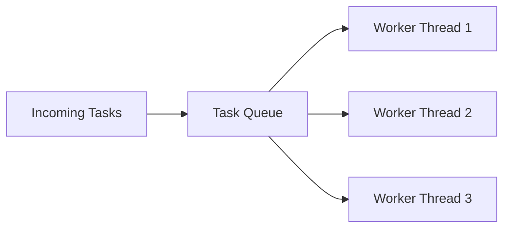
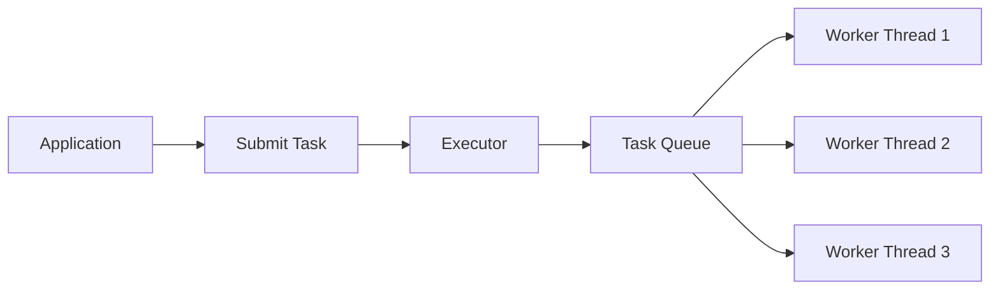

# Thread Pools

> **Difficulty:** 🟠 Intermediate
>
> **Reading Time:** ~25 minutes
>
> **Prerequisites**
>
> - Thread Lifecycle
> - Thread Control
> - Race Conditions & Synchronization
> - Locks & ReentrantLock
>
> **Core Question**
>
> > **Why is creating a new thread for every task inefficient, and how do thread pools solve this problem?**
>
> **Mental Model**
>
> Creating a thread is like hiring a new employee for every single task.
>
> Hiring and training a new employee every time is expensive.
>
> Instead, companies hire employees once and assign them new work as it arrives.
>
> A thread pool follows the same idea:
>
> - Create a fixed set of worker threads.
> - Reuse them for many tasks.
> - Avoid the cost of repeatedly creating and destroying threads.

---

# Introduction

Imagine you're building a web server.

Every incoming HTTP request needs some processing.

One possible solution is:

```java
new Thread(() -> processRequest()).start();
```

for every request.

Initially, this seems reasonable.

A new request arrives.

Create a new thread.

Process the request.

Destroy the thread.

Repeat.

But what happens when your server receives:

```
10 requests?
```

Probably fine.

```
1,000 requests?
```

Still manageable.

```
100,000 requests?
```

Now things start to break down.

Creating a new thread for every task does **not** scale.

---

# Why Are Threads Expensive?

A thread is much more than just a piece of Java code.

Creating a thread involves work at both the JVM and operating system levels.

```text
Application

      │

      ▼

Create Java Thread

      │

      ▼

Allocate Thread Stack

      │

      ▼

Create Native OS Thread

      │

      ▼

Register with Scheduler

      │

      ▼

Execute Task

      │

      ▼

Thread Terminates
```

Every new thread requires:

- Memory for its stack.
- JVM bookkeeping.
- Native operating system resources.
- Scheduling by the operating system.
- Cleanup after completion.

These operations are relatively expensive compared to simply executing a small task.

---

# The Cost of Creating Threads

Suppose every task takes only:

```
5 ms
```

If thread creation itself consumes a noticeable amount of time and resources, a significant portion of your application's work is spent managing threads rather than performing useful work.

Instead of:

```
Execute Task
```

your application repeatedly performs:

```text
Create Thread

↓

Execute Task

↓

Destroy Thread
```

again and again.

The overhead becomes increasingly significant as the number of tasks grows.

---

# An Analogy

Imagine a restaurant.

For every customer who walks in:

```text
Customer Arrives

↓

Hire New Chef

↓

Prepare Meal

↓

Fire Chef
```

Clearly, this would be inefficient.

Restaurants don't hire a new chef for every order.

Instead, they keep a team of chefs ready.

```text
Customers
     │
     ▼
 Orders Queue
     │
     ▼
+----------------------+
| Chef 1               |
| Chef 2               |
| Chef 3               |
+----------------------+
```

When a new order arrives, the next available chef prepares it.

No hiring.

No firing.

Just continuous work.

A **thread pool** works exactly the same way.

---

# What Is a Thread Pool?

A thread pool is a collection of **pre-created worker threads** that are reused to execute many tasks.

Instead of creating a new thread for every task:

```text
Task

↓

New Thread

↓

Execute

↓

Destroy Thread
```

we reuse existing threads.

```text
Task

↓

Idle Worker Thread

↓

Execute Task

↓

Return to Pool
```

The thread isn't destroyed after finishing.

It simply waits for the next task.

---

# Components of a Thread Pool

A thread pool consists of three main parts.



### 1. Incoming Tasks

These are units of work submitted by the application.

Examples:

- Process an HTTP request.
- Send an email.
- Resize an image.
- Write data to a database.

---

### 2. Task Queue

If every worker thread is busy,

new tasks wait inside a queue.

Think of it as customers waiting in line.

---

### 3. Worker Threads

Worker threads repeatedly perform the same cycle.

```text
Take Task

↓

Execute Task

↓

Look For Next Task

↓

Repeat
```

Notice something important.

The **task changes**.

The **thread stays alive**.

This is the key idea behind thread pools.

---

# Thread Pool Lifecycle

Unlike manually created threads,

worker threads usually live for a long time.

```text
Create Worker Threads

        │

        ▼

Wait For Tasks

        │

        ▼

Execute Task

        │

        ▼

Return To Pool

        │

        ▼

Wait Again
```

A worker thread may execute hundreds or even thousands of tasks during its lifetime.

---

# Production Note

> [!NOTE]
> Most modern Java applications rarely create threads using `new Thread()`.
>
> Instead, frameworks such as Spring Boot, Tomcat, Jetty, Kafka, Netty, and many others rely on thread pools to efficiently manage thousands of concurrent tasks.

---

# Why Thread Pools Improve Performance

Thread pools provide several important benefits.

### Reduced Thread Creation Overhead

Threads are created once and reused many times.

---

### Better Resource Management

The application controls how many threads exist.

Instead of accidentally creating thousands of threads, the workload is distributed among a fixed number of workers.

---

### Improved Throughput

Worker threads immediately begin processing queued tasks without paying the cost of thread creation.

---

### Predictable Resource Usage

Limiting the number of worker threads helps prevent excessive memory consumption and context switching.

---

# Summary So Far

We've answered the first question:

> **Why not create a new thread for every task?**

Creating threads is expensive because it requires memory, operating system resources, scheduling, and cleanup.

Instead of repeatedly creating and destroying threads, Java applications reuse a pool of worker threads.

Tasks are submitted to the pool, placed into a queue, executed by available workers, and the workers return to the pool to handle the next task.

In the next section, we'll see how Java provides thread pools through the **Executor Framework** and explore the different types of thread pools available.


---

# The Executor Framework

So far, we've learned **why** thread pools exist.

The next question is:

> **How do we use them in Java?**

Java provides the **Executor Framework**, a high-level API for managing and executing tasks.

Instead of creating and managing threads manually, we submit **tasks** to an executor.

The executor decides:

- Which thread should execute the task.
- When the task should run.
- Whether the task should wait in a queue.
- Whether an existing worker thread can be reused.

As developers, we focus on **what** needs to be done.

The executor handles **how** it gets done.

---

# From Manual Threads to Executors

Without an executor:

```java
Thread thread = new Thread(() -> processOrder());

thread.start();
```

Here, we are responsible for:

- Creating the thread.
- Starting it.
- Managing its lifecycle.

With an executor:

```java
ExecutorService executor =
        Executors.newFixedThreadPool(4);

executor.submit(() -> processOrder());
```

Now we simply submit a task.

The executor chooses an available worker thread from the pool.

---

# How Tasks Flow Through an Executor

The process looks like this:



Notice that the application never interacts directly with worker threads.

Everything goes through the executor.

---

# Key Interfaces

The Executor Framework is built around a few core interfaces.

```
Executor
        │
        ▼
ExecutorService
        │
        ▼
ScheduledExecutorService
```

Each interface adds more capabilities.

---

## `Executor`

The simplest interface.

It has only one responsibility:

```java
void execute(Runnable command);
```

It simply executes a task.

No shutdown.

No return values.

No task management.

Think of it as the minimal abstraction.

---

## `ExecutorService`

`ExecutorService` extends `Executor` and adds many useful features.

For example:

- Submit tasks.
- Return results.
- Shut down the thread pool.
- Wait for tasks to finish.
- Cancel tasks.

Most real-world applications use `ExecutorService` rather than `Executor`.

---

## `ScheduledExecutorService`

Sometimes tasks shouldn't run immediately.

Examples:

- Send a heartbeat every 30 seconds.
- Clean expired cache entries every hour.
- Retry a failed operation after 5 seconds.

`ScheduledExecutorService` is designed for these situations.

We'll explore it in a later chapter.

---

# Creating a Thread Pool

The easiest way to create a thread pool is through the `Executors` utility class.

```java
ExecutorService executor =
        Executors.newFixedThreadPool(4);
```

This creates:

- Four worker threads.
- A shared task queue.
- An executor that assigns tasks to available workers.

```text
                 Tasks
                   │
                   ▼
             +-----------+
             |   Queue   |
             +-----------+
             /    |    \
            ▼     ▼     ▼
      Worker1 Worker2 Worker3 Worker4
```

If all four workers are busy, new tasks wait in the queue.

---

# Submitting Tasks

Suppose we need to process multiple orders.

```java
ExecutorService executor =
        Executors.newFixedThreadPool(4);

executor.submit(() -> processOrder(101));

executor.submit(() -> processOrder(102));

executor.submit(() -> processOrder(103));
```

Each call to `submit()` creates a new **task**, not a new thread.

The executor distributes these tasks among the existing worker threads.

This is one of the biggest mindset shifts when learning the Executor Framework.

> **You submit tasks, not threads.**

---

# Shutting Down the Executor

Worker threads remain alive after completing their tasks.

They continue waiting for new work.

When the application no longer needs the thread pool, it should be shut down.

```java
executor.shutdown();
```

This tells the executor:

> "Don't accept any new tasks, but finish the ones that are already running or waiting."

```text
Running Tasks

↓

Finish Normally

↓

Executor Terminates
```

If you forget to shut down the executor, its worker threads may continue running, preventing the JVM from exiting.

> [!IMPORTANT]
> Always shut down an `ExecutorService` when it is no longer needed.

---

# `shutdown()` vs `shutdownNow()`

Java provides two shutdown methods.

### `shutdown()`

```java
executor.shutdown();
```

- Stops accepting new tasks.
- Allows queued and running tasks to complete.
- Graceful shutdown.

---

### `shutdownNow()`

```java
executor.shutdownNow();
```

- Attempts to stop running tasks.
- Removes tasks that haven't started.
- Interrupts worker threads.

Because interruption is cooperative, running tasks may still continue if they ignore interruption.

Use `shutdownNow()` only when an immediate shutdown is required.

---

# Production Note

> [!NOTE]
> In long-running applications such as web servers, thread pools are typically created once during application startup and reused throughout the application's lifetime.
>
> Creating and destroying thread pools repeatedly defeats the purpose of using a thread pool.

---

# Best Practices

✅ Submit **tasks**, not threads.

✅ Reuse a small number of thread pools instead of creating new ones frequently.

✅ Shut down executors gracefully using `shutdown()`.

✅ Prefer `ExecutorService` over manually creating threads.

❌ Don't create a new thread pool for every request.

❌ Don't forget to shut down executors when they're no longer needed.

---

# Summary So Far

The Executor Framework provides a higher-level abstraction for executing concurrent tasks.

Instead of managing individual threads, applications submit tasks to an `ExecutorService`.

The executor:

- Reuses worker threads.
- Queues incoming tasks.
- Schedules execution.
- Manages the lifecycle of the thread pool.

This separation allows developers to focus on application logic while the framework handles efficient thread management.

In the next section, we'll explore the different types of thread pools provided by Java and learn when each one is appropriate.