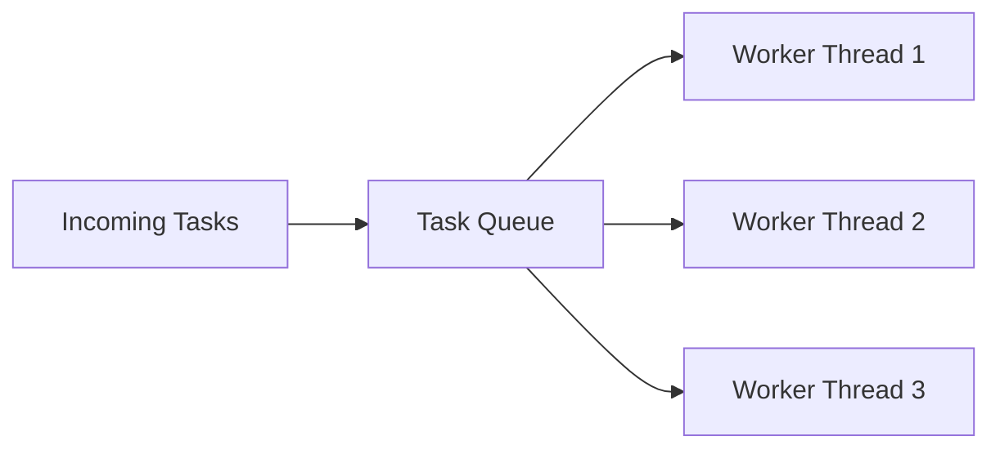
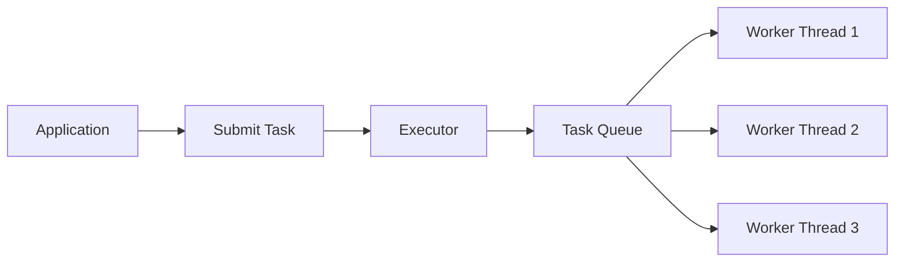
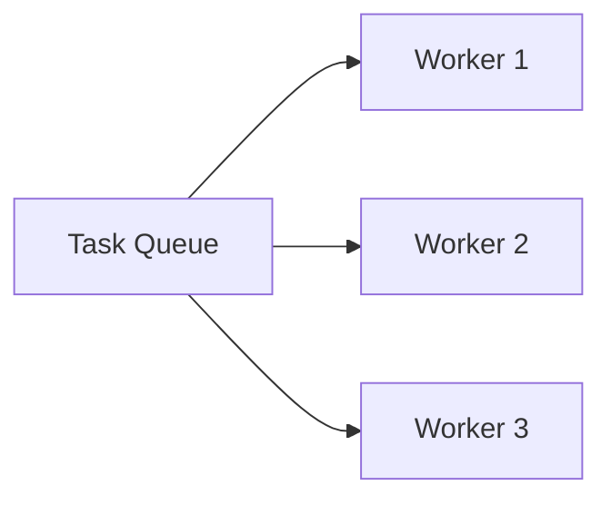

# Thread Pools

> **Difficulty:** 🟠 Intermediate
>
> **Reading Time:** ~25 minutes
>
> **Prerequisites**
>
> - Thread Lifecycle
> - Thread Control
> - Race Conditions & Synchronization
> - Locks & ReentrantLock
>
> **Core Question**
>
> > **Why is creating a new thread for every task inefficient, and how do thread pools solve this problem?**
>
> **Mental Model**
>
> Creating a thread is like hiring a new employee for every single task.
>
> Hiring and training a new employee every time is expensive.
>
> Instead, companies hire employees once and assign them new work as it arrives.
>
> A thread pool follows the same idea:
>
> - Create a fixed set of worker threads.
> - Reuse them for many tasks.
> - Avoid the cost of repeatedly creating and destroying threads.

---

# Introduction

Imagine you're building a web server.

Every incoming HTTP request needs some processing.

One possible solution is:

```java
new Thread(() -> processRequest()).start();
```

for every request.

Initially, this seems reasonable.

A new request arrives.

Create a new thread.

Process the request.

Destroy the thread.

Repeat.

But what happens when your server receives:

```
10 requests?
```

Probably fine.

```
1,000 requests?
```

Still manageable.

```
100,000 requests?
```

Now things start to break down.

Creating a new thread for every task does **not** scale.

---

# Why Are Threads Expensive?

A thread is much more than just a piece of Java code.

Creating a thread involves work at both the JVM and operating system levels.

```text
Application

      │

      ▼

Create Java Thread

      │

      ▼

Allocate Thread Stack

      │

      ▼

Create Native OS Thread

      │

      ▼

Register with Scheduler

      │

      ▼

Execute Task

      │

      ▼

Thread Terminates
```

Every new thread requires:

- Memory for its stack.
- JVM bookkeeping.
- Native operating system resources.
- Scheduling by the operating system.
- Cleanup after completion.

These operations are relatively expensive compared to simply executing a small task.

---

# The Cost of Creating Threads

Suppose every task takes only:

```
5 ms
```

If thread creation itself consumes a noticeable amount of time and resources, a significant portion of your application's work is spent managing threads rather than performing useful work.

Instead of:

```
Execute Task
```

your application repeatedly performs:

```text
Create Thread

↓

Execute Task

↓

Destroy Thread
```

again and again.

The overhead becomes increasingly significant as the number of tasks grows.

---

# An Analogy

Imagine a restaurant.

For every customer who walks in:

```text
Customer Arrives

↓

Hire New Chef

↓

Prepare Meal

↓

Fire Chef
```

Clearly, this would be inefficient.

Restaurants don't hire a new chef for every order.

Instead, they keep a team of chefs ready.

```text
Customers
     │
     ▼
 Orders Queue
     │
     ▼
+----------------------+
| Chef 1               |
| Chef 2               |
| Chef 3               |
+----------------------+
```

When a new order arrives, the next available chef prepares it.

No hiring.

No firing.

Just continuous work.

A **thread pool** works exactly the same way.

---

# What Is a Thread Pool?

A thread pool is a collection of **pre-created worker threads** that are reused to execute many tasks.

Instead of creating a new thread for every task:

```text
Task

↓

New Thread

↓

Execute

↓

Destroy Thread
```

we reuse existing threads.

```text
Task

↓

Idle Worker Thread

↓

Execute Task

↓

Return to Pool
```

The thread isn't destroyed after finishing.

It simply waits for the next task.

---

# Components of a Thread Pool

A thread pool consists of three main parts.



### 1. Incoming Tasks

These are units of work submitted by the application.

Examples:

- Process an HTTP request.
- Send an email.
- Resize an image.
- Write data to a database.

---

### 2. Task Queue

If every worker thread is busy,

new tasks wait inside a queue.

Think of it as customers waiting in line.

---

### 3. Worker Threads

Worker threads repeatedly perform the same cycle.

```text
Take Task

↓

Execute Task

↓

Look For Next Task

↓

Repeat
```

Notice something important.

The **task changes**.

The **thread stays alive**.

This is the key idea behind thread pools.

---

# Thread Pool Lifecycle

Unlike manually created threads,

worker threads usually live for a long time.

```text
Create Worker Threads

        │

        ▼

Wait For Tasks

        │

        ▼

Execute Task

        │

        ▼

Return To Pool

        │

        ▼

Wait Again
```

A worker thread may execute hundreds or even thousands of tasks during its lifetime.

---

# Production Note

> [!NOTE]
> Most modern Java applications rarely create threads using `new Thread()`.
>
> Instead, frameworks such as Spring Boot, Tomcat, Jetty, Kafka, Netty, and many others rely on thread pools to efficiently manage thousands of concurrent tasks.

---

# Why Thread Pools Improve Performance

Thread pools provide several important benefits.

### Reduced Thread Creation Overhead

Threads are created once and reused many times.

---

### Better Resource Management

The application controls how many threads exist.

Instead of accidentally creating thousands of threads, the workload is distributed among a fixed number of workers.

---

### Improved Throughput

Worker threads immediately begin processing queued tasks without paying the cost of thread creation.

---

### Predictable Resource Usage

Limiting the number of worker threads helps prevent excessive memory consumption and context switching.

---

# Summary So Far

We've answered the first question:

> **Why not create a new thread for every task?**

Creating threads is expensive because it requires memory, operating system resources, scheduling, and cleanup.

Instead of repeatedly creating and destroying threads, Java applications reuse a pool of worker threads.

Tasks are submitted to the pool, placed into a queue, executed by available workers, and the workers return to the pool to handle the next task.

In the next section, we'll see how Java provides thread pools through the **Executor Framework** and explore the different types of thread pools available.


---

# The Executor Framework

So far, we've learned **why** thread pools exist.

The next question is:

> **How do we use them in Java?**

Java provides the **Executor Framework**, a high-level API for managing and executing tasks.

Instead of creating and managing threads manually, we submit **tasks** to an executor.

The executor decides:

- Which thread should execute the task.
- When the task should run.
- Whether the task should wait in a queue.
- Whether an existing worker thread can be reused.

As developers, we focus on **what** needs to be done.

The executor handles **how** it gets done.

---

# From Manual Threads to Executors

Without an executor:

```java
Thread thread = new Thread(() -> processOrder());

thread.start();
```

Here, we are responsible for:

- Creating the thread.
- Starting it.
- Managing its lifecycle.

With an executor:

```java
ExecutorService executor =
        Executors.newFixedThreadPool(4);

executor.submit(() -> processOrder());
```

Now we simply submit a task.

The executor chooses an available worker thread from the pool.

---

# How Tasks Flow Through an Executor

The process looks like this:



Notice that the application never interacts directly with worker threads.

Everything goes through the executor.

---

# Key Interfaces

The Executor Framework is built around a few core interfaces.

```
Executor
        │
        ▼
ExecutorService
        │
        ▼
ScheduledExecutorService
```

Each interface adds more capabilities.

---

## `Executor`

The simplest interface.

It has only one responsibility:

```java
void execute(Runnable command);
```

It simply executes a task.

No shutdown.

No return values.

No task management.

Think of it as the minimal abstraction.

---

## `ExecutorService`

`ExecutorService` extends `Executor` and adds many useful features.

For example:

- Submit tasks.
- Return results.
- Shut down the thread pool.
- Wait for tasks to finish.
- Cancel tasks.

Most real-world applications use `ExecutorService` rather than `Executor`.

---

## `ScheduledExecutorService`

Sometimes tasks shouldn't run immediately.

Examples:

- Send a heartbeat every 30 seconds.
- Clean expired cache entries every hour.
- Retry a failed operation after 5 seconds.

`ScheduledExecutorService` is designed for these situations.

We'll explore it in a later chapter.

---

# Creating a Thread Pool

The easiest way to create a thread pool is through the `Executors` utility class.

```java
ExecutorService executor =
        Executors.newFixedThreadPool(4);
```

This creates:

- Four worker threads.
- A shared task queue.
- An executor that assigns tasks to available workers.

```text
                 Tasks
                   │
                   ▼
             +-----------+
             |   Queue   |
             +-----------+
             /    |    \
            ▼     ▼     ▼
      Worker1 Worker2 Worker3 Worker4
```

If all four workers are busy, new tasks wait in the queue.

---

# Submitting Tasks

Suppose we need to process multiple orders.

```java
ExecutorService executor =
        Executors.newFixedThreadPool(4);

executor.submit(() -> processOrder(101));

executor.submit(() -> processOrder(102));

executor.submit(() -> processOrder(103));
```

Each call to `submit()` creates a new **task**, not a new thread.

The executor distributes these tasks among the existing worker threads.

This is one of the biggest mindset shifts when learning the Executor Framework.

> **You submit tasks, not threads.**

---

# Shutting Down the Executor

Worker threads remain alive after completing their tasks.

They continue waiting for new work.

When the application no longer needs the thread pool, it should be shut down.

```java
executor.shutdown();
```

This tells the executor:

> "Don't accept any new tasks, but finish the ones that are already running or waiting."

```text
Running Tasks

↓

Finish Normally

↓

Executor Terminates
```

If you forget to shut down the executor, its worker threads may continue running, preventing the JVM from exiting.

> [!IMPORTANT]
> Always shut down an `ExecutorService` when it is no longer needed.

---

# `shutdown()` vs `shutdownNow()`

Java provides two shutdown methods.

### `shutdown()`

```java
executor.shutdown();
```

- Stops accepting new tasks.
- Allows queued and running tasks to complete.
- Graceful shutdown.

---

### `shutdownNow()`

```java
executor.shutdownNow();
```

- Attempts to stop running tasks.
- Removes tasks that haven't started.
- Interrupts worker threads.

Because interruption is cooperative, running tasks may still continue if they ignore interruption.

Use `shutdownNow()` only when an immediate shutdown is required.

---

# Production Note

> [!NOTE]
> In long-running applications such as web servers, thread pools are typically created once during application startup and reused throughout the application's lifetime.
>
> Creating and destroying thread pools repeatedly defeats the purpose of using a thread pool.

---

# Best Practices

✅ Submit **tasks**, not threads.

✅ Reuse a small number of thread pools instead of creating new ones frequently.

✅ Shut down executors gracefully using `shutdown()`.

✅ Prefer `ExecutorService` over manually creating threads.

❌ Don't create a new thread pool for every request.

❌ Don't forget to shut down executors when they're no longer needed.

---

# Summary So Far

The Executor Framework provides a higher-level abstraction for executing concurrent tasks.

Instead of managing individual threads, applications submit tasks to an `ExecutorService`.

The executor:

- Reuses worker threads.
- Queues incoming tasks.
- Schedules execution.
- Manages the lifecycle of the thread pool.

This separation allows developers to focus on application logic while the framework handles efficient thread management.

In the next section, we'll explore the different types of thread pools provided by Java and learn when each one is appropriate.


---

# Fixed Thread Pool

The most commonly used thread pool in Java is the **Fixed Thread Pool**.

It creates a fixed number of worker threads that are reused to execute incoming tasks.

```java
ExecutorService executor =
        Executors.newFixedThreadPool(4);
```

This creates exactly **4 worker threads**.

No matter how many tasks are submitted, the pool will never execute more than four tasks concurrently.

---

# How It Works

Suppose we create:

```java
ExecutorService executor =
        Executors.newFixedThreadPool(3);
```

The pool immediately creates:

```
Worker 1

Worker 2

Worker 3
```

Now imagine ten tasks arrive.

```text
Task 1
Task 2
Task 3
Task 4
Task 5
Task 6
Task 7
Task 8
Task 9
Task10
```

Only three tasks can execute simultaneously.

The remaining tasks wait in the queue.



---

# Task Execution

Suppose each task takes five seconds.

```
Time = 0s

Worker 1 → Task 1

Worker 2 → Task 2

Worker 3 → Task 3
```

The queue contains:

```
Task 4

Task 5

Task 6

...
```

Five seconds later:

```
Worker 1 → Task 4

Worker 2 → Task 5

Worker 3 → Task 6
```

Notice something important.

The workers never disappear.

Only the **tasks** change.

---

# Why Is This Efficient?

Without a thread pool:

```
Task

↓

Create Thread

↓

Execute

↓

Destroy Thread
```

Repeated for every task.

With a fixed thread pool:

```
Create Workers Once

↓

Execute Task

↓

Return Worker To Pool

↓

Execute Next Task
```

Thread creation happens only once.

This significantly reduces overhead.

---

# Internal Architecture

Conceptually, a fixed thread pool looks like this.

```text
                 Tasks
                   │
                   ▼
          +----------------+
          |  Task Queue    |
          +----------------+
             │    │    │
      ┌──────┘    │    └──────┐
      ▼           ▼           ▼

  Worker 1    Worker 2    Worker 3

      ▲           ▲           ▲
      └───────────┴───────────┘

        Reused For Future Tasks
```

The queue stores waiting tasks.

Workers continuously:

1. Take a task.
2. Execute it.
3. Return to the queue.
4. Repeat.

---

# What Happens If More Tasks Arrive?

Suppose the pool has:

```
4 workers
```

and:

```
500 tasks
```

The executor **does not create more workers**.

Instead:

```
4 Running

496 Waiting
```

Every new task joins the queue.

As workers finish,

they immediately begin processing queued tasks.

---

# Choosing the Pool Size

One common question is:

> **How many worker threads should I create?**

There is no universal answer.

It depends on the workload.

### CPU-bound tasks

Examples:

- Image processing
- Encryption
- Data compression

These tasks spend most of their time using the CPU.

A common guideline is:

```
Number of Threads ≈ Number of CPU Cores
```

Creating significantly more threads often increases context switching without improving throughput.

---

### I/O-bound tasks

Examples:

- Database queries
- Network requests
- Reading files

These tasks spend much of their time waiting for external systems.

While one thread is waiting,

another can use the CPU.

For this reason,

I/O-heavy applications often benefit from having more threads than CPU cores.

> [!TIP]
> Start with measurements rather than guesses. The optimal thread count depends on your workload, hardware, and latency characteristics.

---

# Advantages

✅ Reuses worker threads.

✅ Limits the maximum number of concurrent threads.

✅ Predictable resource usage.

✅ Suitable for long-running server applications.

---

# Limitations

A fixed thread pool has one important limitation.

Tasks that cannot start immediately wait in the queue.

If tasks arrive faster than workers can process them:

```
Tasks Arriving

↓

Queue Grows

↓

Memory Usage Increases

↓

Longer Waiting Times
```

A continuously growing queue can eventually consume a large amount of memory.

---

# Real-World Examples

A fixed thread pool is a good choice when:

- Processing HTTP requests.
- Executing business logic.
- Handling background jobs.
- Processing messages from a queue.
- Running scheduled business operations with a controlled level of concurrency.

The key idea is that the application wants to **limit the number of simultaneously running tasks**.

---

# Best Practices

✅ Choose the pool size based on the workload.

✅ Monitor queue length in production.

✅ Keep tasks reasonably short.

✅ Shut down the pool gracefully when the application exits.

❌ Don't create a pool with hundreds of threads "just in case."

❌ Don't submit long-running blocking tasks without considering their impact on queue growth.

---

# Summary

A fixed thread pool maintains a constant number of worker threads and reuses them to process incoming tasks.

If all workers are busy, new tasks wait in a queue until a worker becomes available.

This provides predictable resource usage and makes fixed thread pools the most common choice for server-side applications.

However, choosing an appropriate pool size is critical.

Too few workers reduce throughput.

Too many increase contention and context-switching overhead.

Understanding your workload is the key to selecting the right configuration.

---

# Cached Thread Pool

A fixed thread pool limits the number of worker threads.

If all workers are busy, new tasks wait in a queue.

A **Cached Thread Pool** takes a different approach.

Instead of making tasks wait,

it creates **new worker threads whenever needed**.

```java
ExecutorService executor =
        Executors.newCachedThreadPool();
```

Unlike a fixed thread pool, there is **no fixed limit** on the number of worker threads.

---

# How It Works

Suppose the application starts.

Initially:

```text
Worker Threads

0
```

The first task arrives.

```text
Task 1

↓

Create Worker 1

↓

Execute Task
```

A second task arrives while Worker 1 is still busy.

```text
Task 2

↓

Create Worker 2

↓

Execute Task
```

A third task arrives.

```text
Task 3

↓

Create Worker 3
```

The pool keeps creating new workers **only when no idle worker is available**.

---

# Reusing Idle Threads

Suppose Worker 1 finishes its task.

Instead of terminating immediately, it waits for more work.

```text
Worker 1

↓

Task Completed

↓

Idle

↓

Wait For Next Task
```

If another task arrives:

```text
New Task

↓

Reuse Worker 1
```

No new thread is created.

This is why it's called a **Cached** Thread Pool.

Idle threads are cached for future reuse.

---

# What Happens During a Traffic Spike?

Imagine an application suddenly receives:

```
500 independent tasks
```

A cached thread pool behaves roughly like this.

```text
Tasks Arrive

↓

No Idle Workers

↓

Create More Workers

↓

Execute Tasks Immediately
```

Unlike a fixed thread pool,

tasks usually don't wait in a queue.

Instead,

the number of worker threads increases.

---

# Internal Architecture

Conceptually, it looks like this.

```text
Incoming Tasks
      │
      ▼
Idle Worker Available?

      │
  ┌───┴────┐
  │        │
 Yes       No
  │        │
  ▼        ▼
Reuse    Create New
Worker    Worker
```

Notice the key difference from a fixed thread pool.

There is **no long waiting queue**.

The pool prefers creating workers over making tasks wait.

---

# Thread Lifecycle

A cached thread pool doesn't keep every thread forever.

When a worker becomes idle:

```text
Task Finished

↓

Idle

↓

Wait For More Work

↓

No Task For Some Time?

↓

Terminate Worker
```

By default, idle threads are removed after approximately **60 seconds**.

This allows the pool to grow during busy periods and shrink when demand decreases.

---

# Fixed vs Cached Thread Pool

| Fixed Thread Pool | Cached Thread Pool |
|-------------------|--------------------|
| Fixed number of workers | Creates workers as needed |
| Tasks wait in a queue | Tries to execute tasks immediately |
| Predictable thread count | Thread count can grow significantly |
| Stable memory usage | Higher resource usage during spikes |
| Best for controlled concurrency | Best for many short-lived asynchronous tasks |

---

# When Should You Use a Cached Thread Pool?

A cached thread pool is useful when:

- Tasks are **short-lived**.
- The arrival rate of tasks is unpredictable.
- Most tasks complete quickly.
- You don't want tasks waiting in a queue.

Examples:

- Processing many lightweight asynchronous jobs.
- Small utility applications.
- Bursty workloads where idle periods are common.

---

# When Should You Avoid It?

Suppose your application receives:

```
20,000 long-running tasks
```

A cached thread pool may attempt to create a very large number of worker threads.

```text
More Tasks

↓

More Threads

↓

More Memory

↓

More Context Switching

↓

Reduced Performance
```

Instead of improving performance,

too many threads may overwhelm the system.

For long-running or blocking tasks,

a cached thread pool is usually **not** the right choice.

> [!WARNING]
> A cached thread pool has **no practical upper limit** on the number of threads it may create.
>
> If tasks are slow or arrive faster than they complete, thread creation can grow rapidly, leading to excessive memory usage and context switching.

---

# Real-World Examples

A cached thread pool can be appropriate for:

- Lightweight background jobs.
- Short asynchronous callbacks.
- Applications with occasional bursts of work.
- Internal tools where task execution is brief.

It is generally **not** recommended for high-traffic servers handling thousands of long-running requests.

---

# Best Practices

✅ Use for short, fast, independent tasks.

✅ Ensure tasks complete quickly.

✅ Monitor thread count in production.

❌ Don't use it for blocking database calls or long-running network operations.

❌ Don't assume "more threads" always means "better performance."

---

# Summary

A cached thread pool dynamically creates worker threads when demand increases and reuses idle workers whenever possible.

Unlike a fixed thread pool, it favors creating additional threads instead of making tasks wait in a queue.

This makes it well-suited for applications with many short-lived tasks and unpredictable workloads.

However, because the number of worker threads can grow significantly under heavy load, cached thread pools should be used carefully in production systems.